<div align="center">

> **Implementation note:** TSCloak does not reimplement the OAuth 2.0 or OpenID Connect protocol stack. It uses `nest-oidc-provider`, which integrates the underlying `oidc-provider` library into the NestJS application architecture.

# 🛡️ TSCloak

### A modular OpenID Connect & OAuth 2.0 Authorization Server built with NestJS

[](https://nestjs.com/)
[](https://www.typescriptlang.org/)
[](https://openid.net/connect/)
[](https://oauth.net/2/)
[](https://typeorm.io/)
[](#license)

**Protocol-driven. Modular. Persistent. Extensible.**

</div>

---

## 📖 Overview

**TSCloak** is a modular OpenID Connect (OIDC) and OAuth 2.0 Authorization Server built with **NestJS** and **TypeScript**.

It uses [`oidc-provider`](https://github.com/panva/node-oidc-provider) for standards-compliant OAuth 2.0 and OpenID Connect protocol handling while keeping application concerns such as identity, client management, persistence, and infrastructure cleanly separated.

The goal is to provide a maintainable architecture for building an authorization server without tightly coupling business logic to protocol or database implementations.

### ✨ Highlights

- 🔐 OAuth 2.0 Authorization Code Flow
- 🪪 OpenID Connect support
- 🔑 PKCE
- 🎫 Access Tokens and ID Tokens
- ♻️ Refresh Tokens with rotation
- 📴 Offline access
- 👤 UserInfo endpoint
- ⚡ Dynamic client resolution
- 📝 Dynamic Client Registration (RFC 7591)
- 💾 Persistent OIDC runtime state
- 🔄 State survives application restarts
- 🧹 Automatic expiration cleanup
- 🚫 Token Revocation Endpoint (RFC 7009)
- 🔍 Token Introspection Endpoint (RFC 7662)
- 🗄️ Repository-based persistence abstraction
- 🛡️ Database-backed security policy management
- ⏱️ Configurable OIDC token lifetimes from security policy
- 🔑 RSA signing key management and JWKS publication

---

## 🧭 Navigation

- [Overview](#-overview)
- [Architecture](#️-architecture)
- [Technology Stack](#-technology-stack)
- [Project Structure](#-project-structure)
- [Getting Started](#-getting-started)
- [Authentication Flow](#-authentication-flow)
- [Login Experience](#️-login-experience)
- [Consent Experience](#-consent-experience)
- [Interaction UI Customization](#️-interaction-ui-customization)
- [Supported Scopes](#-supported-scopes)
- [Token Types](#-token-types)
- [OIDC Token Lifetimes](#️-oidc-token-lifetimes)
- [Using Access Tokens](#-using-access-tokens)
- [Refreshing an Access Token](#️-refreshing-an-access-token)
- [UserInfo Endpoint](#-userinfo-endpoint)
- [Token Management Endpoints](#-token-management-endpoints)
- [Dynamic Client Resolution](#-dynamic-client-resolution)
- [Dynamic Client Registration](#-dynamic-client-registration)
- [Security Policy Management](#️-security-policy-management)
- [Signing Keys and JWKS](#-signing-keys-and-jwks)
- [Persistent OIDC Storage](#-persistent-oidc-storage)
- [Storage Architecture](#️-storage-architecture)
- [OIDC Storage Model](#️-oidc-storage-model)
- [Expiration Handling](#️-expiration-handling)
- [Example Authorization Request](#-example-authorization-request)
- [Example Token Request](#-example-token-request)
- [Design Principles](#-design-principles)
- [Roadmap](#️-roadmap)
- [Contributing](#-contributing)
- [License](#-license)

---

## 🏗️ Architecture

TSCloak is a NestJS-based Identity Provider that uses `nest-oidc-provider` as the NestJS integration layer for the underlying `oidc-provider` OAuth 2.0 and OpenID Connect implementation.

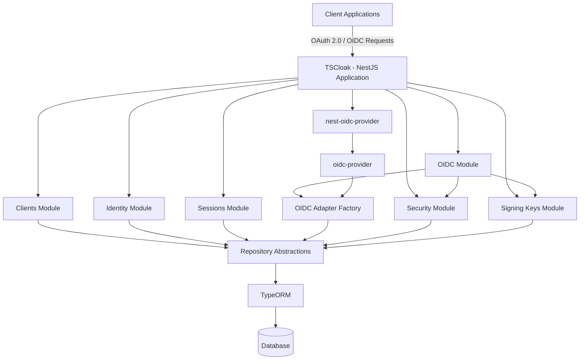

### Responsibility Layers

| Layer | Responsibility |
|---|---|
| **TSCloak** | Application architecture, NestJS modules, account management, client management, hosted/custom interaction UI, persistence integration |
| **nest-oidc-provider** | NestJS integration layer for configuring and hosting the OIDC provider |
| **oidc-provider** | Core OAuth 2.0 and OpenID Connect protocol implementation |
| **OIDC Adapters** | Connect `oidc-provider` models and persistence requirements to TSCloak repositories |
| **Security** | Central security policy and token lifetime configuration |
| **Signing Keys** | RSA key lifecycle and key material used to sign tokens |
| **Repository Abstractions** | Decouple application and OIDC persistence from the underlying database |
| **TypeORM** | Database persistence implementation |

## 🧩 Technology Stack

| Technology | Purpose |
|---|---|
| **NestJS** | Application framework |
| **TypeScript** | Programming language |
| **oidc-provider** | OAuth 2.0 & OpenID Connect protocol engine |
| **nest-oidc-provider** | NestJS integration |
| **TypeORM** | Persistence abstraction |
| **SQLite** | Current database implementation |
| **better-sqlite3** | SQLite driver |

---

## 📁 Project Structure

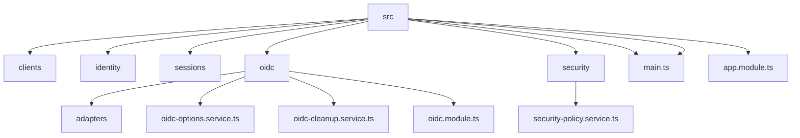

### Module Responsibilities

| Module | Responsibility |
|---|---|
| **Clients** | Client registration and lookup |
| **Identity** | User identity and account claims |
| **Sessions** | Application session management |
| **OIDC** | Protocol configuration, adapters, and OIDC integration |
| **Security** | Security policy administration and runtime policy access |
| **Signing Keys** | Signing key persistence and key management |

---

## 🚀 Getting Started

### Prerequisites

- Node.js
- npm
- Git

### Installation

```bash
git clone <repository-url>
cd TSCloak
npm install
```

### Run in Development

```bash
npm run start:dev
```

### Build

```bash
npm run build
```

### Run in Production

```bash
npm run start:prod
```

---

## 🔐 Authentication Flow

TSCloak currently supports the **Authorization Code Flow with PKCE**.

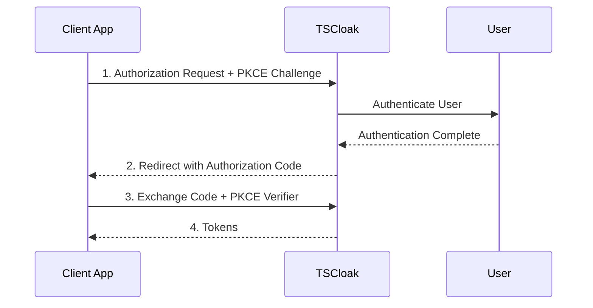

### Token Response

```json
{
  "access_token": "...",
  "id_token": "...",
  "refresh_token": "...",
  "expires_in": 3600,
  "scope": "openid profile email offline_access",
  "token_type": "Bearer"
}
```

---

## 🖥️ Login Experience

TSCloak provides an authentication interaction page for users to securely sign in before authorization is completed.

<div align="center">

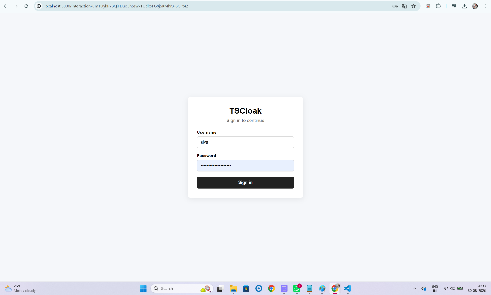

*TSCloak authentication interaction page*

</div>

---

## 🤝 Consent Experience

TSCloak supports a hosted consent page and can also be integrated with a client-provided custom interaction UI.

During authorization, TSCloak evaluates the authenticated user session, the existing Grant, and the requested scopes. A consent interaction is shown when user approval is required.

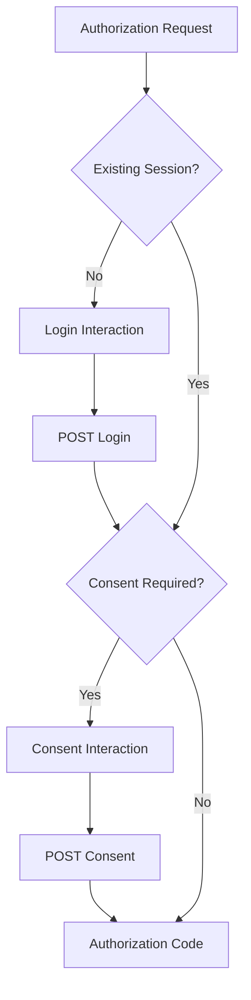

<div align="center">

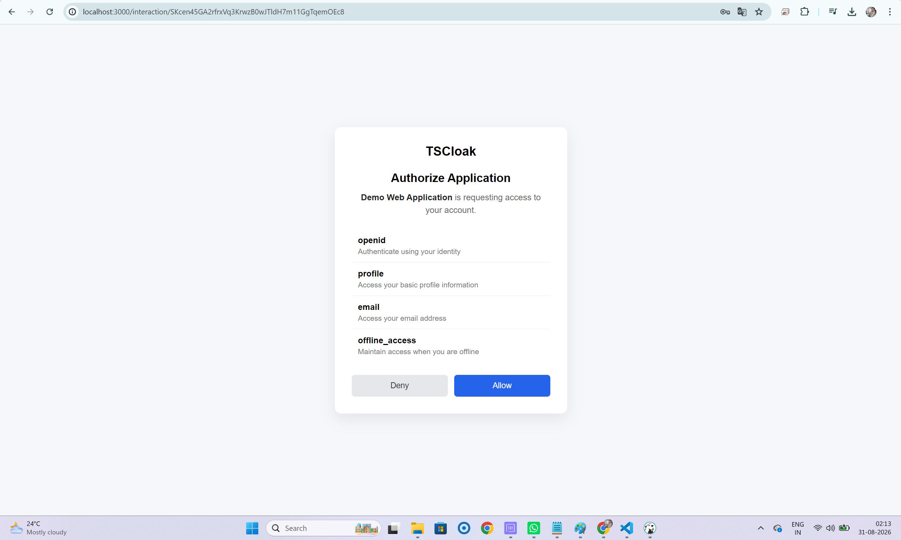

*TSCloak consent interaction page*

</div>

### Hosted Consent Endpoint

The hosted consent UI submits the user's decision to:

```text
POST /interaction/:uid/consent
```

The consent decision values must be:

| User Action | Value |
|---|---|
| Allow | `accept` |
| Deny | `reject` |

Example hosted form:

```html
<form method="POST" action="/interaction/{{UID}}/consent">
  <button type="submit" name="decision" value="reject">Deny</button>
  <button type="submit" name="decision" value="accept">Allow</button>
</form>
```

> `accept` and `reject` are the values expected by the interaction controller.

### Standard Scope Descriptions

The hosted consent UI displays human-readable descriptions for standard scopes.

| Scope | Description |
|---|---|
| `openid` | Authenticate you and verify your identity |
| `profile` | Access your basic profile information, such as your name and profile details |
| `email` | Access your email address and email verification status |
| `offline_access` | Maintain access when you are not actively using the application and allow refresh token usage |

### Consent Persistence

When a user approves a client, TSCloak persists an OIDC `Grant` containing the approved scopes. The session is associated with that Grant so subsequent authorization requests can reuse the existing consent.

Example Grant:

```json
{
  "accountId": "USER_ID",
  "clientId": "CLIENT_ID",
  "openid": {
    "scope": "openid profile email"
  }
}
```

### `prompt=consent`

Clients can explicitly force the consent screen by including:

```text
prompt=consent
```

Even when a valid session and existing Grant are present, this requests a new consent interaction.

### Incremental Consent

For normal scopes, when a client requests permissions that have not yet been approved, TSCloak can present the consent interaction again so the user can approve the additional permissions.

For example:

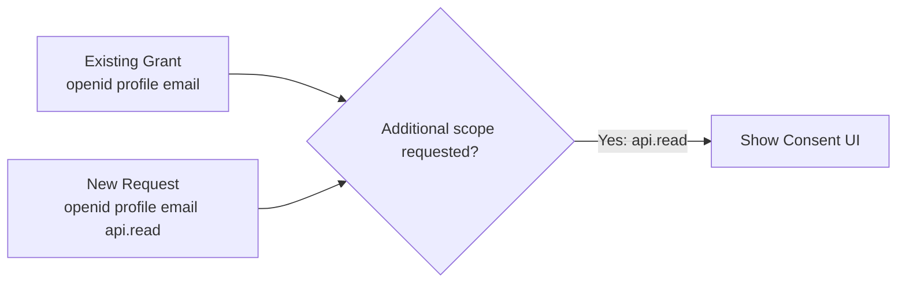

### `offline_access` and Refresh Tokens

`offline_access` is a special OpenID Connect scope used to request refresh-token capability.

A client requesting refresh tokens should explicitly request user consent:

```text
scope=openid profile email offline_access
&prompt=consent
```

Without explicit consent, the underlying OIDC provider may exclude `offline_access` from the effective authorization scope. As a result, `offline_access` should not be treated as a normal incremental-consent test case.

After consent is granted, the authorization request can proceed with `offline_access`, allowing the token endpoint to issue a refresh token when the client is configured for the `refresh_token` grant.

---

## 🖥️ Interaction UI Customization

TSCloak supports two approaches for handling OIDC interactions:

1. **Hosted Interaction UI** — TSCloak renders the Login and Consent pages.
2. **Custom Interaction UI** — Applications can provide their own Login and/or Consent experience.

This allows TSCloak to work both as a standalone Identity Provider with built-in screens and as a backend authorization server integrated with an organization's existing UI.

### Interaction Endpoints

TSCloak separates displaying an interaction from completing it.

| Method | Endpoint | Description |
|---|---|---|
| `GET` | `/interaction/:uid` | Resolves and displays the current OIDC interaction |
| `POST` | `/interaction/:uid/login` | Completes a login interaction |
| `POST` | `/interaction/:uid/consent` | Completes a consent interaction |

The current interaction type is determined by the OIDC provider and can include `login` or `consent`.

### Hosted UI Flow

Hosted UI is the default behavior.

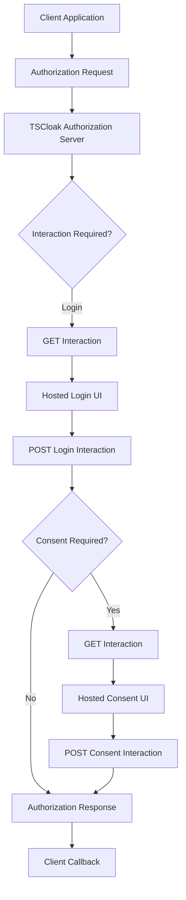

#### Hosted Login UI

When a login interaction is required and no external login UI is configured, TSCloak renders its built-in login page.

The login page submits credentials to:

```text
POST /interaction/:uid/login
```

#### Hosted Consent UI

When consent is required and no external consent UI is configured, TSCloak renders its built-in consent page.

The page displays the client application, requested scopes, human-readable scope descriptions, and Allow/Deny actions.

The consent page submits to:

```text
POST /interaction/:uid/consent
```

### Custom Interaction UI Flow

Organizations may already have their own Login UI, branding, or consent experience. TSCloak allows Login and Consent interactions to be delegated independently to an external application.

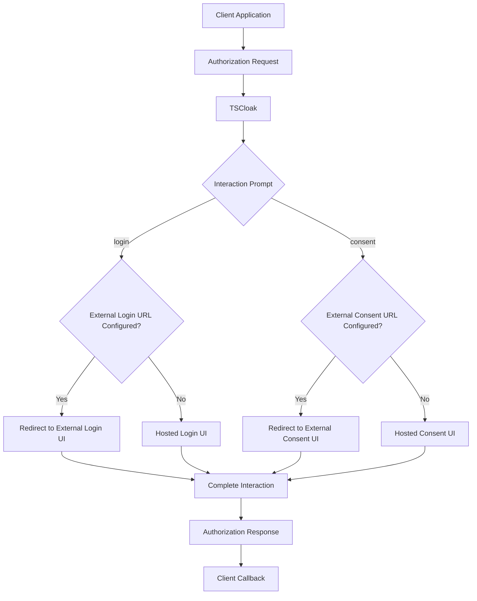

### Interaction URL Configuration

Each client can configure interaction mode and separate URLs for Login and Consent.

```typescript
interactionMode: 'HOSTED' | 'EXTERNAL';
interactionLoginUrl?: string;
interactionConsentUrl?: string;
```

| Configuration | Login Behavior | Consent Behavior |
|---|---|---|
| `HOSTED` | TSCloak Hosted Login UI | TSCloak Hosted Consent UI |
| `EXTERNAL` with Login URL | External Login UI | Depends on Consent URL |
| `EXTERNAL` with Consent URL | Depends on Login URL | External Consent UI |
| URL missing | Hosted fallback | Hosted fallback |

This allows Login and Consent to be customized independently while preserving a hosted fallback.

### External Interaction Redirect

When TSCloak delegates an interaction to an external UI, it redirects the browser with interaction information.

Example login redirect:

```text
http://localhost:4200/login?interaction_uid=<uid>&prompt=login&client_id=<client_id>
```

Example consent redirect:

```text
http://localhost:4200/consent?interaction_uid=<uid>&prompt=consent&client_id=<client_id>
```

### `interaction_uid`

The `interaction_uid` identifies the current OIDC interaction.

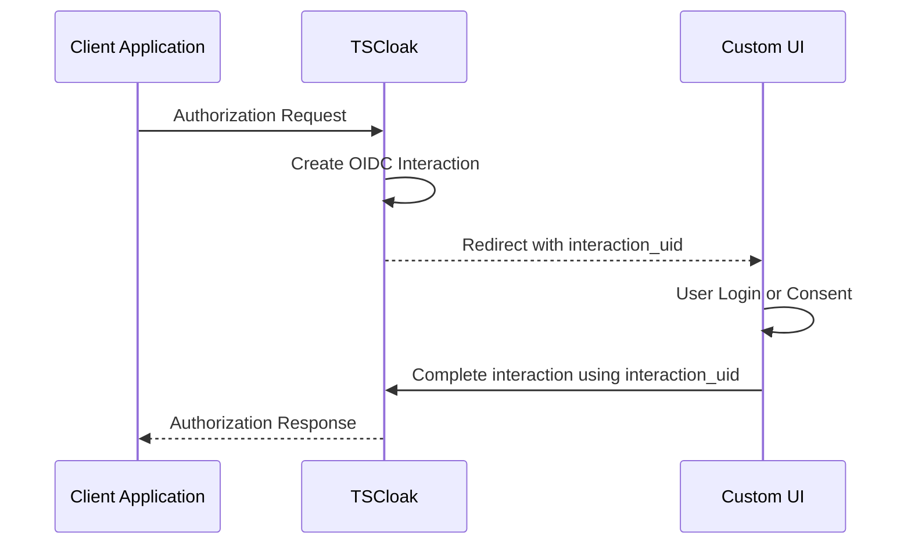

The Custom UI must preserve this value throughout the Login or Consent flow so that the interaction can be completed against the correct authorization request.

### Prompt-Aware Custom UI

The `prompt` parameter allows a Custom UI application to determine which interaction experience should be rendered.

```text
prompt=login
```

The application should render its authentication experience.

```text
prompt=consent
```

The application should render its consent experience.

This architecture allows organizations to fully customize branding and user experience while TSCloak continues to own the OAuth 2.0 / OpenID Connect protocol flow, sessions, grants, authorization codes, and tokens.

---

## 🎯 Supported Scopes

| Scope | Description |
|---|---|
| `openid` | Enables OpenID Connect |
| `profile` | Requests user profile information |
| `email` | Requests email claims |
| `offline_access` | Requests refresh token capability; requires appropriate user consent |

Example:

```text
scope=openid profile email offline_access
```

---

## 🎫 Token Types

### Access Token

Used to access protected resources.

### ID Token

Represents the authenticated user and contains OpenID Connect claims.

Example:

```json
{
  "sub": "user-id",
  "aud": "client-id",
  "iss": "http://localhost:3000"
}
```

### Refresh Token

Allows clients to obtain new access tokens without requiring the user to authenticate again.

TSCloak supports refresh token rotation through the underlying OIDC provider.

> ⚠️ A rotated refresh token should not be reused.

---

## ⏱️ OIDC Token Lifetimes

TSCloak keeps token lifetime policy outside of hard-coded OIDC configuration. The `OidcOptionsService` obtains the active security policy during provider configuration and supplies the configured lifetime values to `oidc-provider` through its `ttl` configuration.

The policy is intended to govern lifetimes such as:

- Access tokens
- ID tokens
- Refresh tokens
- Authorization codes and other OIDC artifacts as policy support expands

`oidc-provider` requires TTL resolution during token processing, so the values supplied to its callbacks must be immediately available. The current design therefore treats the database-backed policy as the source of truth while keeping the OIDC provider configuration compatible with its synchronous TTL contract.

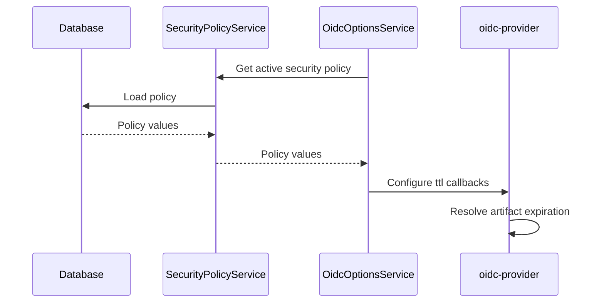

## 🔑 Using Access Tokens

After completing the authorization flow, TSCloak returns an access token:

```json
{
  "access_token": "ACCESS_TOKEN",
  "expires_in": 3600,
  "id_token": "ID_TOKEN",
  "refresh_token": "REFRESH_TOKEN",
  "scope": "openid profile email offline_access",
  "token_type": "Bearer"
}
```

Use the access token as a **Bearer token** when calling the UserInfo (`/me`) endpoint.

### Get Current User Details

```http
GET /me
Authorization: Bearer ACCESS_TOKEN
```

Using `curl`:

```bash
curl http://localhost:3000/me \
  -H "Authorization: Bearer ACCESS_TOKEN"
```

Example response:

```json
{
  "sub": "0804b05f-960c-46ac-b0c2-a8d6313b5143",
  "name": "siva",
  "preferred_username": "siva",
  "email": "siva@example.com",
  "email_verified": true
}
```

The `/me` endpoint validates the access token and returns identity claims based on the scopes granted to the client.

---

## ♻️ Refreshing an Access Token

When the access token expires, use the refresh token to obtain a new token set without requiring the user to sign in again.

A refresh token is issued when the authorization request includes `offline_access`, the client is configured to allow the `refresh_token` grant, and the required user consent is obtained.

For a standard authorization request, explicitly request consent:

```text
scope=openid profile email offline_access
&prompt=consent
```

`offline_access` is a special OIDC scope. Without explicit consent, the underlying OIDC provider may exclude it from the effective authorization scope, resulting in no refresh token being issued.

### Refresh Token Request

```http
POST /token
Content-Type: application/x-www-form-urlencoded
```

Request body:

```text
grant_type=refresh_token
&refresh_token=REFRESH_TOKEN
&client_id=YOUR_CLIENT_ID
```

Using `curl`:

```bash
curl -X POST http://localhost:3000/token \
  -H "Content-Type: application/x-www-form-urlencoded" \
  -d "grant_type=refresh_token" \
  -d "refresh_token=REFRESH_TOKEN" \
  -d "client_id=YOUR_CLIENT_ID"
```

Example response:

```json
{
  "access_token": "NEW_ACCESS_TOKEN",
  "expires_in": 3600,
  "id_token": "NEW_ID_TOKEN",
  "refresh_token": "NEW_REFRESH_TOKEN",
  "scope": "openid profile email offline_access",
  "token_type": "Bearer"
}
```

### Refresh Token Rotation

TSCloak supports refresh token rotation through `oidc-provider`.

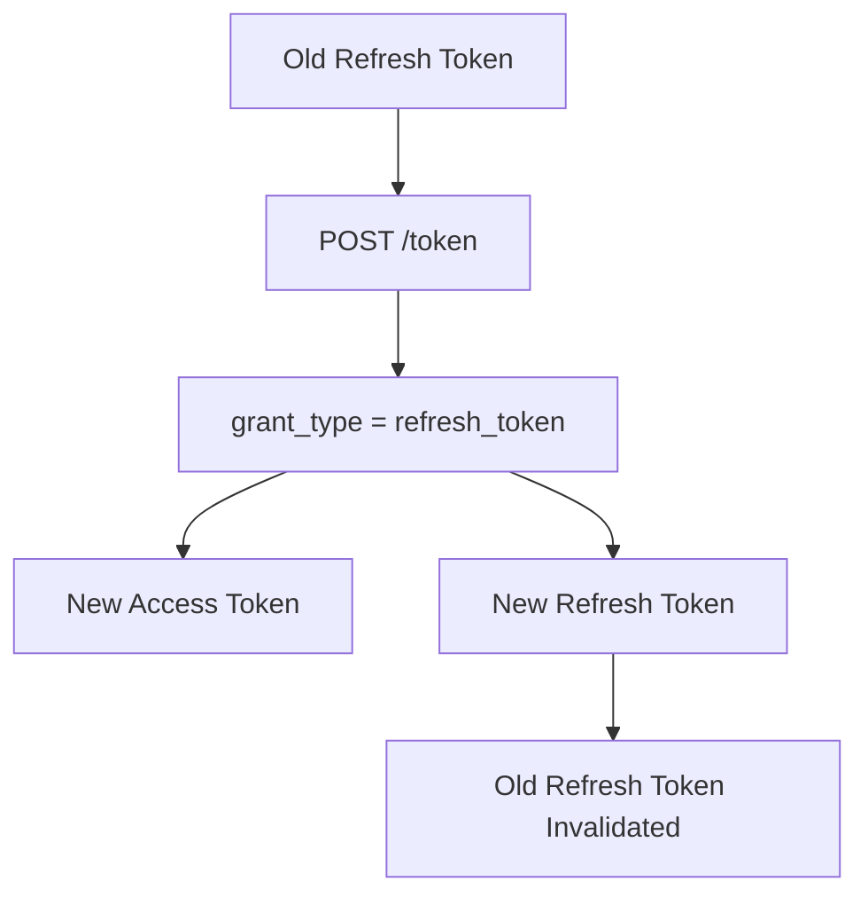

> ⚠️ **Important:** After refresh token rotation, store the newly returned refresh token. Reusing the old refresh token should fail.

### Typical Token Lifecycle

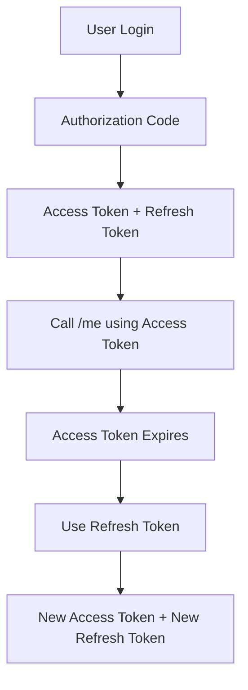

---

## 👤 UserInfo Endpoint

User identity claims can be retrieved using the UserInfo endpoint with a valid access token.

Example response:

```json
{
  "sub": "user-id",
  "name": "username",
  "preferred_username": "username",
  "email": "user@example.com",
  "email_verified": true
}
```

---

## 🔒 Token Management Endpoints

TSCloak provides standard OAuth 2.0 token management capabilities through the underlying OIDC provider.

### 🚫 Token Revocation Endpoint

The Token Revocation endpoint allows a client to explicitly invalidate an issued token.

```text
POST /token/revocation
```

Typical use cases include:

- User logout
- Revoking a refresh token
- Revoking compromised credentials
- Preventing future access token renewal

Example request:

```http
POST /token/revocation
Content-Type: application/x-www-form-urlencoded
```

```text
token=REFRESH_TOKEN
&token_type_hint=refresh_token
&client_id=YOUR_CLIENT_ID
```

A successful revocation request returns:

```text
HTTP 200 OK
```

After revocation, attempting to use the revoked refresh token to obtain new access tokens should fail.

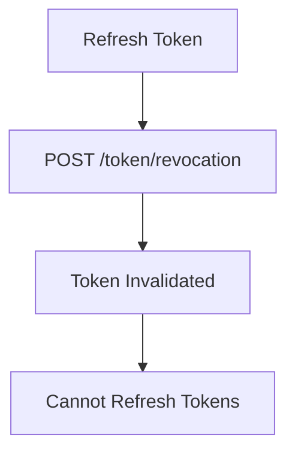

---

### 🔍 Token Introspection Endpoint

The Token Introspection endpoint allows a resource server to query TSCloak and determine whether a token is currently active.

```text
POST /token/introspection
```

A resource API can submit a token to the endpoint:

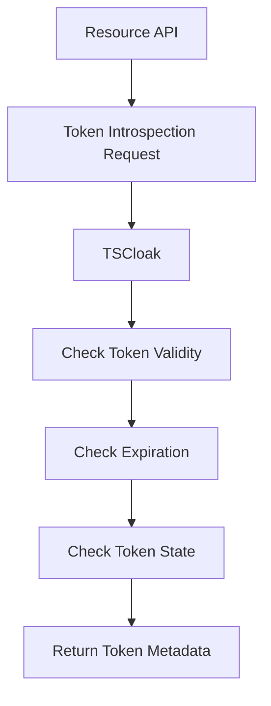

Example response for an active token:

```json
{
  "active": true,
  "scope": "openid profile email",
  "client_id": "YOUR_CLIENT_ID",
  "token_type": "Bearer",
  "sub": "USER_ID",
  "iss": "http://localhost:3000"
}
```

An inactive, expired, or invalid token returns:

```json
{
  "active": false
}
```

### Token Management Summary

| Endpoint | Purpose | Primary Consumer |
|---|---|---|
| `/token` | Issue and refresh tokens | OAuth client |
| `/token/revocation` | Explicitly invalidate a token | OAuth client |
| `/token/introspection` | Check token status and metadata | Resource server/API |
| `/me` | Retrieve authenticated user claims | Client application |

---

## ⚡ Dynamic Client Resolution

Clients are resolved dynamically when an authorization request is processed.

TSCloak does **not preload all clients during application startup**.

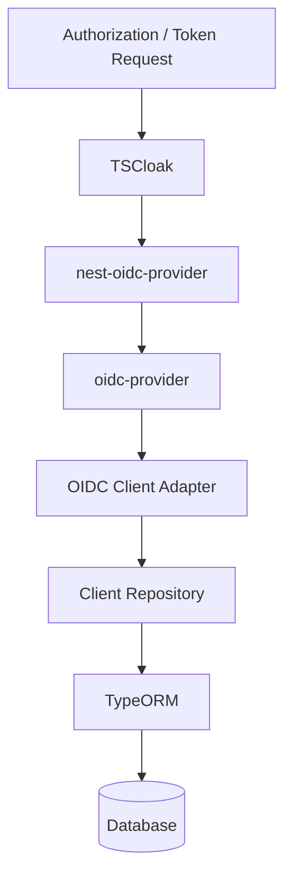

This approach allows client configuration to be managed independently of the OIDC provider lifecycle.

---

## 📝 Dynamic Client Registration

TSCloak supports **OpenID Connect Dynamic Client Registration**, allowing OAuth/OIDC clients to register at runtime instead of requiring every client to be created manually.

The registration endpoint is advertised through the OpenID Connect Discovery document:

```text
GET /.well-known/openid-configuration
```

Example discovery metadata:

```json
{
  "registration_endpoint": "http://localhost:3000/reg"
}
```

### Current Support

| Method | Endpoint | Status |
|---|---|---|
| `POST` | `/reg` | ✅ Implemented |
| `GET` | `/reg/:client_id` | ⏳ Planned |
| `PUT` | `/reg/:client_id` | ⏳ Planned |
| `DELETE` | `/reg/:client_id` | ⏳ Planned |

### Register a Client

```http
POST /reg
Content-Type: application/json
```

Example request:

```json
{
  "client_name": "Test Dynamic Client",
  "redirect_uris": ["http://localhost:4200/callback"],
  "scope": "openid profile email offline_access",
  "grant_types": ["authorization_code", "refresh_token"],
  "response_types": ["code"],
  "token_endpoint_auth_method": "none",
  "interaction_mode": "EXTERNAL",
  "interaction_login_url": "http://localhost:4200/login",
  "interaction_consent_url": "http://localhost:4200/consent"
}
```

Using `curl`:

```bash
curl -X POST http://localhost:3000/reg \
  -H "Content-Type: application/json" \
  -d '{
    "client_name": "Test Dynamic Client",
    "redirect_uris": ["http://localhost:4200/callback"],
    "scope": "openid profile email offline_access",
    "grant_types": ["authorization_code", "refresh_token"],
    "response_types": ["code"],
    "token_endpoint_auth_method": "none",
    "interaction_mode": "EXTERNAL",
    "interaction_login_url": "http://localhost:4200/login",
    "interaction_consent_url": "http://localhost:4200/consent"
  }'
```

### Example Response

A successful registration returns dynamically generated client metadata:

```json
{
  "application_type": "web",
  "grant_types": ["authorization_code", "refresh_token"],
  "id_token_signed_response_alg": "RS256",
  "require_auth_time": false,
  "response_types": ["code"],
  "subject_type": "public",
  "token_endpoint_auth_method": "none",
  "post_logout_redirect_uris": [],
  "require_pushed_authorization_requests": false,
  "dpop_bound_access_tokens": false,
  "client_id_issued_at": 1788109603,
  "client_id": "generated-client-id",
  "client_name": "Test Dynamic Client",
  "redirect_uris": ["http://localhost:4200/callback"],
  "registration_client_uri": "http://localhost:3000/reg/generated-client-id",
  "registration_access_token": "generated-registration-access-token"
}
```

### Registration Metadata Mapping

TSCloak maps standard Dynamic Client Registration metadata to its internal client model:

| Registration Metadata | Internal Client Property |
|---|---|
| `client_id` | `clientId` |
| `client_secret` | `clientSecret` |
| `client_name` | `name` |
| `redirect_uris` | `redirectUris` |
| `scope` | `allowedScopes` |
| `grant_types` | `grantTypes` |
| `response_types` | `responseTypes` |
| `token_endpoint_auth_method` | `tokenEndpointAuthMethod` |
| `interaction_mode` | `interactionMode` |
| `interaction_login_url` | `interactionLoginUrl` |
| `interaction_consent_url` | `interactionConsentUrl` |

### Interaction UI Registration Metadata

Dynamic clients can choose the built-in hosted UI or configure external interaction URLs.

| Registration Metadata | Description |
|---|---|
| `interaction_mode` | `HOSTED` or `EXTERNAL` |
| `interaction_login_url` | External Login UI URL |
| `interaction_consent_url` | External Consent UI URL |

When an external URL is not configured for a specific interaction type, TSCloak falls back to the corresponding Hosted UI.

The standard registration `scope` value is converted internally from:

```text
openid profile email offline_access
```

to:

```text
allowedScopes = [
  "openid",
  "profile",
  "email",
  "offline_access"
]
```

### Using a Dynamically Registered Client

After registration, the returned `client_id` can be used like any other configured OAuth/OIDC client.

```text
http://localhost:3000/auth?
client_id=YOUR_DYNAMIC_CLIENT_ID
&redirect_uri=http://localhost:4200/callback
&response_type=code
&scope=openid profile email offline_access
&code_challenge=CODE_CHALLENGE
&code_challenge_method=S256
```

For public clients using:

```json
{
  "token_endpoint_auth_method": "none"
}
```

PKCE should be used with the Authorization Code Flow.

### Persistence Architecture

Dynamically registered clients are persisted through TSCloak's client repository infrastructure. The registration protocol is handled by `oidc-provider`, hosted through `nest-oidc-provider`, while the custom OIDC Client Adapter connects provider persistence to the application database.

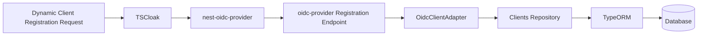

## 🛡️ Security Policy Management

Security-sensitive runtime settings are managed as application data rather than being scattered as constants across the OIDC configuration. The security policy is persisted in the database and exposed through an administrative API.

Current policy management endpoint:

- `GET /api/admin/security-policy` — retrieve the active policy
- `PUT /api/admin/security-policy` — update the active policy

This creates a single source of truth for settings that affect authorization-server behavior.

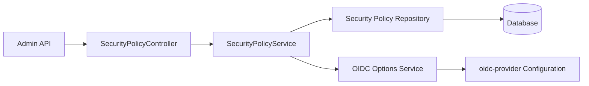

## 🔑 Signing Keys and JWKS

TSCloak manages signing keys as a dedicated application concern. RSA key material is persisted and made available to the OIDC provider for token signing. Public key information is exposed through the provider's standard JWKS discovery surface, allowing relying parties to validate issued tokens.

The intended separation is:

- **Signing Keys module** owns key lifecycle and persistence.
- **OIDC configuration** consumes the active signing key material.
- **JWKS** exposes public key information required by clients and resource servers.
- Private key material remains an internal server concern and is never exposed by JWKS.

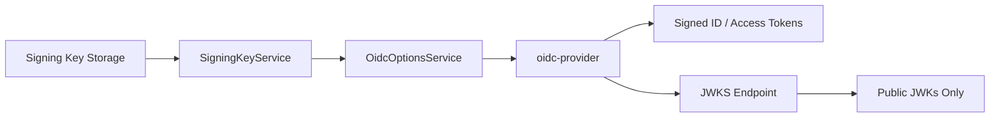

## 💾 Persistent OIDC Storage

OIDC runtime objects are persisted in the database rather than memory.

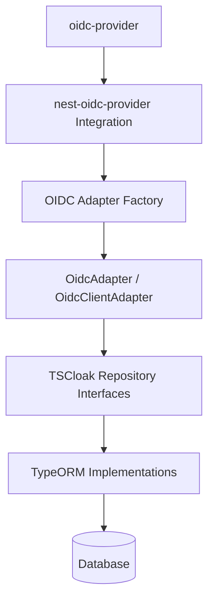

This enables OIDC state to survive application restarts.

### Persisted Runtime Objects

The persistence layer supports OIDC models such as:

- AuthorizationCode
- AccessToken
- RefreshToken
- Session
- Grant
- DeviceCode
- BackchannelAuthenticationRequest

---

## 🗄️ Storage Architecture

The OIDC adapter is isolated from database-specific implementations.

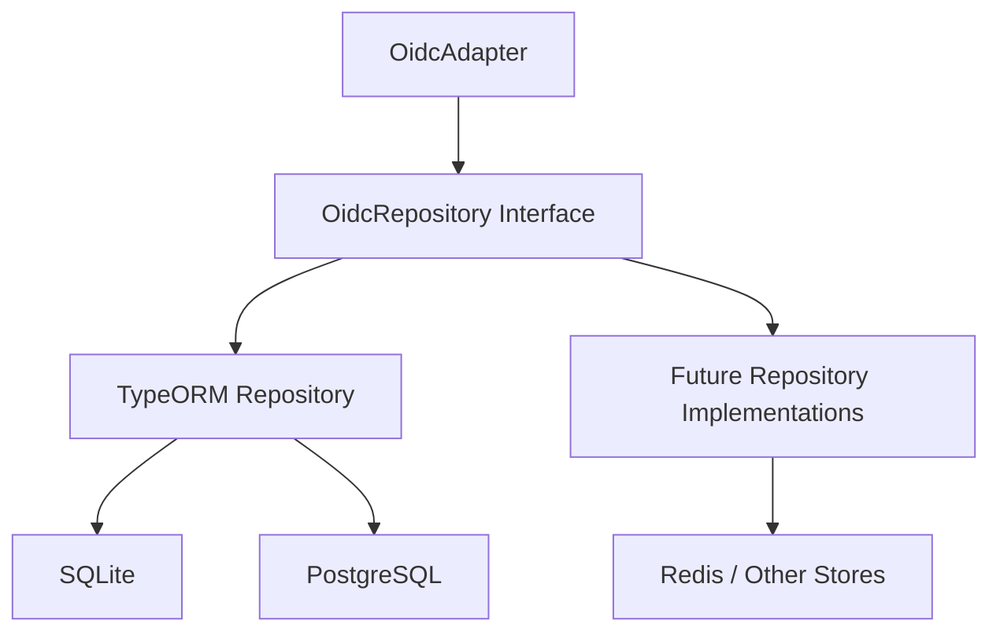

This allows persistence implementations to evolve without changing OIDC protocol integration.

---

## 🗃️ OIDC Storage Model

OIDC runtime records are stored in a common persistence model.

| Column | Description |
|---|---|
| `id` | OIDC record identifier |
| `model` | OIDC model type |
| `payload` | Serialized OIDC payload |
| `expiresAt` | Record expiration timestamp |
| `grantId` | Associated grant identifier |
| `uid` | OIDC UID lookup identifier |
| `userCode` | Device flow user code |
| `createdAt` | Record creation timestamp |
| `updatedAt` | Record update timestamp |

---

## ⏳ Expiration Handling

OIDC runtime objects have different lifetimes. Lifetime values are governed by the active security policy, while persistence cleanup handles records whose configured expiration has passed. TSCloak uses two complementary cleanup strategies.

### 1. Lazy Cleanup

When a record is read:

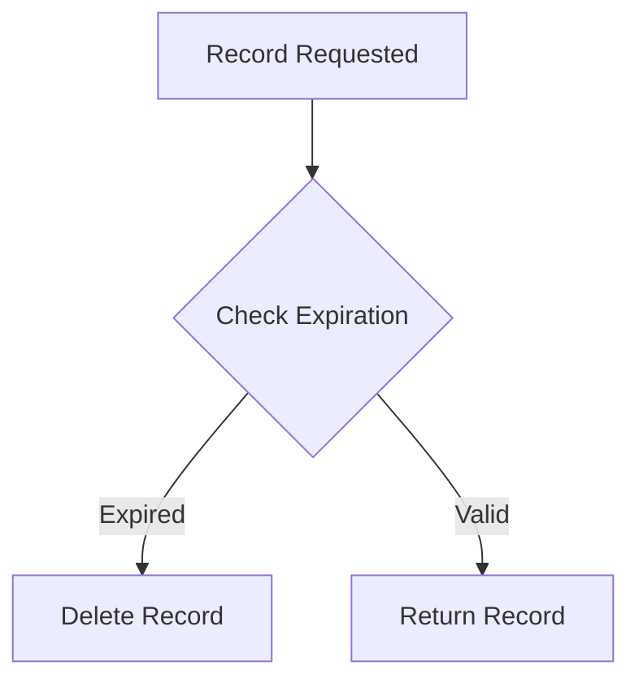

Expired records are removed when encountered.

### 2. Background Cleanup

A scheduled background job periodically removes expired records.

```mermaid
flowchart TD
    A["OIDC Cleanup Service"] --> B["Scheduled Job"]
    B --> C["Find Expired Records"]
    C --> D["Delete Records"]
```

An index on `expiresAt` improves cleanup query performance.

---

## 🧪 Example Authorization Request

```text
http://localhost:3000/auth?
client_id=YOUR_CLIENT_ID
&redirect_uri=http://localhost:4200/callback
&response_type=code
&scope=openid profile email offline_access
&prompt=consent
&state=test123
&code_challenge=CODE_CHALLENGE
&code_challenge_method=S256
```

---

## 🔄 Example Token Request

```http
POST /token
Content-Type: application/x-www-form-urlencoded
```

Request body:

```text
grant_type=authorization_code
&code=AUTHORIZATION_CODE
&redirect_uri=http://localhost:4200/callback
&client_id=YOUR_CLIENT_ID
&code_verifier=CODE_VERIFIER
```

---

## 🎯 Design Principles

TSCloak is designed around the following principles:

- **Separation of concerns** — Protocol, identity, clients, and persistence remain independent.
- **Repository abstraction** — Infrastructure is isolated behind application-level contracts.
- **Storage independence** — Persistence implementations can evolve without changing OIDC integration.
- **Dynamic resolution** — Clients are resolved when needed rather than eagerly loaded.
- **Persistent state** — OIDC runtime state survives application restarts.
- **Modular architecture** — NestJS modules represent distinct responsibilities.
- **Protocol isolation** — OAuth/OIDC protocol implementation is delegated to a dedicated provider engine.

---

## 🗺️ Roadmap

### Implemented

- [x] NestJS application structure
- [x] Client management
- [x] User identity management
- [x] Authorization Code Flow
- [x] PKCE
- [x] Access Tokens
- [x] ID Tokens
- [x] Refresh Tokens
- [x] Refresh Token Rotation
- [x] Offline Access
- [x] Hosted Consent UI
- [x] Persisted User Consent (OIDC Grants)
- [x] Consent Reuse
- [x] Hosted Login UI
- [x] Hosted Consent UI
- [x] External Login UI support
- [x] External Consent UI support
- [x] Prompt-aware Custom Login / Consent flow
- [x] UserInfo endpoint
- [x] Dynamic client resolution
- [x] Database-backed OIDC persistence
- [x] OIDC state survives application restart
- [x] Lazy expiration cleanup
- [x] Background expiration cleanup
- [x] Token Revocation Endpoint (RFC 7009)
- [x] Token Introspection Endpoint (RFC 7662)
- [x] Dynamic Client Registration (`POST /reg`)
- [x] Database-backed security policy management
- [x] OIDC token lifetime configuration
- [x] RSA signing key management and JWKS support

### Planned

- [ ] Client Credentials Flow
- [ ] Dynamic Client Registration Management (`GET` / `PUT` / `DELETE`)
- [ ] PostgreSQL support
- [ ] Distributed cache for policy and configuration reads
- [ ] Horizontal scaling
- [ ] Admin API
- [ ] Audit logging

---

## 🤝 Contributing

Contributions, ideas, and architectural discussions are welcome.

Please open an issue or submit a pull request.

---

## 📄 License

This project is licensed under the **MIT License**.

---

<div align="center">

Built with ❤️ using NestJS, TypeScript, and OpenID Connect

</div>

