<div align="center">

> **Implementation note:** TSCloak does not reimplement the OAuth 2.0 or OpenID Connect protocol stack. It uses `nest-oidc-provider`, which integrates the underlying `oidc-provider` library into the NestJS application architecture.

# 🛡️ TSCloak

<a id="a-modular-openid-connect-oauth-20-authorization-server-built-with-nestjs"></a>
### A modular OpenID Connect & OAuth 2.0 Authorization Server built with NestJS

[](https://nestjs.com/)
[](https://www.typescriptlang.org/)
[](https://openid.net/connect/)
[](https://oauth.net/2/)
[](https://typeorm.io/)
[](#license)

**Protocol-driven. Modular. Persistent. Extensible.**

</div>

---

<a id="overview"></a>
## 📖 Overview

**TSCloak** is a modular OpenID Connect (OIDC) and OAuth 2.0 Authorization Server built with **NestJS** and **TypeScript**.

It uses [`oidc-provider`](https://github.com/panva/node-oidc-provider) for standards-compliant OAuth 2.0 and OpenID Connect protocol handling while keeping application concerns such as identity, client management, persistence, and infrastructure cleanly separated.

The goal is to provide a maintainable architecture for building an authorization server without tightly coupling business logic to protocol or database implementations.

<a id="highlights"></a>
### ✨ Highlights

- 🔐 OAuth 2.0 Authorization Code Flow
- 🪪 OpenID Connect support
- 🔑 PKCE
- 🎫 Access Tokens and ID Tokens
- ♻️ Refresh Tokens with rotation
- 📴 Offline access
- 👤 UserInfo endpoint
- ⚡ Dynamic client resolution
- 📝 Dynamic Client Registration (RFC 7591)
- 💾 Persistent OIDC runtime state
- 🔄 State survives application restarts
- 🧹 Automatic expiration cleanup
- 🚫 Token Revocation Endpoint (RFC 7009)
- 🔍 Token Introspection Endpoint (RFC 7662)
- 🗄️ Repository-based persistence abstraction
- 🛡️ Database-backed security policy management
- ⏱️ Configurable OIDC token lifetimes from security policy
- 🔑 RSA signing key management and JWKS publication

---

## 🧭 Navigation

This README is organized from project fundamentals through OIDC capabilities, management features, persistence, examples, and project information.

  - [Responsibility Layers](#responsibility-layers)
- [🧩 Technology Stack](#technology-stack)
- [📁 Project Structure](#project-structure)
  - [Module Responsibilities](#module-responsibilities)
- [🚀 Getting Started](#getting-started)
  - [Prerequisites](#prerequisites)
  - [Installation](#installation)
  - [Run in Development](#run-in-development)
  - [Build](#build)
  - [Run in Production](#run-in-production)
- [🔐 Authentication Flow](#authentication-flow)
  - [Token Response](#token-response)
- [🖥️ Login Experience](#login-experience)
- [🤝 Consent Experience](#consent-experience)
  - [Hosted Consent Endpoint](#hosted-consent-endpoint)
  - [Standard Scope Descriptions](#standard-scope-descriptions)
  - [Consent Persistence](#consent-persistence)
  - [`prompt=consent`](#promptconsent)
  - [Incremental Consent](#incremental-consent)
  - [`offline_access` and Refresh Tokens](#offlineaccess-and-refresh-tokens)
- [🖥️ Interaction UI Customization](#interaction-ui-customization)
  - [Interaction Endpoints](#interaction-endpoints)
  - [Hosted UI Flow](#hosted-ui-flow)
  - [Custom Interaction UI Flow](#custom-interaction-ui-flow)
  - [Interaction URL Configuration](#interaction-url-configuration)
  - [External Interaction Redirect](#external-interaction-redirect)
  - [`interaction_uid`](#interactionuid)
  - [Prompt-Aware Custom UI](#prompt-aware-custom-ui)
- [🎯 Supported Scopes](#supported-scopes)
- [🎫 Token Types](#token-types)
  - [Access Token](#access-token)
  - [ID Token](#id-token)
  - [Refresh Token](#refresh-token)
- [⏱️ OIDC Token Lifetimes](#oidc-token-lifetimes)
- [🔑 Using Access Tokens](#using-access-tokens)
  - [Get Current User Details](#get-current-user-details)
- [♻️ Refreshing an Access Token](#refreshing-an-access-token)
  - [Refresh Token Request](#refresh-token-request)
  - [Refresh Token Rotation](#refresh-token-rotation)
  - [Typical Token Lifecycle](#typical-token-lifecycle)
- [👤 UserInfo Endpoint](#userinfo-endpoint)
  - [Endpoint](#endpoint)
  - [How It Fits Into the OIDC Flow](#how-it-fits-into-the-oidc-flow)
  - [Calling the Endpoint](#calling-the-endpoint)
  - [How TSCloak Resolves UserInfo Claims](#how-tscloak-resolves-userinfo-claims)
  - [Scopes and Claims](#scopes-and-claims)
  - [Example Response](#example-response)
  - [ID Token vs UserInfo Endpoint](#id-token-vs-userinfo-endpoint)
  - [Endpoint Discovery](#endpoint-discovery)
  - [Error Handling](#error-handling)
- [🔒 Token Management Endpoints](#token-management-endpoints)
  - [🚫 Token Revocation Endpoint](#token-revocation-endpoint)
  - [🔍 Token Introspection Endpoint](#token-introspection-endpoint)
  - [Token Management Summary](#token-management-summary)
- [⚡ Dynamic Client Resolution](#dynamic-client-resolution)
- [📝 Dynamic Client Registration](#dynamic-client-registration)
  - [Current Support](#current-support)
  - [Register a Client](#register-a-client)
  - [Example Response](#example-response-1)
  - [Registration Metadata Mapping](#registration-metadata-mapping)
  - [Interaction UI Registration Metadata](#interaction-ui-registration-metadata)
  - [Using a Dynamically Registered Client](#using-a-dynamically-registered-client)
  - [Persistence Architecture](#persistence-architecture)
- [🛡️ Security Policy Management](#security-policy-management)
  - [What the Security Policy Controls](#what-the-security-policy-controls)
  - [Security Policy Data Model](#security-policy-data-model)
  - [Default Policy Creation](#default-policy-creation)
  - [Administrative API](#administrative-api)
  - [Management Architecture](#management-architecture)
  - [Reading the Policy](#reading-the-policy)
  - [Updating the Policy](#updating-the-policy)
  - [Relationship with OIDC Configuration](#relationship-with-oidc-configuration)
  - [OIDC Token Lifetime Mapping](#oidc-token-lifetime-mapping)
  - [Why the Values Are Not Hardcoded](#why-the-values-are-not-hardcoded)
  - [Runtime Configuration Considerations](#runtime-configuration-considerations)
  - [Policy Changes and Existing Tokens](#policy-changes-and-existing-tokens)
  - [Refresh Token Controls](#refresh-token-controls)
  - [Persistence and Scaling](#persistence-and-scaling)
  - [Security Considerations](#security-considerations)
  - [Current Scope](#current-scope)
- [🔑 Signing Keys and JWKS](#signing-keys-and-jwks)
  - [Why Signing Keys Are Required](#why-signing-keys-are-required)
  - [Signing Key Management](#signing-key-management)
  - [How Keys Are Used During Token Issuance](#how-keys-are-used-during-token-issuance)
  - [JWKS Endpoint](#jwks-endpoint)
  - [JWKS Response](#jwks-response)
  - [Token Verification Flow](#token-verification-flow)
  - [Discovery Integration](#discovery-integration)
  - [Key Identifiers (`kid`)](#key-identifiers-kid)
  - [Key Rotation](#key-rotation)
  - [Private Key Protection](#private-key-protection)
  - [Relationship to Token Management](#relationship-to-token-management)
- [💾 Persistent OIDC Storage](#persistent-oidc-storage)
  - [Persisted Runtime Objects](#persisted-runtime-objects)
- [🗄️ Storage Architecture](#storage-architecture)
- [🗃️ OIDC Storage Model](#oidc-storage-model)
- [⏳ Expiration Handling](#expiration-handling)
  - [1. Lazy Cleanup](#1-lazy-cleanup)
  - [2. Background Cleanup](#2-background-cleanup)
- [🧪 Example Authorization Request](#example-authorization-request)
- [🔄 Example Token Request](#example-token-request)
- [🎯 Design Principles](#design-principles)
- [🗺️ Roadmap](#roadmap)
  - [Implemented](#implemented)
  - [Planned](#planned)
- [🤝 Contributing](#contributing)
- [📄 License](#license)

## 🏗️ Architecture

TSCloak is a NestJS-based Identity Provider that uses `nest-oidc-provider` as the NestJS integration layer for the underlying `oidc-provider` OAuth 2.0 and OpenID Connect implementation.

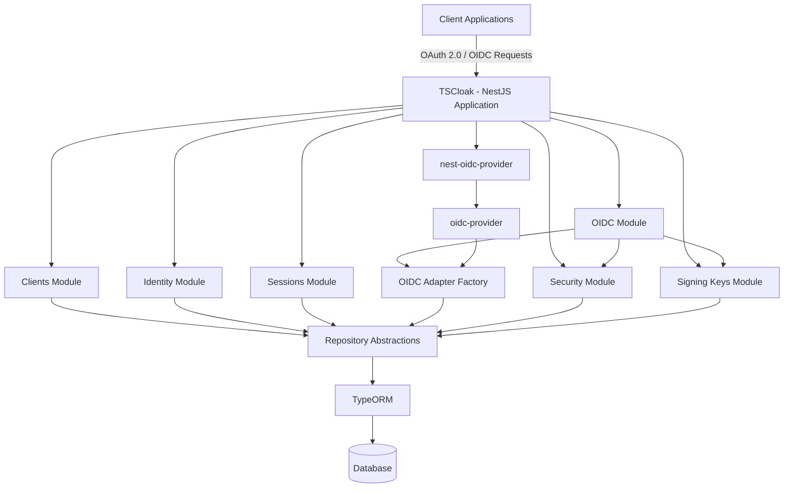

<a id="responsibility-layers"></a>
### Responsibility Layers

| Layer | Responsibility |
|---|---|
| **TSCloak** | Application architecture, NestJS modules, account management, client management, hosted/custom interaction UI, persistence integration |
| **nest-oidc-provider** | NestJS integration layer for configuring and hosting the OIDC provider |
| **oidc-provider** | Core OAuth 2.0 and OpenID Connect protocol implementation |
| **OIDC Adapters** | Connect `oidc-provider` models and persistence requirements to TSCloak repositories |
| **Security** | Central security policy and token lifetime configuration |
| **Signing Keys** | RSA key lifecycle and key material used to sign tokens |
| **Repository Abstractions** | Decouple application and OIDC persistence from the underlying database |
| **TypeORM** | Database persistence implementation |

<a id="technology-stack"></a>
## 🧩 Technology Stack

| Technology | Purpose |
|---|---|
| **NestJS** | Application framework |
| **TypeScript** | Programming language |
| **oidc-provider** | OAuth 2.0 & OpenID Connect protocol engine |
| **nest-oidc-provider** | NestJS integration |
| **TypeORM** | Persistence abstraction |
| **SQLite** | Current database implementation |
| **better-sqlite3** | SQLite driver |

---

<a id="project-structure"></a>
## 📁 Project Structure

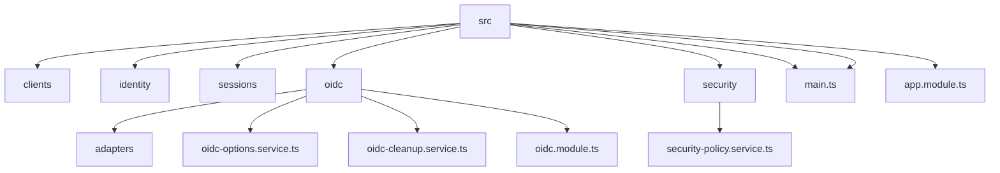

<a id="module-responsibilities"></a>
### Module Responsibilities

| Module | Responsibility |
|---|---|
| **Clients** | Client registration and lookup |
| **Identity** | User identity and account claims |
| **Sessions** | Application session management |
| **OIDC** | Protocol configuration, adapters, and OIDC integration |
| **Security** | Security policy administration and runtime policy access |
| **Signing Keys** | Signing key persistence and key management |

---

<a id="getting-started"></a>
## 🚀 Getting Started

<a id="prerequisites"></a>
### Prerequisites

- Node.js
- npm
- Git

<a id="installation"></a>
### Installation

```bash
git clone <repository-url>
cd TSCloak
npm install
```

<a id="run-in-development"></a>
### Run in Development

```bash
npm run start:dev
```

<a id="build"></a>
### Build

```bash
npm run build
```

<a id="run-in-production"></a>
### Run in Production

```bash
npm run start:prod
```

---

<a id="authentication-flow"></a>
## 🔐 Authentication Flow

TSCloak currently supports the **Authorization Code Flow with PKCE**.

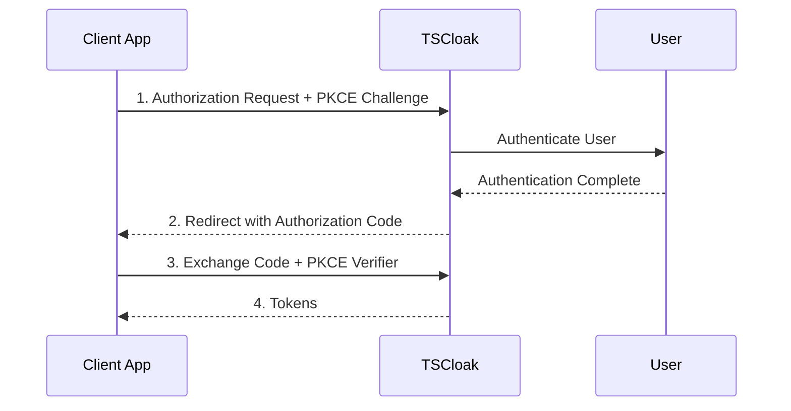

<a id="token-response"></a>
### Token Response

```json
{
  "access_token": "...",
  "id_token": "...",
  "refresh_token": "...",
  "expires_in": 3600,
  "scope": "openid profile email offline_access",
  "token_type": "Bearer"
}
```

---

<a id="login-experience"></a>
## 🖥️ Login Experience

TSCloak provides an authentication interaction page for users to securely sign in before authorization is completed.

<div align="center">


*TSCloak authentication interaction page*

</div>

---

<a id="consent-experience"></a>
## 🤝 Consent Experience

TSCloak supports a hosted consent page and can also be integrated with a client-provided custom interaction UI.

During authorization, TSCloak evaluates the authenticated user session, the existing Grant, and the requested scopes. A consent interaction is shown when user approval is required.

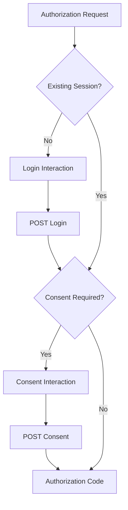

<div align="center">


*TSCloak consent interaction page*

</div>

<a id="hosted-consent-endpoint"></a>
### Hosted Consent Endpoint

The hosted consent UI submits the user's decision to:

```text
POST /interaction/:uid/consent
```

The consent decision values must be:

| User Action | Value |
|---|---|
| Allow | `accept` |
| Deny | `reject` |

Example hosted form:

```html
<form method="POST" action="/interaction/{{UID}}/consent">
  <button type="submit" name="decision" value="reject">Deny</button>
  <button type="submit" name="decision" value="accept">Allow</button>
</form>
```

> `accept` and `reject` are the values expected by the interaction controller.

<a id="standard-scope-descriptions"></a>
### Standard Scope Descriptions

The hosted consent UI displays human-readable descriptions for standard scopes.

| Scope | Description |
|---|---|
| `openid` | Authenticate you and verify your identity |
| `profile` | Access your basic profile information, such as your name and profile details |
| `email` | Access your email address and email verification status |
| `offline_access` | Maintain access when you are not actively using the application and allow refresh token usage |

<a id="consent-persistence"></a>
### Consent Persistence

When a user approves a client, TSCloak persists an OIDC `Grant` containing the approved scopes. The session is associated with that Grant so subsequent authorization requests can reuse the existing consent.

Example Grant:

```json
{
  "accountId": "USER_ID",
  "clientId": "CLIENT_ID",
  "openid": {
    "scope": "openid profile email"
  }
}
```

<a id="promptconsent"></a>
### `prompt=consent`

Clients can explicitly force the consent screen by including:

```text
prompt=consent
```

Even when a valid session and existing Grant are present, this requests a new consent interaction.

<a id="incremental-consent"></a>
### Incremental Consent

For normal scopes, when a client requests permissions that have not yet been approved, TSCloak can present the consent interaction again so the user can approve the additional permissions.

For example:

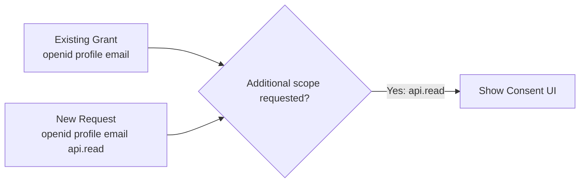

<a id="offlineaccess-and-refresh-tokens"></a>
### `offline_access` and Refresh Tokens

`offline_access` is a special OpenID Connect scope used to request refresh-token capability.

A client requesting refresh tokens should explicitly request user consent:

```text
scope=openid profile email offline_access
&prompt=consent
```

Without explicit consent, the underlying OIDC provider may exclude `offline_access` from the effective authorization scope. As a result, `offline_access` should not be treated as a normal incremental-consent test case.

After consent is granted, the authorization request can proceed with `offline_access`, allowing the token endpoint to issue a refresh token when the client is configured for the `refresh_token` grant.

---

<a id="interaction-ui-customization"></a>
## 🖥️ Interaction UI Customization

TSCloak supports two approaches for handling OIDC interactions:

1. **Hosted Interaction UI** — TSCloak renders the Login and Consent pages.
2. **Custom Interaction UI** — Applications can provide their own Login and/or Consent experience.

This allows TSCloak to work both as a standalone Identity Provider with built-in screens and as a backend authorization server integrated with an organization's existing UI.

<a id="interaction-endpoints"></a>
### Interaction Endpoints

TSCloak separates displaying an interaction from completing it.

| Method | Endpoint | Description |
|---|---|---|
| `GET` | `/interaction/:uid` | Resolves and displays the current OIDC interaction |
| `POST` | `/interaction/:uid/login` | Completes a login interaction |
| `POST` | `/interaction/:uid/consent` | Completes a consent interaction |

The current interaction type is determined by the OIDC provider and can include `login` or `consent`.

<a id="hosted-ui-flow"></a>
### Hosted UI Flow

Hosted UI is the default behavior.

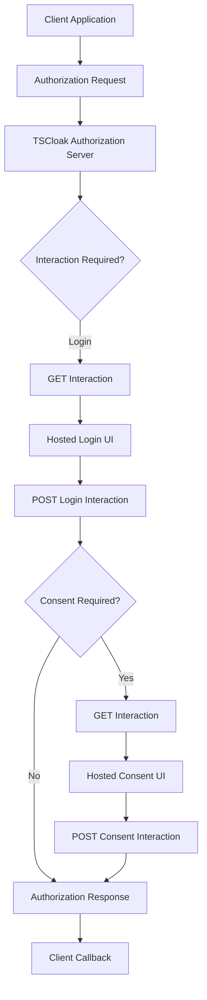

#### Hosted Login UI

When a login interaction is required and no external login UI is configured, TSCloak renders its built-in login page.

The login page submits credentials to:

```text
POST /interaction/:uid/login
```

#### Hosted Consent UI

When consent is required and no external consent UI is configured, TSCloak renders its built-in consent page.

The page displays the client application, requested scopes, human-readable scope descriptions, and Allow/Deny actions.

The consent page submits to:

```text
POST /interaction/:uid/consent
```

<a id="custom-interaction-ui-flow"></a>
### Custom Interaction UI Flow

Organizations may already have their own Login UI, branding, or consent experience. TSCloak allows Login and Consent interactions to be delegated independently to an external application.

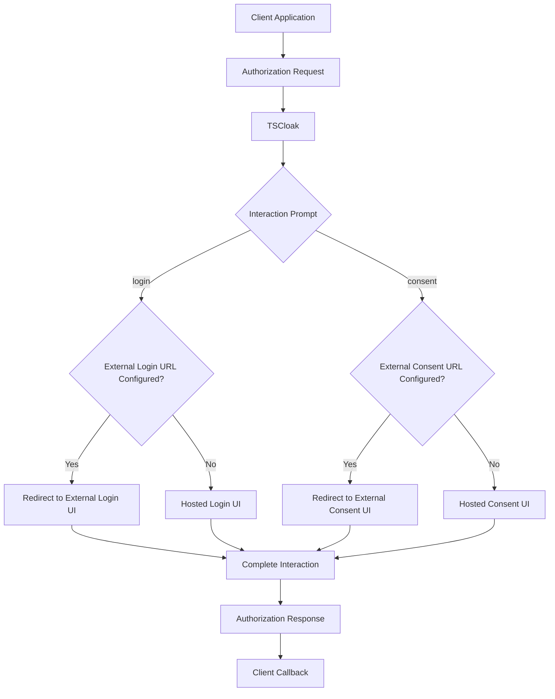

<a id="interaction-url-configuration"></a>
### Interaction URL Configuration

Each client can configure interaction mode and separate URLs for Login and Consent.

```typescript
interactionMode: 'HOSTED' | 'EXTERNAL';
interactionLoginUrl?: string;
interactionConsentUrl?: string;
```

| Configuration | Login Behavior | Consent Behavior |
|---|---|---|
| `HOSTED` | TSCloak Hosted Login UI | TSCloak Hosted Consent UI |
| `EXTERNAL` with Login URL | External Login UI | Depends on Consent URL |
| `EXTERNAL` with Consent URL | Depends on Login URL | External Consent UI |
| URL missing | Hosted fallback | Hosted fallback |

This allows Login and Consent to be customized independently while preserving a hosted fallback.

<a id="external-interaction-redirect"></a>
### External Interaction Redirect

When TSCloak delegates an interaction to an external UI, it redirects the browser with interaction information.

Example login redirect:

```text
http://localhost:4200/login?interaction_uid=<uid>&prompt=login&client_id=<client_id>
```

Example consent redirect:

```text
http://localhost:4200/consent?interaction_uid=<uid>&prompt=consent&client_id=<client_id>
```

<a id="interactionuid"></a>
### `interaction_uid`

The `interaction_uid` identifies the current OIDC interaction.

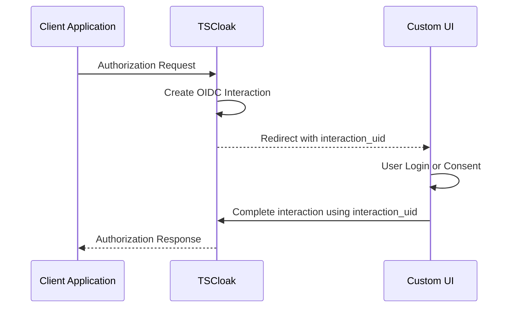

The Custom UI must preserve this value throughout the Login or Consent flow so that the interaction can be completed against the correct authorization request.

<a id="prompt-aware-custom-ui"></a>
### Prompt-Aware Custom UI

The `prompt` parameter allows a Custom UI application to determine which interaction experience should be rendered.

```text
prompt=login
```

The application should render its authentication experience.

```text
prompt=consent
```

The application should render its consent experience.

This architecture allows organizations to fully customize branding and user experience while TSCloak continues to own the OAuth 2.0 / OpenID Connect protocol flow, sessions, grants, authorization codes, and tokens.

---

<a id="supported-scopes"></a>
## 🎯 Supported Scopes

| Scope | Description |
|---|---|
| `openid` | Enables OpenID Connect |
| `profile` | Requests user profile information |
| `email` | Requests email claims |
| `offline_access` | Requests refresh token capability; requires appropriate user consent |

Example:

```text
scope=openid profile email offline_access
```

---

<a id="token-types"></a>
## 🎫 Token Types

<a id="access-token"></a>
### Access Token

Used to access protected resources.

<a id="id-token"></a>
### ID Token

Represents the authenticated user and contains OpenID Connect claims.

Example:

```json
{
  "sub": "user-id",
  "aud": "client-id",
  "iss": "http://localhost:3000"
}
```

<a id="refresh-token"></a>
### Refresh Token

Allows clients to obtain new access tokens without requiring the user to authenticate again.

TSCloak supports refresh token rotation through the underlying OIDC provider.

> ⚠️ A rotated refresh token should not be reused.

---

<a id="oidc-token-lifetimes"></a>
## ⏱️ OIDC Token Lifetimes

TSCloak keeps token lifetime policy outside of hard-coded OIDC configuration. The `OidcOptionsService` obtains the active security policy during provider configuration and supplies the configured lifetime values to `oidc-provider` through its `ttl` configuration.

The policy is intended to govern lifetimes such as:

- Access tokens
- ID tokens
- Refresh tokens
- Authorization codes and other OIDC artifacts as policy support expands

`oidc-provider` requires TTL resolution during token processing, so the values supplied to its callbacks must be immediately available. The current design therefore treats the database-backed policy as the source of truth while keeping the OIDC provider configuration compatible with its synchronous TTL contract.

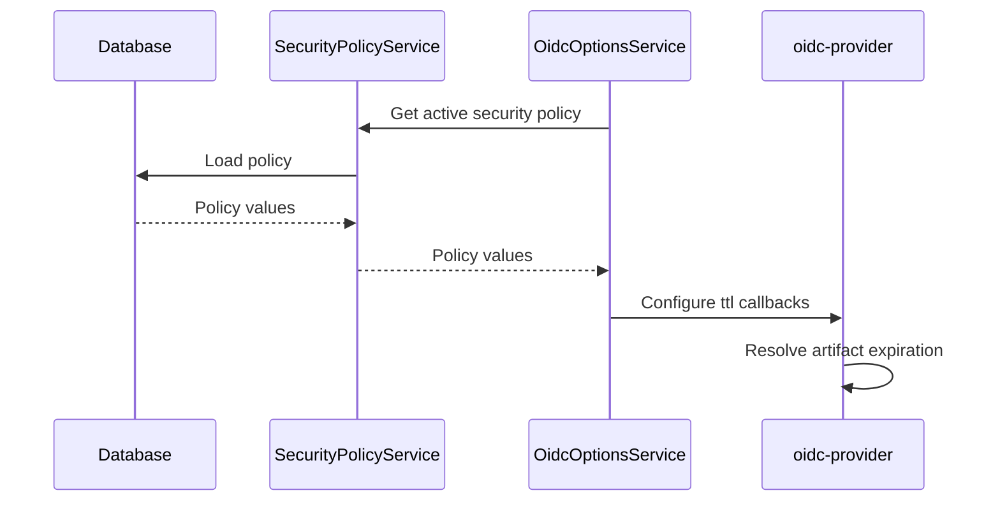

<a id="using-access-tokens"></a>
## 🔑 Using Access Tokens

After completing the authorization flow, TSCloak returns an access token:

```json
{
  "access_token": "ACCESS_TOKEN",
  "expires_in": 3600,
  "id_token": "ID_TOKEN",
  "refresh_token": "REFRESH_TOKEN",
  "scope": "openid profile email offline_access",
  "token_type": "Bearer"
}
```

Use the access token as a **Bearer token** when calling the UserInfo (`/me`) endpoint.

<a id="get-current-user-details"></a>
### Get Current User Details

```http
GET /me
Authorization: Bearer ACCESS_TOKEN
```

Using `curl`:

```bash
curl http://localhost:3000/me \
  -H "Authorization: Bearer ACCESS_TOKEN"
```

Example response:

```json
{
  "sub": "0804b05f-960c-46ac-b0c2-a8d6313b5143",
  "name": "siva",
  "preferred_username": "siva",
  "email": "siva@example.com",
  "email_verified": true
}
```

The `/me` endpoint validates the access token and returns identity claims based on the scopes granted to the client.

---

<a id="refreshing-an-access-token"></a>
## ♻️ Refreshing an Access Token

When the access token expires, use the refresh token to obtain a new token set without requiring the user to sign in again.

A refresh token is issued when the authorization request includes `offline_access`, the client is configured to allow the `refresh_token` grant, and the required user consent is obtained.

For a standard authorization request, explicitly request consent:

```text
scope=openid profile email offline_access
&prompt=consent
```

`offline_access` is a special OIDC scope. Without explicit consent, the underlying OIDC provider may exclude it from the effective authorization scope, resulting in no refresh token being issued.

<a id="refresh-token-request"></a>
### Refresh Token Request

```http
POST /token
Content-Type: application/x-www-form-urlencoded
```

Request body:

```text
grant_type=refresh_token
&refresh_token=REFRESH_TOKEN
&client_id=YOUR_CLIENT_ID
```

Using `curl`:

```bash
curl -X POST http://localhost:3000/token \
  -H "Content-Type: application/x-www-form-urlencoded" \
  -d "grant_type=refresh_token" \
  -d "refresh_token=REFRESH_TOKEN" \
  -d "client_id=YOUR_CLIENT_ID"
```

Example response:

```json
{
  "access_token": "NEW_ACCESS_TOKEN",
  "expires_in": 3600,
  "id_token": "NEW_ID_TOKEN",
  "refresh_token": "NEW_REFRESH_TOKEN",
  "scope": "openid profile email offline_access",
  "token_type": "Bearer"
}
```

<a id="refresh-token-rotation"></a>
### Refresh Token Rotation

TSCloak supports refresh token rotation through `oidc-provider`.

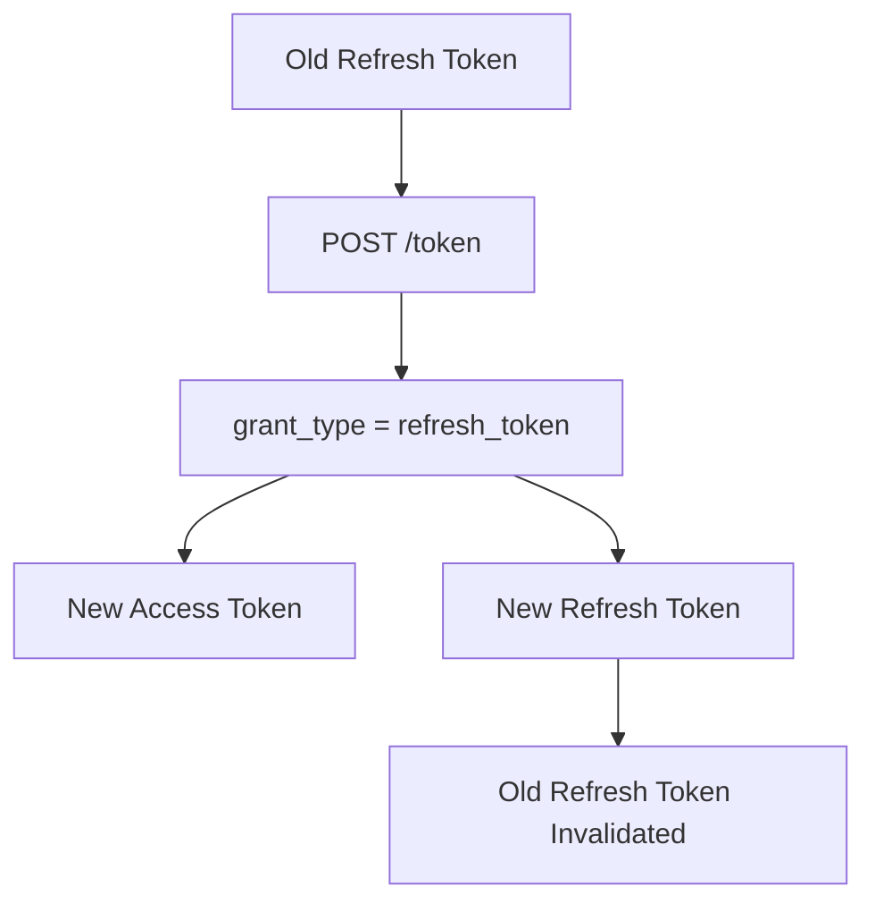

> ⚠️ **Important:** After refresh token rotation, store the newly returned refresh token. Reusing the old refresh token should fail.

<a id="typical-token-lifecycle"></a>
### Typical Token Lifecycle

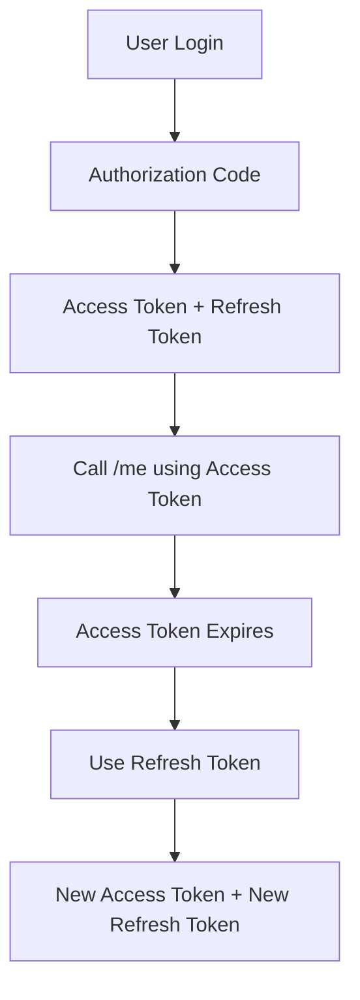

---

<a id="userinfo-endpoint"></a>
## 👤 UserInfo Endpoint

The **UserInfo Endpoint** is a standard OpenID Connect endpoint that allows a client application to retrieve claims about the authenticated end user.

After a client completes authentication and receives an Access Token, it can call the UserInfo Endpoint to obtain identity and profile information for the user represented by that token. This keeps authentication separate from profile retrieval and allows claims to be returned according to the scopes granted during authorization.

<a id="endpoint"></a>
### Endpoint

TSCloak currently exposes the UserInfo Endpoint at:

```text
GET http://localhost:3000/me
```

The endpoint is advertised through the OpenID Connect Discovery document:

```json
{
  "userinfo_endpoint": "http://localhost:3000/me"
}
```

Clients should preferably obtain this URL from the provider's Discovery metadata instead of hardcoding `/me`.

<a id="how-it-fits-into-the-oidc-flow"></a>
### How It Fits Into the OIDC Flow

The UserInfo Endpoint is typically called after the client exchanges an Authorization Code for tokens.

```text
┌──────────┐                                  ┌──────────┐
│  Client  │                                  │ TSCloak  │
└────┬─────┘                                  └────┬─────┘
     │                                             │
     │ 1. Authorization Request                     │
     │────────────────────────────────────────────>│
     │                                             │
     │ 2. Authorization Code                        │
     │<────────────────────────────────────────────│
     │                                             │
     │ 3. Exchange Code for Tokens                  │
     │────────────────────────────────────────────>│
     │                                             │
     │ 4. Access Token + ID Token                   │
     │<────────────────────────────────────────────│
     │                                             │
     │ 5. GET /me                                  │
     │    Authorization: Bearer <access_token>      │
     │────────────────────────────────────────────>│
     │                                             │
     │ 6. User Claims                               │
     │<────────────────────────────────────────────│
     │                                             │
```

<a id="calling-the-endpoint"></a>
### Calling the Endpoint

The endpoint requires a valid OAuth 2.0 Bearer Access Token.

```http
GET /me HTTP/1.1
Host: localhost:3000
Authorization: Bearer <access_token>
```

Example using `curl`:

```bash
curl http://localhost:3000/me \
  -H "Authorization: Bearer <access_token>"
```

The Access Token is sent using the standard HTTP Authorization header:

```text
Authorization: Bearer <access_token>
```

<a id="how-tscloak-resolves-userinfo-claims"></a>
### How TSCloak Resolves UserInfo Claims

At a high level, a UserInfo request follows this processing flow:

```text
UserInfo Request
       │
       ▼
Extract Bearer Access Token
       │
       ▼
Validate Access Token
       │
       ├── Invalid / Expired ──► Reject Request
       │
       ▼
Resolve Authenticated Subject
       │
       ▼
Determine Granted Scopes
       │
       ▼
Resolve Claims Allowed by Scopes
       │
       ▼
Return UserInfo Response
```

The subject returned by the endpoint is associated with the user represented by the Access Token.

<a id="scopes-and-claims"></a>
### Scopes and Claims

OpenID Connect scopes determine which categories of claims a client is permitted to request.

Typical scope-to-claim relationships are:

| Scope | Typical Claims |
|---|---|
| `openid` | `sub` |
| `profile` | Name and profile-related claims |
| `email` | `email`, `email_verified` |
| `phone` | Phone-related claims |
| `address` | Address-related claims |

The exact claims returned depend on:

1. The scopes requested by the client.
2. The scopes granted during authorization.
3. The claims available for the authenticated user.
4. TSCloak's claim resolution configuration.

<a id="example-response"></a>
### Example Response

A successful UserInfo response may look like:

```json
{
  "sub": "user-123",
  "name": "John Doe",
  "email": "john@example.com",
  "email_verified": true
}
```

The `sub` claim identifies the authenticated end user and is the primary subject identifier used by OpenID Connect.

<a id="id-token-vs-userinfo-endpoint"></a>
### ID Token vs UserInfo Endpoint

Both the ID Token and the UserInfo Endpoint provide identity information, but they serve different purposes.

| ID Token | UserInfo Endpoint |
|---|---|
| Issued as part of the authentication/token flow | Called separately after authentication |
| Contains identity assertions | Returns user claims |
| Delivered as a token | Returned as an HTTPS response |
| Claims may be limited | Claims can be resolved based on granted scopes |
| Can be validated locally by the client | Requires a request with an Access Token |

A client should not assume that all available user profile information will always be included in the ID Token. When additional user claims are needed, the client can use the UserInfo Endpoint.

<a id="endpoint-discovery"></a>
### Endpoint Discovery

OIDC clients should use the Discovery document as the authoritative source for provider endpoint URLs.

For a local TSCloak instance:

```text
http://localhost:3000/.well-known/openid-configuration
```

The provider metadata advertises endpoints including:

```json
{
  "issuer": "http://localhost:3000",
  "authorization_endpoint": "http://localhost:3000/auth",
  "token_endpoint": "http://localhost:3000/token",
  "userinfo_endpoint": "http://localhost:3000/me",
  "jwks_uri": "http://localhost:3000/jwks"
}
```

This allows client applications to discover TSCloak endpoints dynamically rather than maintaining hardcoded endpoint URLs.

> **Important:** Although TSCloak currently exposes UserInfo at `/me`, client applications should use the `userinfo_endpoint` value advertised by the Discovery document.

<a id="error-handling"></a>
### Error Handling

A UserInfo request is rejected when the supplied Access Token cannot be accepted.

Common failure scenarios include:

| Scenario | Expected Behavior |
|---|---|
| Missing `Authorization` header | Request is rejected |
| Malformed Bearer token | Request is rejected |
| Invalid token | Request is rejected |
| Expired token | Request is rejected |
| Token cannot identify a valid subject | Request is rejected |

The client should treat the Access Token as the authorization credential for this endpoint and must not send ID Tokens in place of Access Tokens.

<a id="token-management-endpoints"></a>
## 🔒 Token Management Endpoints

TSCloak provides standard OAuth 2.0 token management capabilities through the underlying OIDC provider.

<a id="token-revocation-endpoint"></a>
### 🚫 Token Revocation Endpoint

The Token Revocation endpoint allows a client to explicitly invalidate an issued token.

```text
POST /token/revocation
```

Typical use cases include:

- User logout
- Revoking a refresh token
- Revoking compromised credentials
- Preventing future access token renewal

Example request:

```http
POST /token/revocation
Content-Type: application/x-www-form-urlencoded
```

```text
token=REFRESH_TOKEN
&token_type_hint=refresh_token
&client_id=YOUR_CLIENT_ID
```

A successful revocation request returns:

```text
HTTP 200 OK
```

After revocation, attempting to use the revoked refresh token to obtain new access tokens should fail.

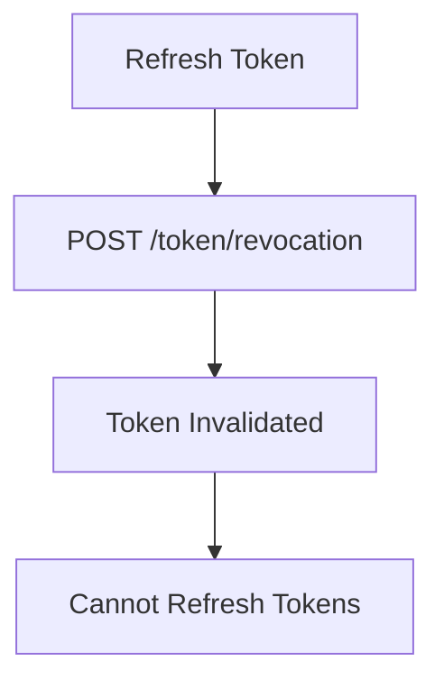

---

<a id="token-introspection-endpoint"></a>
### 🔍 Token Introspection Endpoint

The Token Introspection endpoint allows a resource server to query TSCloak and determine whether a token is currently active.

```text
POST /token/introspection
```

A resource API can submit a token to the endpoint:

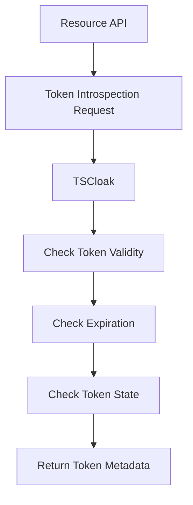

Example response for an active token:

```json
{
  "active": true,
  "scope": "openid profile email",
  "client_id": "YOUR_CLIENT_ID",
  "token_type": "Bearer",
  "sub": "USER_ID",
  "iss": "http://localhost:3000"
}
```

An inactive, expired, or invalid token returns:

```json
{
  "active": false
}
```

<a id="token-management-summary"></a>
### Token Management Summary

| Endpoint | Purpose | Primary Consumer |
|---|---|---|
| `/token` | Issue and refresh tokens | OAuth client |
| `/token/revocation` | Explicitly invalidate a token | OAuth client |
| `/token/introspection` | Check token status and metadata | Resource server/API |
| `/me` | Retrieve authenticated user claims | Client application |

---

<a id="dynamic-client-resolution"></a>
## ⚡ Dynamic Client Resolution

Clients are resolved dynamically when an authorization request is processed.

TSCloak does **not preload all clients during application startup**.

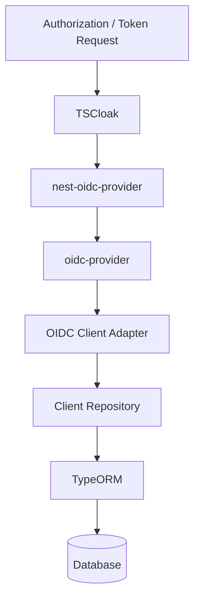

This approach allows client configuration to be managed independently of the OIDC provider lifecycle.

---

<a id="dynamic-client-registration"></a>
## 📝 Dynamic Client Registration

TSCloak supports **OpenID Connect Dynamic Client Registration**, allowing OAuth/OIDC clients to register at runtime instead of requiring every client to be created manually.

The registration endpoint is advertised through the OpenID Connect Discovery document:

```text
GET /.well-known/openid-configuration
```

Example discovery metadata:

```json
{
  "registration_endpoint": "http://localhost:3000/reg"
}
```

<a id="current-support"></a>
### Current Support

| Method | Endpoint | Status |
|---|---|---|
| `POST` | `/reg` | ✅ Implemented |
| `GET` | `/reg/:client_id` | ⏳ Planned |
| `PUT` | `/reg/:client_id` | ⏳ Planned |
| `DELETE` | `/reg/:client_id` | ⏳ Planned |

<a id="register-a-client"></a>
### Register a Client

```http
POST /reg
Content-Type: application/json
```

Example request:

```json
{
  "client_name": "Test Dynamic Client",
  "redirect_uris": ["http://localhost:4200/callback"],
  "scope": "openid profile email offline_access",
  "grant_types": ["authorization_code", "refresh_token"],
  "response_types": ["code"],
  "token_endpoint_auth_method": "none",
  "interaction_mode": "EXTERNAL",
  "interaction_login_url": "http://localhost:4200/login",
  "interaction_consent_url": "http://localhost:4200/consent"
}
```

Using `curl`:

```bash
curl -X POST http://localhost:3000/reg \
  -H "Content-Type: application/json" \
  -d '{
    "client_name": "Test Dynamic Client",
    "redirect_uris": ["http://localhost:4200/callback"],
    "scope": "openid profile email offline_access",
    "grant_types": ["authorization_code", "refresh_token"],
    "response_types": ["code"],
    "token_endpoint_auth_method": "none",
    "interaction_mode": "EXTERNAL",
    "interaction_login_url": "http://localhost:4200/login",
    "interaction_consent_url": "http://localhost:4200/consent"
  }'
```

<a id="example-response-1"></a>
### Example Response

A successful registration returns dynamically generated client metadata:

```json
{
  "application_type": "web",
  "grant_types": ["authorization_code", "refresh_token"],
  "id_token_signed_response_alg": "RS256",
  "require_auth_time": false,
  "response_types": ["code"],
  "subject_type": "public",
  "token_endpoint_auth_method": "none",
  "post_logout_redirect_uris": [],
  "require_pushed_authorization_requests": false,
  "dpop_bound_access_tokens": false,
  "client_id_issued_at": 1788109603,
  "client_id": "generated-client-id",
  "client_name": "Test Dynamic Client",
  "redirect_uris": ["http://localhost:4200/callback"],
  "registration_client_uri": "http://localhost:3000/reg/generated-client-id",
  "registration_access_token": "generated-registration-access-token"
}
```

<a id="registration-metadata-mapping"></a>
### Registration Metadata Mapping

TSCloak maps standard Dynamic Client Registration metadata to its internal client model:

| Registration Metadata | Internal Client Property |
|---|---|
| `client_id` | `clientId` |
| `client_secret` | `clientSecret` |
| `client_name` | `name` |
| `redirect_uris` | `redirectUris` |
| `scope` | `allowedScopes` |
| `grant_types` | `grantTypes` |
| `response_types` | `responseTypes` |
| `token_endpoint_auth_method` | `tokenEndpointAuthMethod` |
| `interaction_mode` | `interactionMode` |
| `interaction_login_url` | `interactionLoginUrl` |
| `interaction_consent_url` | `interactionConsentUrl` |

<a id="interaction-ui-registration-metadata"></a>
### Interaction UI Registration Metadata

Dynamic clients can choose the built-in hosted UI or configure external interaction URLs.

| Registration Metadata | Description |
|---|---|
| `interaction_mode` | `HOSTED` or `EXTERNAL` |
| `interaction_login_url` | External Login UI URL |
| `interaction_consent_url` | External Consent UI URL |

When an external URL is not configured for a specific interaction type, TSCloak falls back to the corresponding Hosted UI.

The standard registration `scope` value is converted internally from:

```text
openid profile email offline_access
```

to:

```text
allowedScopes = [
  "openid",
  "profile",
  "email",
  "offline_access"
]
```

<a id="using-a-dynamically-registered-client"></a>
### Using a Dynamically Registered Client

After registration, the returned `client_id` can be used like any other configured OAuth/OIDC client.

```text
http://localhost:3000/auth?
client_id=YOUR_DYNAMIC_CLIENT_ID
&redirect_uri=http://localhost:4200/callback
&response_type=code
&scope=openid profile email offline_access
&code_challenge=CODE_CHALLENGE
&code_challenge_method=S256
```

For public clients using:

```json
{
  "token_endpoint_auth_method": "none"
}
```

PKCE should be used with the Authorization Code Flow.

<a id="persistence-architecture"></a>
### Persistence Architecture

Dynamically registered clients are persisted through TSCloak's client repository infrastructure. The registration protocol is handled by `oidc-provider`, hosted through `nest-oidc-provider`, while the custom OIDC Client Adapter connects provider persistence to the application database.

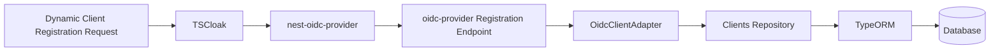

<a id="security-policy-management"></a>
## 🛡️ Security Policy Management

TSCloak manages authorization-server security settings through a **database-backed server-level Security Policy**.

Instead of scattering token lifetimes and related security settings across environment variables or hardcoded OIDC configuration, TSCloak stores the active policy in the `security_policies` table and exposes it through an administrative API.

This makes security configuration a first-class part of the TSCloak domain model.

<a id="what-the-security-policy-controls"></a>
### What the Security Policy Controls

The current `SecurityPolicy` model contains three groups of settings.

#### Token Policy

| Setting | Default | Purpose |
|---|---:|---|
| `accessTokenTtl` | 900 seconds | Access Token lifetime |
| `idTokenTtl` | 900 seconds | ID Token lifetime |
| `authorizationCodeTtl` | 300 seconds | Authorization Code lifetime |
| `refreshTokenTtl` | 30 days | Refresh Token lifetime |

#### Refresh Token Policy

| Setting | Default | Purpose |
|---|---:|---|
| `refreshTokenRotationEnabled` | `true` | Controls refresh token rotation policy |
| `refreshTokenReuseDetectionEnabled` | `true` | Controls refresh token reuse detection policy |

#### Session Policy

| Setting | Default | Purpose |
|---|---:|---|
| `sessionTtl` | 7 days | OIDC session lifetime |
| `interactionTtl` | 600 seconds | Login/consent interaction lifetime |

All lifetime values are stored in **seconds**.

<a id="security-policy-data-model"></a>
### Security Policy Data Model

The policy is represented by a TypeORM entity and persisted as application data.

```text
security_policies
│
├── id
│
├── Token Policy
│   ├── accessTokenTtl
│   ├── idTokenTtl
│   ├── authorizationCodeTtl
│   └── refreshTokenTtl
│
├── Refresh Token Policy
│   ├── refreshTokenRotationEnabled
│   └── refreshTokenReuseDetectionEnabled
│
├── Session Policy
│   ├── sessionTtl
│   └── interactionTtl
│
└── Audit
    ├── createdAt
    └── updatedAt
```

The policy is intentionally modeled as a **server-level policy** rather than a client-level policy. TSCloak currently manages one effective security policy for the authorization server.

<a id="default-policy-creation"></a>
### Default Policy Creation

TSCloak does not require a security policy row to be manually seeded before the application can use the policy service.

When `SecurityPolicyService.getPolicy()` is called:

1. TSCloak attempts to load the existing policy.
2. If no policy exists, the service creates one using the built-in defaults.
3. The default policy is persisted.
4. The persisted policy is returned.

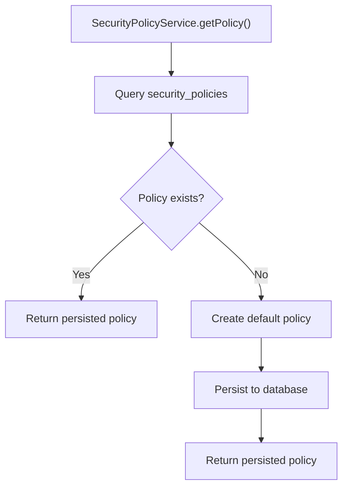

The defaults currently created by the service are:

```text
Access Token TTL         = 15 minutes
ID Token TTL             = 15 minutes
Authorization Code TTL   = 5 minutes
Refresh Token TTL        = 30 days

Refresh Token Rotation   = enabled
Reuse Detection          = enabled

Session TTL              = 7 days
Interaction TTL          = 10 minutes
```

Once created, the database becomes the persisted source of the policy rather than requiring the defaults to be recreated for every request.

<a id="administrative-api"></a>
### Administrative API

The current Security Policy Management API exposes a single server-level policy.

#### Get Active Policy

```http
GET /api/admin/security-policy
```

Example:

```bash
curl http://localhost:3000/api/admin/security-policy
```

A policy response contains the currently persisted configuration:

```json
{
  "id": "policy-id",
  "accessTokenTtl": 900,
  "idTokenTtl": 900,
  "authorizationCodeTtl": 300,
  "refreshTokenTtl": 2592000,
  "refreshTokenRotationEnabled": true,
  "refreshTokenReuseDetectionEnabled": true,
  "sessionTtl": 604800,
  "interactionTtl": 600,
  "createdAt": "2026-09-01T10:00:00.000Z",
  "updatedAt": "2026-09-01T10:00:00.000Z"
}
```

#### Update Active Policy

```http
PUT /api/admin/security-policy
Content-Type: application/json
```

Example request:

```json
{
  "accessTokenTtl": 1800,
  "idTokenTtl": 1800,
  "authorizationCodeTtl": 300,
  "refreshTokenTtl": 1209600,
  "refreshTokenRotationEnabled": true,
  "refreshTokenReuseDetectionEnabled": true,
  "sessionTtl": 604800,
  "interactionTtl": 600
}
```

Example using `curl`:

```bash
curl -X PUT http://localhost:3000/api/admin/security-policy \
  -H "Content-Type: application/json" \
  -d '{
    "accessTokenTtl": 1800,
    "idTokenTtl": 1800,
    "authorizationCodeTtl": 300,
    "refreshTokenTtl": 1209600,
    "refreshTokenRotationEnabled": true,
    "refreshTokenReuseDetectionEnabled": true,
    "sessionTtl": 604800,
    "interactionTtl": 600
  }'
```

The update operation first obtains the server-level policy, applies the supplied DTO values, and persists the resulting entity.

<a id="management-architecture"></a>
### Management Architecture

Security Policy Management follows the standard NestJS application layering used by TSCloak.

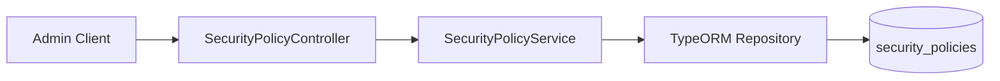

Responsibilities are separated as follows:

| Component | Responsibility |
|---|---|
| `SecurityPolicyController` | Exposes administrative HTTP endpoints |
| `SecurityPolicyService` | Owns default creation, retrieval, and update behavior |
| `SecurityPolicy` entity | Defines the persisted policy model |
| TypeORM repository | Reads and writes policy data |
| Database | Stores the active server-level configuration |

<a id="reading-the-policy"></a>
### Reading the Policy

The retrieval path is intentionally simple.

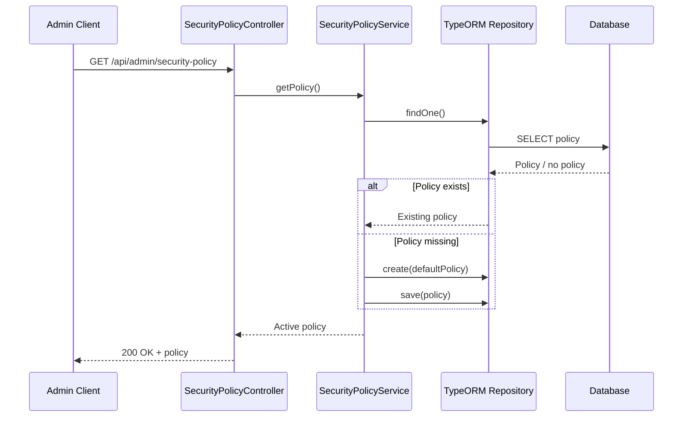

<a id="updating-the-policy"></a>
### Updating the Policy

Updating a policy uses the same server-level record.

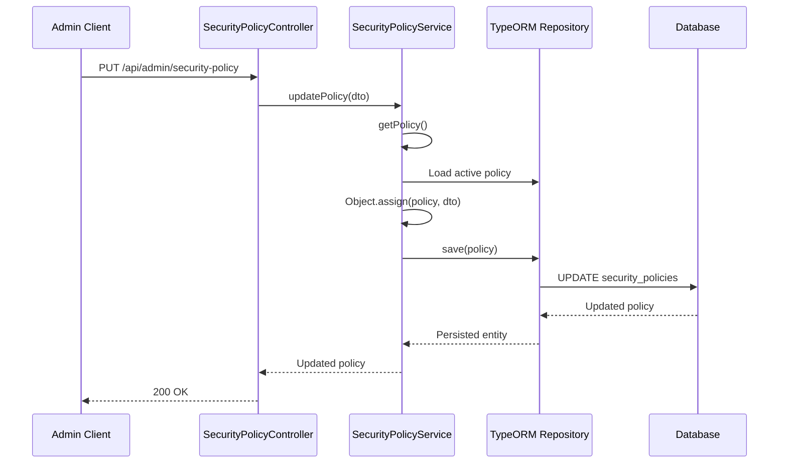

This design means callers do not create arbitrary policy records. They manage the effective server-level policy.

<a id="relationship-with-oidc-configuration"></a>
### Relationship with OIDC Configuration

Security Policy Management is not merely an administrative CRUD feature. Its purpose is to provide configuration that can be consumed by the OIDC layer.

`OidcOptionsService` is responsible for building the configuration passed through `nest-oidc-provider` to `oidc-provider`.

The dependency relationship is:

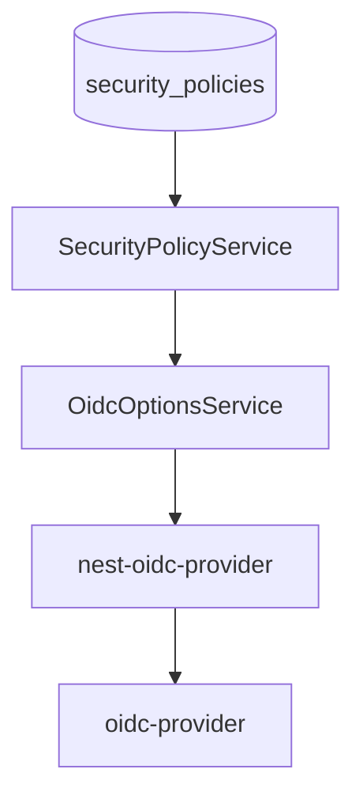

Conceptually, the flow is:

```text
Database
   │
   ▼
SecurityPolicyService
   │
   ▼
OIDC configuration
   │
   ▼
oidc-provider TTL / security options
   │
   ▼
Issued OIDC artifacts
```

This is the key architectural reason for storing the values in the database: **the security policy is the TSCloak-owned source of configuration, while `oidc-provider` remains the protocol engine that applies the resulting settings.**

<a id="oidc-token-lifetime-mapping"></a>
### OIDC Token Lifetime Mapping

The underlying `oidc-provider` configuration supports separate TTL configuration for OIDC artifacts.

TSCloak's policy fields map conceptually to those artifacts:

| TSCloak Policy | OIDC Artifact |
|---|---|
| `accessTokenTtl` | `AccessToken` |
| `idTokenTtl` | `IdToken` |
| `authorizationCodeTtl` | `AuthorizationCode` |
| `refreshTokenTtl` | `RefreshToken` |
| `sessionTtl` | `Session` |
| `interactionTtl` | `Interaction` |

The OIDC provider evaluates artifact expiration when tokens and other runtime objects are created.

Conceptually:

```mermaid
flowchart LR
    A["Security Policy"] --> B["TTL Configuration"]
    B --> C["AccessToken"]
    B --> D["IdToken"]
    B --> E["AuthorizationCode"]
    B --> F["RefreshToken"]
    B --> G["Session"]
    B --> H["Interaction"]
```

<a id="why-the-values-are-not-hardcoded"></a>
### Why the Values Are Not Hardcoded

TSCloak deliberately separates policy values from the protocol configuration code.

A hardcoded configuration would look conceptually like:

```typescript
ttl: {
  AccessToken: 900,
  RefreshToken: 2592000
}
```

That approach requires changing application code and redeploying whenever policy values change.

The Security Policy approach instead establishes:

```text
Database Policy
      ↓
SecurityPolicyService
      ↓
OIDC Configuration
      ↓
Protocol Behavior
```

This makes the values part of the authorization-server configuration model rather than implementation constants.

<a id="runtime-configuration-considerations"></a>
### Runtime Configuration Considerations

The current architecture distinguishes between **persisting a policy** and **when a provider consumes a policy value**.

`oidc-provider` artifact TTL functions are synchronous when an artifact is being created. They cannot directly perform an asynchronous database query for every token issuance.

Therefore, the policy integration must ensure that values required by synchronous OIDC callbacks are available synchronously at the point of evaluation.

This is an important architectural constraint for future evolution:

```text
Async Database
      │
      │ cannot be awaited directly by
      ▼
Synchronous TTL callback
      │
      ▼
OIDC artifact expiration
```

TSCloak's policy remains database-backed as the source of truth. How policy values are made available to synchronous runtime callbacks is a separate runtime integration concern and should not be confused with the persistence model.

<a id="policy-changes-and-existing-tokens"></a>
### Policy Changes and Existing Tokens

Changing a policy does not retroactively alter the expiration already assigned to an existing token or authorization artifact.

For example:

```text
Existing Access Token
expires_in = 15 minutes
        │
        │ Admin changes policy
        ▼
New Access Token TTL = 30 minutes
```

The already-issued token retains its existing expiry. The changed policy affects provider behavior when the new configuration value is applied to future artifact creation.

<a id="refresh-token-controls"></a>
### Refresh Token Controls

The policy model already includes two refresh-token security settings:

- `refreshTokenRotationEnabled`
- `refreshTokenReuseDetectionEnabled`

These settings represent TSCloak's security-policy domain model for refresh-token behavior.

They are intentionally separate from `refreshTokenTtl` because lifetime and lifecycle security are different concerns:

```text
Refresh Token Policy
│
├── How long is it valid?
│       └── refreshTokenTtl
│
├── Is a replacement token issued?
│       └── refreshTokenRotationEnabled
│
└── Is reuse detected?
        └── refreshTokenReuseDetectionEnabled
```

This separation provides room for the refresh-token implementation to evolve without changing the persisted policy model.

<a id="persistence-and-scaling"></a>
### Persistence and Scaling

The policy is stored in the database, not in process-local memory.

This is important for deployments with multiple application instances:

```text
              ┌───────────────┐
              │   Instance 1  │
              └───────┬───────┘
                      │
              ┌───────▼───────┐
              │   Database    │
              │ SecurityPolicy│
              └───────▲───────┘
                      │
              ┌───────┴───────┐
              │   Instance 2  │
              └───────────────┘
```

The database provides a shared source of truth across instances. This avoids treating a single application's in-memory state as the authoritative security configuration.

<a id="security-considerations"></a>
### Security Considerations

Security Policy Management endpoints modify authorization-server behavior and should therefore be treated as administrative operations.

In a production deployment, these endpoints should be protected with appropriate administrative authorization controls. Changes to token lifetimes or refresh-token security behavior can directly affect the security posture of the identity provider.

<a id="current-scope"></a>
### Current Scope

The currently implemented Security Policy Management feature provides:

- Database-backed server-level policy storage.
- Automatic creation of a default policy.
- Retrieval of the active policy.
- Update of the active policy.
- Configurable token lifetime fields.
- Refresh-token policy fields.
- Session and interaction lifetime fields.
- Audit timestamps through TypeORM.

The policy model also provides a foundation for future additions such as validation rules, policy-change auditing, multi-tenant policies, and more advanced runtime configuration strategies.

<a id="signing-keys-and-jwks"></a>
## 🔑 Signing Keys and JWKS

OpenID Connect relies on cryptographic signatures to allow clients and resource servers to verify tokens issued by the authorization server.

TSCloak manages signing keys as part of the identity-provider infrastructure and exposes public key material through a JSON Web Key Set (JWKS).

<a id="why-signing-keys-are-required"></a>
### Why Signing Keys Are Required

When TSCloak issues a signed token, the token must be protected against modification.

The authorization server signs the token using a private key. A relying party can then verify the signature using the corresponding public key.

The cryptographic trust model is:

```text
                    Private Key
                         │
                         │ signs
                         ▼
                  ┌─────────────┐
                  │ ID / Access │
                  │    Token    │
                  └──────┬──────┘
                         │
                         │ sent to
                         ▼
                     Client
                         │
                         │ obtains public key
                         ▼
                      JWKS
                         │
                         │ verifies
                         ▼
                  Trusted Token
```

The private signing key must remain under TSCloak's control. Only public key information is exposed through JWKS.

<a id="signing-key-management"></a>
### Signing Key Management

Signing keys are managed as a dedicated concern rather than being embedded directly into OIDC configuration.

Conceptually:

```text
┌──────────────────────┐
│ SigningKeyService    │
│                      │
│ Manage active keys   │
└──────────┬───────────┘
           │
           ├──────────────► Private key material
           │
           └──────────────► Public JWK representation
                            │
                            ▼
                          JWKS
```

This separation allows TSCloak to distinguish between:

- Key generation and storage.
- Selecting a key for signing.
- Publishing public keys.
- Future key rotation.
- OIDC provider signing configuration.

<a id="how-keys-are-used-during-token-issuance"></a>
### How Keys Are Used During Token Issuance

When the OIDC provider needs to issue a signed token, the signing configuration selects an appropriate active signing key.

The high-level flow is:

```text
Token Issuance Request
        │
        ▼
OIDC Provider
        │
        ▼
Resolve Signing Configuration
        │
        ▼
SigningKeyService
        │
        ▼
Select Active Signing Key
        │
        ▼
Sign Token with Private Key
        │
        ▼
Return Signed JWT
```

The resulting JWT contains a header identifying the cryptographic algorithm and, when applicable, the key identifier (`kid`) used for verification.

<a id="jwks-endpoint"></a>
### JWKS Endpoint

TSCloak publishes public signing key information through a JWKS endpoint.

The endpoint URL should be obtained from the OpenID Connect Discovery document through the `jwks_uri` property.

For example:

```json
{
  "jwks_uri": "http://localhost:3000/jwks"
}
```

A local client can therefore obtain the provider's public keys from:

```text
GET http://localhost:3000/jwks
```

As with other OIDC endpoints, clients should prefer the Discovery metadata rather than hardcoding the JWKS URL.

<a id="jwks-response"></a>
### JWKS Response

A JWKS response contains a collection of JSON Web Keys:

```json
{
  "keys": [
    {
      "kty": "RSA",
      "use": "sig",
      "kid": "key-identifier",
      "alg": "RS256",
      "n": "...",
      "e": "AQAB"
    }
  ]
}
```

The exact fields depend on the key type and algorithm.

Important fields include:

| Field | Meaning |
|---|---|
| `kty` | Key type |
| `use` | Intended key usage, such as signature verification |
| `kid` | Key identifier |
| `alg` | Intended signing algorithm |
| Public key parameters | Cryptographic material required for verification |

Private key parameters must never be included in the JWKS response.

<a id="token-verification-flow"></a>
### Token Verification Flow

A client validating a JWT issued by TSCloak follows this conceptual flow:

```text
Receive JWT
    │
    ▼
Read JWT Header
    │
    ├── alg
    └── kid
    │
    ▼
Obtain Provider Metadata
    │
    ▼
Read jwks_uri
    │
    ▼
Retrieve / Use Cached JWKS
    │
    ▼
Find Matching Public Key by kid
    │
    ▼
Verify JWT Signature
    │
    ├── Invalid ──► Reject Token
    │
    ▼
Validate Token Claims
    │
    └── iss, aud, exp, etc.
```

Signature validation proves that the token was signed by a trusted key. Clients must also validate relevant JWT claims such as issuer, audience, and expiration.

<a id="discovery-integration"></a>
### Discovery Integration

OIDC clients should begin with the provider's Discovery document:

```text
http://localhost:3000/.well-known/openid-configuration
```

The metadata connects the provider identity to its verification keys:

```json
{
  "issuer": "http://localhost:3000",
  "jwks_uri": "http://localhost:3000/jwks"
}
```

This enables automatic client configuration and supports future changes to key infrastructure without requiring clients to embed public keys directly in their applications.

<a id="key-identifiers-kid"></a>
### Key Identifiers (`kid`)

A key identifier allows a token verifier to select the correct public key when multiple keys are published.

This is especially important during key rotation.

```text
                 JWKS
                   │
        ┌──────────┴──────────┐
        ▼                     ▼
   key-2026-a            key-2026-b
   (previous)            (active)
        │                     │
        └──────────┬──────────┘
                   │
            Match JWT `kid`
```

A verifier reads the JWT header, identifies its `kid`, and selects the corresponding public key from the JWKS.

<a id="key-rotation"></a>
### Key Rotation

Signing keys should eventually support rotation because long-lived key material should not remain active indefinitely.

A safe conceptual rotation process is:

```text
1. Generate New Key Pair
          │
          ▼
2. Publish New Public Key in JWKS
          │
          ▼
3. Begin Signing New Tokens with New Key
          │
          ▼
4. Continue Publishing Previous Public Key
   while previously issued tokens remain valid
          │
          ▼
5. Retire Previous Key
```

The overlap period is important. Removing an old public key immediately can cause clients to fail validation of tokens that were legitimately issued with the previous key.

<a id="private-key-protection"></a>
### Private Key Protection

Private signing keys are highly sensitive security assets.

TSCloak's key-management architecture should ensure that:

- Private keys are never returned by public APIs.
- JWKS contains public key material only.
- Key-management operations are restricted.
- Key material is protected at rest.
- Production deployments use an appropriate secret-management strategy.
- Signing key rotation is auditable.

<a id="relationship-to-token-management"></a>
### Relationship to Token Management

Signing keys establish **cryptographic trust**, while token management controls the lifecycle and operational handling of tokens.

```text
Signing Keys
    │
    ├── Sign Tokens
    └── Publish Public Keys
              │
              ▼
         Token Trust

Token Management
    │
    ├── Issue Tokens
    ├── Refresh Tokens
    ├── Revoke Tokens
    └── Control Lifetimes
              │
              ▼
        Token Lifecycle
```

Together, these components provide two essential parts of an identity provider:

- **Can the token be trusted?** → Signing Keys and JWKS.
- **Is the token currently valid and permitted?** → Token lifecycle and authorization rules.

<a id="persistent-oidc-storage"></a>
## 💾 Persistent OIDC Storage

OIDC runtime objects are persisted in the database rather than memory.

```mermaid
flowchart TD
    A["oidc-provider"] --> B["nest-oidc-provider Integration"]
    B --> C["OIDC Adapter Factory"]
    C --> D["OidcAdapter / OidcClientAdapter"]
    D --> E["TSCloak Repository Interfaces"]
    E --> F["TypeORM Implementations"]
    F --> G[("Database")]
```

This enables OIDC state to survive application restarts.

<a id="persisted-runtime-objects"></a>
### Persisted Runtime Objects

The persistence layer supports OIDC models such as:

- AuthorizationCode
- AccessToken
- RefreshToken
- Session
- Grant
- DeviceCode
- BackchannelAuthenticationRequest

---

<a id="storage-architecture"></a>
## 🗄️ Storage Architecture

The OIDC adapter is isolated from database-specific implementations.

```mermaid
flowchart TD
    A["OidcAdapter"] --> B["OidcRepository Interface"]
    B --> C["TypeORM Repository"]
    B --> D["Future Repository Implementations"]
    C --> E["SQLite"]
    C --> F["PostgreSQL"]
    D --> G["Redis / Other Stores"]
```

This allows persistence implementations to evolve without changing OIDC protocol integration.

---

<a id="oidc-storage-model"></a>
## 🗃️ OIDC Storage Model

OIDC runtime records are stored in a common persistence model.

| Column | Description |
|---|---|
| `id` | OIDC record identifier |
| `model` | OIDC model type |
| `payload` | Serialized OIDC payload |
| `expiresAt` | Record expiration timestamp |
| `grantId` | Associated grant identifier |
| `uid` | OIDC UID lookup identifier |
| `userCode` | Device flow user code |
| `createdAt` | Record creation timestamp |
| `updatedAt` | Record update timestamp |

---

<a id="expiration-handling"></a>
## ⏳ Expiration Handling

OIDC runtime objects have different lifetimes. Lifetime values are governed by the active security policy, while persistence cleanup handles records whose configured expiration has passed. TSCloak uses two complementary cleanup strategies.

<a id="1-lazy-cleanup"></a>
### 1. Lazy Cleanup

When a record is read:

```mermaid
flowchart TD
    A["Record Requested"] --> B{"Check Expiration"}
    B -->|Expired| C["Delete Record"]
    B -->|Valid| D["Return Record"]
```

Expired records are removed when encountered.

<a id="2-background-cleanup"></a>
### 2. Background Cleanup

A scheduled background job periodically removes expired records.

```mermaid
flowchart TD
    A["OIDC Cleanup Service"] --> B["Scheduled Job"]
    B --> C["Find Expired Records"]
    C --> D["Delete Records"]
```

An index on `expiresAt` improves cleanup query performance.

---

<a id="example-authorization-request"></a>
## 🧪 Example Authorization Request

```text
http://localhost:3000/auth?
client_id=YOUR_CLIENT_ID
&redirect_uri=http://localhost:4200/callback
&response_type=code
&scope=openid profile email offline_access
&prompt=consent
&state=test123
&code_challenge=CODE_CHALLENGE
&code_challenge_method=S256
```

---

<a id="example-token-request"></a>
## 🔄 Example Token Request

```http
POST /token
Content-Type: application/x-www-form-urlencoded
```

Request body:

```text
grant_type=authorization_code
&code=AUTHORIZATION_CODE
&redirect_uri=http://localhost:4200/callback
&client_id=YOUR_CLIENT_ID
&code_verifier=CODE_VERIFIER
```

---

<a id="design-principles"></a>
## 🎯 Design Principles

TSCloak is designed around the following principles:

- **Separation of concerns** — Protocol, identity, clients, and persistence remain independent.
- **Repository abstraction** — Infrastructure is isolated behind application-level contracts.
- **Storage independence** — Persistence implementations can evolve without changing OIDC integration.
- **Dynamic resolution** — Clients are resolved when needed rather than eagerly loaded.
- **Persistent state** — OIDC runtime state survives application restarts.
- **Modular architecture** — NestJS modules represent distinct responsibilities.
- **Protocol isolation** — OAuth/OIDC protocol implementation is delegated to a dedicated provider engine.

---

<a id="roadmap"></a>
## 🗺️ Roadmap

<a id="implemented"></a>
### Implemented

- [x] NestJS application structure
- [x] Client management
- [x] User identity management
- [x] Authorization Code Flow
- [x] PKCE
- [x] Access Tokens
- [x] ID Tokens
- [x] Refresh Tokens
- [x] Refresh Token Rotation
- [x] Offline Access
- [x] Hosted Consent UI
- [x] Persisted User Consent (OIDC Grants)
- [x] Consent Reuse
- [x] Hosted Login UI
- [x] Hosted Consent UI
- [x] External Login UI support
- [x] External Consent UI support
- [x] Prompt-aware Custom Login / Consent flow
- [x] UserInfo endpoint
- [x] Dynamic client resolution
- [x] Database-backed OIDC persistence
- [x] OIDC state survives application restart
- [x] Lazy expiration cleanup
- [x] Background expiration cleanup
- [x] Token Revocation Endpoint (RFC 7009)
- [x] Token Introspection Endpoint (RFC 7662)
- [x] Dynamic Client Registration (`POST /reg`)
- [x] Database-backed security policy management
- [x] OIDC token lifetime configuration
- [x] RSA signing key management and JWKS support

<a id="planned"></a>
### Planned

- [ ] Client Credentials Flow
- [ ] Dynamic Client Registration Management (`GET` / `PUT` / `DELETE`)
- [ ] PostgreSQL support
- [ ] Distributed cache for policy and configuration reads
- [ ] Horizontal scaling
- [ ] Admin API
- [ ] Audit logging

---

<a id="contributing"></a>
## 🤝 Contributing

Contributions, ideas, and architectural discussions are welcome.

Please open an issue or submit a pull request.

---

<a id="license"></a>
## 📄 License

This project is licensed under the **MIT License**.

---

<div align="center">

Built with ❤️ using NestJS, TypeScript, and OpenID Connect

</div>

