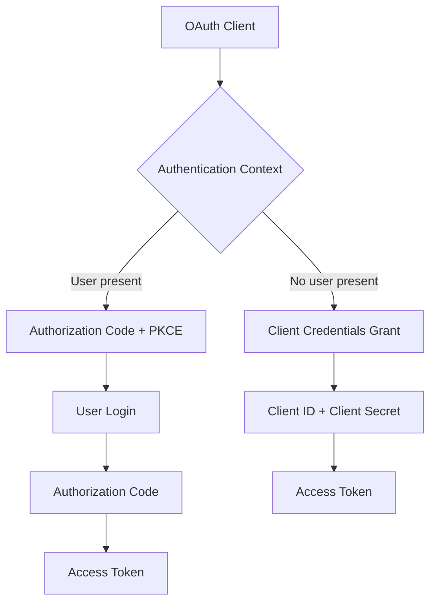
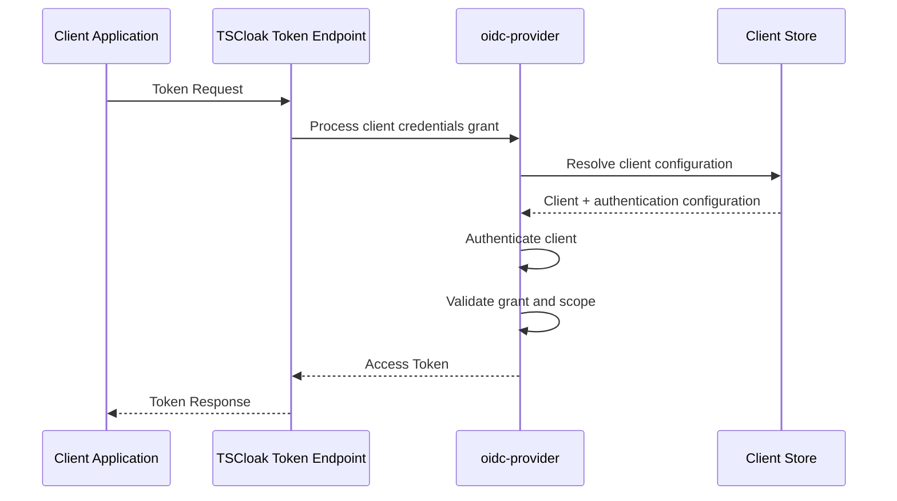
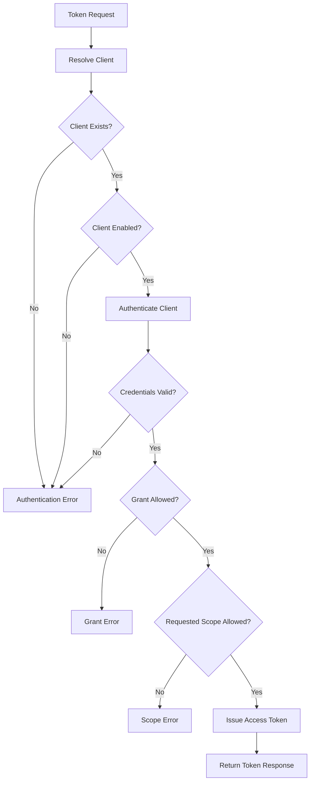
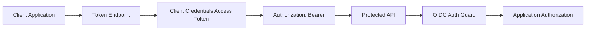
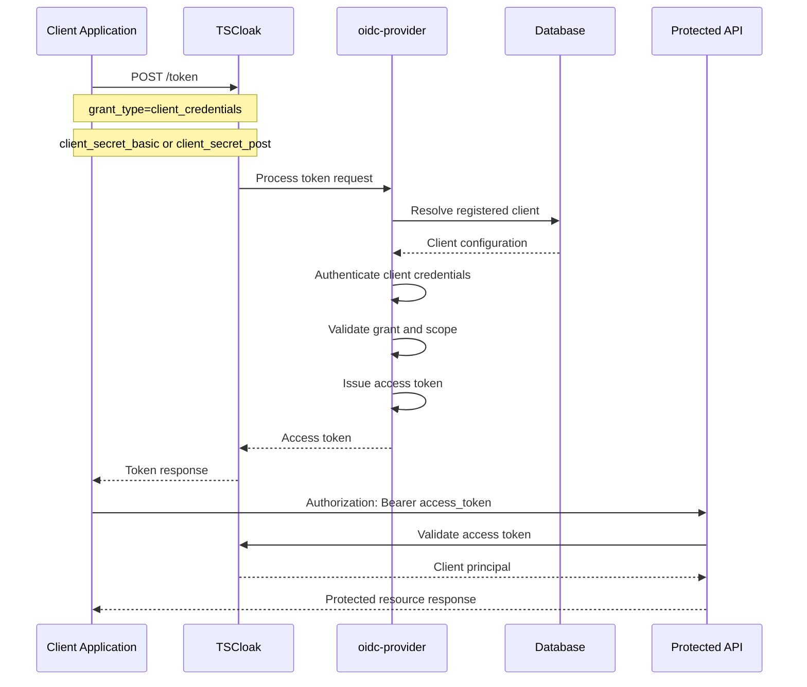

# 🔑 Client Secret and Client Credentials Flow

TSCloak supports confidential OAuth 2.0 clients that authenticate at the token endpoint using a client secret. This document describes the client-secret authentication model and the machine-to-machine **Client Credentials Grant** in the context of the TSCloak architecture.

The protocol behavior remains delegated to `oidc-provider`, while TSCloak owns client configuration, persistence, security policy, and application-level access control around the resulting token.

> TSCloak does not reimplement the OAuth 2.0 or OpenID Connect protocol stack. It uses `nest-oidc-provider`, which integrates the underlying `oidc-provider` library into the NestJS application architecture.

---

## 🧭 Navigation

- [Overview](#overview)
- [Client Authentication vs User Authentication](#client-authentication-vs-user-authentication)
- [Confidential Clients](#confidential-clients)
- [Client Secret](#client-secret)
- [Token Endpoint Authentication](#token-endpoint-authentication)
- [Client Credentials Grant](#client-credentials-grant)
- [Client Credentials Request](#client-credentials-request)
- [Client Secret Basic](#client-secret-basic)
- [Client Secret Post](#client-secret-post)
- [Token Processing Flow](#token-processing-flow)
- [Access Token Principal](#access-token-principal)
- [Client Credentials and API Access](#client-credentials-and-api-access)
- [Authorization Code vs Client Credentials](#authorization-code-vs-client-credentials)
- [Validation and Failure Cases](#validation-and-failure-cases)
- [Security Considerations](#security-considerations)
- [Complete Flow](#complete-flow)
- [Implementation Boundary](#implementation-boundary)

<a id="overview"></a>
## 📖 Overview

TSCloak supports two fundamentally different authentication situations:

1. **User authentication** — a human user authenticates through the hosted/custom login interaction and participates in an authorization flow.
2. **Client authentication** — an application authenticates itself using its registered client credentials without a user interaction.

The Client Credentials Grant is intended for machine-to-machine access where there is no end-user identity involved in the token request.



---

<a id="client-authentication-vs-user-authentication"></a>
## 👤 Client Authentication vs User Authentication

A client secret authenticates the **application/client**, not a human user.

| Authentication | Identity represented by token | User interaction | Typical use |
|---|---|---|---|
| Authorization Code | User + client context | Yes | Web/mobile user login |
| Client Credentials | Client application | No | Machine-to-machine API access |

This distinction is important when an API uses the resulting access token.

A user token represents a user account associated with a client. A client-credentials token represents the client itself.

In TSCloak's authenticated request model, this distinction is represented by the relationship between `id` and `clientId`:

```text
User token
    id       = USER_ID
    clientId = CLIENT_ID

Client credentials token
    id       = CLIENT_ID
    clientId = CLIENT_ID
```

Therefore, a client-credentials principal does not represent an individual user.

---

<a id="confidential-clients"></a>
## 🔐 Confidential Clients

A client that authenticates with a client secret is a confidential client.

The client registration contains information used by the OIDC provider to authenticate the application at the token endpoint.

Conceptually:

```text
Client
 ├── clientId
 ├── clientSecret
 ├── tokenEndpointAuthMethod
 ├── grantTypes
 ├── responseTypes
 ├── redirectUris
 └── scopes / policy-related metadata
```

The client ID identifies the application, while the client secret proves possession of the registered credential when the selected token-endpoint authentication method requires it.

TSCloak persists client configuration through its client/domain layer while `oidc-provider` performs protocol processing.

---

<a id="client-secret"></a>
## 🔑 Client Secret

The client secret is a credential assigned to a confidential client.

It should be treated as an application credential rather than as a user password.

The client secret is used when the configured token endpoint authentication method requires secret-based client authentication.

A client registration can specify the token endpoint authentication method through:

```json
{
  "token_endpoint_auth_method": "client_secret_basic"
}
```

or:

```json
{
  "token_endpoint_auth_method": "client_secret_post"
}
```

The selected method determines how the client credentials are supplied to the token endpoint.

---

<a id="token-endpoint-authentication"></a>
## 🔐 Token Endpoint Authentication

TSCloak works with the token endpoint authentication methods supported by the configured OIDC provider/client registration.

The client-secret based methods relevant to this flow are:

| Method | Client ID | Client Secret | Location |
|---|---|---|---|
| `client_secret_basic` | Yes | Yes | HTTP Basic Authorization header |
| `client_secret_post` | Yes | Yes | Token request form body |

The authentication method is part of the client's registered metadata.

### `client_secret_basic`

The client sends credentials using HTTP Basic authentication.

Conceptually:

```text
Authorization: Basic base64(client_id:client_secret)
```

The credentials are therefore not placed directly in the form body.

### `client_secret_post`

The client sends the credentials in the token request body:

```text
client_id=<client-id>
client_secret=<client-secret>
```

The protocol engine validates the request according to the registered client configuration.

---

<a id="client-credentials-grant"></a>
## 🤖 Client Credentials Grant

The Client Credentials Grant is used when a client needs an access token without authenticating an end user.

The OAuth 2.0 grant type is:

```text
grant_type=client_credentials
```

The basic sequence is:



There is no login page, authorization code, consent screen, or end-user session in this grant.

---

<a id="client-credentials-request"></a>
## 📝 Client Credentials Request

A Client Credentials request is sent to the token endpoint.

The request includes:

```text
grant_type=client_credentials
```

The exact credential placement depends on the client's configured token endpoint authentication method.

The token endpoint is the OIDC provider's token endpoint exposed by TSCloak.

A generic request body is:

```text
grant_type=client_credentials
```

For `client_secret_post`, the body also contains:

```text
client_id=<client-id>
client_secret=<client-secret>
```

For `client_secret_basic`, the client credentials are supplied through the HTTP Authorization header instead.

---

<a id="client-secret-basic"></a>
## 🔐 Client Credentials with `client_secret_basic`

The client authenticates using HTTP Basic authentication.

Example:

```bash
curl -X POST http://localhost:4200/token \\
  -H "Content-Type: application/x-www-form-urlencoded" \\
  -u "my-client:my-client-secret" \\
  -d "grant_type=client_credentials"
```

The important parts are:

```text
Authorization: Basic <base64(client_id:client_secret)>
grant_type=client_credentials
```

The client ID and secret are therefore transported as HTTP Basic credentials rather than request-body parameters.

---

<a id="client-secret-post"></a>
## 📮 Client Credentials with `client_secret_post`

The client can alternatively send its credentials in the request body when the registered authentication method is `client_secret_post`.

Example:

```bash
curl -X POST http://localhost:4200/token \\
  -H "Content-Type: application/x-www-form-urlencoded" \\
  -d "grant_type=client_credentials" \\
  -d "client_id=my-client" \\
  -d "client_secret=my-client-secret"
```

The provider validates the credentials against the registered client configuration.

---

<a id="token-processing-flow"></a>
## ⚙️ Token Processing Flow

The complete processing sequence can be viewed as a series of validation boundaries.



The OIDC provider owns the protocol validation and token issuance path. TSCloak provides the client configuration and application-specific persistence required by that process.

---

<a id="access-token-principal"></a>
## 🎫 Access Token Principal

The most important difference between a user token and a client-credentials token is the subject represented by the token.

### User Authentication

For a user-authenticated request, the principal represents the user:

```text
id       = USER_ID
clientId = CLIENT_ID
```

### Client Credentials

For a client-credentials request, the principal represents the client itself:

```text
id       = CLIENT_ID
clientId = CLIENT_ID
```

This distinction allows TSCloak's application guards to identify whether an authenticated request is acting as a user or as a client application.

For example, password changes require a user principal and therefore reject a client-credentials token.

---

<a id="client-credentials-and-api-access"></a>
## 🌐 Client Credentials and API Access

A client-credentials access token can be presented as a bearer token to APIs protected by TSCloak's OIDC authentication layer.

The general request pattern is:

```http
GET /api/resource
Authorization: Bearer <access_token>
```

TSCloak validates the access token and creates an authenticated request principal.

The API can then apply its own authorization rules.



Authentication establishes that the request is associated with the client. Authorization determines what that client is permitted to do.

---

<a id="authorization-code-vs-client-credentials"></a>
## 🔄 Authorization Code vs Client Credentials

TSCloak's user authentication and machine-to-machine authentication have different protocol paths.

| Area | Authorization Code + PKCE | Client Credentials |
|---|---|---|
| End user | Required | Not required |
| Login UI | Used when authentication is required | Not used |
| Consent UI | May be used | Not used |
| Authorization code | Yes | No |
| PKCE | Yes | No |
| Client authentication | Depends on registered client configuration | Client authentication is central to the grant |
| User identity | Present | Not present |
| Typical use | User-facing application | Service-to-service API access |

The Authorization Code flow is currently the primary interactive authentication flow documented by TSCloak, while Client Credentials provides a separate machine-to-machine authentication path.

---

<a id="validation-and-failure-cases"></a>
## 🚫 Validation and Failure Cases

Client authentication can fail when the token request does not satisfy the registered client configuration or OAuth/OIDC protocol requirements.

Typical failure categories include:

| Condition | Result |
|---|---|
| Unknown client | Client authentication fails |
| Invalid client secret | Client authentication fails |
| Disabled client | Client cannot be used as an active client |
| Unsupported authentication method for the client | Client authentication fails |
| Unsupported grant type | Token request fails |
| Grant not permitted for the client | Token request fails |
| Invalid requested scope | Token request fails according to provider validation |

The exact OAuth error response is produced by the underlying OIDC provider according to the protocol and configured behavior.

### Authentication Method Must Match Registration

A client registered with:

```json
{
  "token_endpoint_auth_method": "client_secret_basic"
}
```

should authenticate using the corresponding method.

Likewise, a client registered for:

```json
{
  "token_endpoint_auth_method": "client_secret_post"
}
```

uses the request-body credential method.

The authentication method is therefore part of the client's protocol configuration, not merely a client-side preference.

---

<a id="security-considerations"></a>
## 🛡️ Security Considerations

### Protect Client Secrets

Client secrets are application credentials and should not be embedded in public clients such as browser JavaScript or distributed mobile applications where the secret cannot be kept confidential.

### Use HTTPS

Client-secret authentication should be transported over TLS in deployed environments so credentials and bearer tokens are not exposed over the network.

### Do Not Treat Client Credentials as User Credentials

A client-credentials token does not represent a user. APIs should not assume that a client-credentials principal has a user identity.

### Apply Authorization Separately

A valid client credential establishes client authentication. It does not automatically mean that the client should have unrestricted access to every application endpoint.

### Restrict Grants and Scopes

Client registration and security policy should restrict the grants and scopes that a client is allowed to request.

### Rotate Secrets When Required

If a client secret is exposed, the affected client credential should be replaced according to the deployment's credential-management process.

---

<a id="complete-flow"></a>
## 🔄 Complete Client Credentials Flow



There is no user login step in this sequence.

---

<a id="implementation-boundary"></a>
## 🧱 Implementation Boundary

The client-secret flow follows the same architectural boundary described throughout the main TSCloak documentation.

| Concern | Primary Owner |
|---|---|
| OAuth 2.0 grant processing | `oidc-provider` |
| Token endpoint hosting/integration | `nest-oidc-provider` + NestJS |
| Client configuration | TSCloak Clients layer |
| Client persistence | TSCloak repositories / TypeORM |
| Security policy | TSCloak Security layer |
| Access-token validation at application APIs | TSCloak OIDC authentication layer |
| Application authorization | Protected API / TSCloak guards |

The important distinction is that TSCloak does not replace the protocol engine with a custom token implementation. It integrates the provider into the application's domain and persistence architecture.

---

## 📌 Summary

The client-secret and Client Credentials model provides TSCloak with a machine-to-machine authentication path alongside its interactive user authentication flow.

The key characteristics are:

- Confidential clients can authenticate using a client secret.
- `client_secret_basic` supplies credentials through HTTP Basic authentication.
- `client_secret_post` supplies credentials in the token request body.
- `grant_type=client_credentials` requests a machine-to-machine access token.
- No end-user login or consent interaction is required.
- The resulting principal represents the client rather than a user.
- Protected APIs can distinguish client credentials from user authentication.
- Client authentication and application authorization remain separate concerns.
- OAuth 2.0 / OIDC protocol processing remains the responsibility of `oidc-provider`.
