<div align="center">

#  TSCloak Federation

### External Identity Providers. One TSCloak Issuer.

[](#)
[](#)
[](https://nestjs.com/)
[](https://www.typescriptlang.org/)
[](#-implementation-status)

**Federated authentication for TSCloak — without changing the application's OIDC integration.**

</div>

---

## 📖 Overview

TSCloak Federation allows TSCloak to authenticate users through an external Identity Provider while remaining the **single OIDC issuer** seen by client applications.

The application continues to use the normal TSCloak Authorization Code flow:

```text
Application
    │
    │ OIDC /authorize
    ▼
 TSCloak
    │
    │ Federated authentication
    ▼
External IdP
    │
    │ authenticated user
    ▼
 TSCloak
    │
    │ TSCloak authorization code / tokens
    ▼
Application
```

Examples of external providers include:

- Google
- Microsoft Entra ID
- Other OpenID Connect providers
- Additional OAuth-based providers in future federation adapters

> **Important:** The external provider authenticates the user. **TSCloak remains responsible for the final OIDC authorization response and token issuance.**

---

## 🧭 Navigation

- [📖 Overview](#-overview)
- [🏗️ Architecture](#️-architecture)
  - [High-Level Architecture](#high-level-architecture)
  - [Responsibility Boundaries](#responsibility-boundaries)
  - [Module Structure](#module-structure)
- [🔄 Authentication Flow](#-authentication-flow)
  - [End-to-End Flow](#end-to-end-flow)
  - [Federation Transaction](#federation-transaction)
  - [Interaction Resume](#interaction-resume)
- [🔐 Security Model](#-security-model)
  - [State](#state)
  - [Nonce](#nonce)
  - [PKCE](#pkce)
  - [ID Token Verification](#id-token-verification)
  - [Stable Subject Mapping](#stable-subject-mapping)
- [👤 User Mapping](#-user-mapping)
  - [Federated Identity](#federated-identity)
  - [New User Creation](#new-user-creation)
  - [Existing User Resolution](#existing-user-resolution)
  - [Email Linking Policy](#email-linking-policy)
- [🗃️ Data Model](#️-data-model)
  - [Federation Provider](#federation-provider)
  - [Federated Identity](#federated-identity)
  - [Federation Transaction](#federation-transaction)
  - [Entity Relationship](#entity-relationship)
- [⚙️ Provider Configuration](#️-provider-configuration)
  - [OIDC Discovery](#oidc-discovery)
  - [Provider Configuration Example](#provider-configuration-example)
  - [Callback URI](#callback-uri)
- [🛠️ Administration](#️-administration)
  - [Provider Management](#provider-management)
  - [Client Scoping](#client-scoping)
- [🇬 Google Example](#-google-example)
- [🧪 API Flow](#-api-flow)
  - [Start Federation](#start-federation)
  - [Federation Callback](#federation-callback)
- [⚠️ Important Security Notes](#️-important-security-notes)
- [📊 Current Implementation](#-current-implementation)
- [🗺️ Roadmap](#️-roadmap)

---

<a id="architecture"></a>
## 🏗️ Architecture

Federation is implemented as an application-level capability around the existing TSCloak OIDC interaction flow.

TSCloak does **not** become an OAuth client for every application. Instead, the federation layer temporarily acts as an OAuth/OIDC client of the external provider, resolves the external identity, and then hands the authenticated identity back to TSCloak.

<a id="high-level-architecture"></a>
### High-Level Architecture

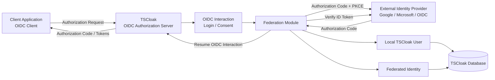

### The trust boundary

```text
┌───────────────────────────────────────────────────────────────┐
│                         TSCloak                               │
│                                                               │
│  ┌──────────────┐   ┌──────────────┐   ┌─────────────────┐  │
│  │ OIDC Provider│   │ Federation   │   │ Identity / User │  │
│  │              │◄──│ Module       │──►│ Management      │  │
│  └──────────────┘   └──────────────┘   └─────────────────┘  │
│           │                    │                    │          │
│           └────────────────────┼────────────────────┘          │
│                                ▼                               │
│                         TSCloak Database                       │
└────────────────────────────────┬──────────────────────────────┘
                                 │
                                 │ External authentication
                                 ▼
                    ┌─────────────────────────┐
                    │     External IdP        │
                    │                         │
                    │ Google / Microsoft /    │
                    │ arbitrary OIDC provider │
                    └─────────────────────────┘
```

<a id="responsibility-boundaries"></a>
### Responsibility Boundaries

| Component | Responsibility |
|---|---|
| **Client Application** | Starts the normal TSCloak OIDC authorization flow |
| **TSCloak OIDC Provider** | Owns the application-facing OIDC protocol and final token issuance |
| **OIDC Interaction** | Represents the pending login/consent operation |
| **Federation Module** | Starts upstream authentication and resolves the external identity |
| **OIDC Federation Service** | Discovers upstream metadata, builds authorization requests, exchanges codes, verifies ID tokens |
| **Federation Crypto Service** | Generates state, nonce, PKCE verifier, and challenge |
| **Identity Service** | Creates local users using the normal password hashing/user creation path |
| **Federated Identity** | Maps `(provider, subject)` to a local user |
| **Federation Transaction** | Stores short-lived browser federation state |
| **Database** | Persists provider configuration, identities, transactions, and users |

<a id="module-structure"></a>
### Module Structure

The federation feature is organized as a dedicated NestJS module:

```text
src/
└── federation/
    ├── dto/
    │   ├── create-federation-provider.dto.ts
    │   ├── update-federation-provider.dto.ts
    │   └── federation-provider-response.dto.ts
    │
    ├── entities/
    │   ├── federation-provider.entity.ts
    │   ├── federated-identity.entity.ts
    │   └── federation-transaction.entity.ts
    │
    ├── providers/
    │   └── oidc-federation/
    │       └── oidc-federation.service.ts
    │
    ├── federation-crypto.service.ts
    ├── federation.service.ts
    ├── federation.controller.ts
    └── federation.module.ts
```

The module is exposed under:

```text
/api/federation
```

---

<a id="authentication-flow"></a>
## 🔄 Authentication Flow

<a id="end-to-end-flow"></a>
### End-to-End Flow

The intended end-to-end flow preserves the original TSCloak OIDC interaction.

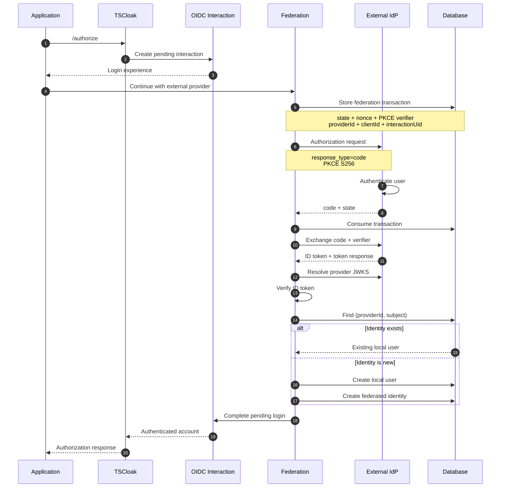

### Application-facing token flow

The external provider is invisible to the application:

```text
Application
     │
     │  OIDC Authorization Code
     ▼
 TSCloak
     │
     │  external authentication
     ▼
 Google / Microsoft / OIDC
     │
     │  external result
     ▼
 TSCloak
     │
     │  TSCloak Authorization Code
     ▼
Application
     │
     │  /token
     ▼
TSCloak-issued Access / ID / Refresh Tokens
```

> **Design principle:** Applications trust **TSCloak**, not each individual external provider.

<a id="federation-transaction"></a>
### Federation Transaction

The browser redirect is protected by a short-lived transaction.

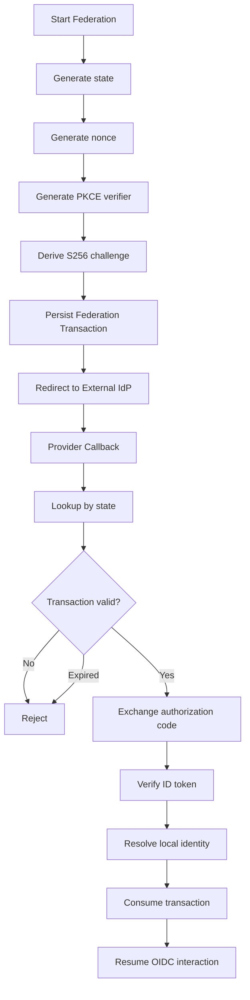

A transaction contains short-lived information such as:

```text
state
nonce
codeVerifier
providerId
clientId
interactionUid
expiresAt
```

The transaction is consumed after callback processing so that the same authorization response cannot be replayed.

<a id="interaction-resume"></a>
### Interaction Resume

The key integration point is the existing `oidc-provider` interaction.

TSCloak already represents login as an interaction:

```text
GET  /interaction/:uid
POST /interaction/:uid/login
POST /interaction/:uid/consent
```

Federation should therefore **complete the existing interaction** rather than creating a second authentication/session mechanism.

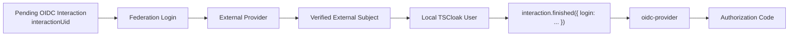

This keeps federation aligned with the normal TSCloak login path.

---

<a id="security-model"></a>
## 🔐 Security Model

Federation introduces an additional trust boundary, so the external login flow must validate both the browser transaction and the provider's identity assertion.

<a id="state"></a>
### State

`state` protects the authorization request against cross-site request forgery and binds the callback to the transaction initiated by TSCloak.

TSCloak generates a cryptographically random value:

```text
randomBytes(32).toString("base64url")
```

The same value is sent to the external provider and stored in the federation transaction.

```text
TSCloak
  │
  ├── store state ──────────────┐
  │                             │
  └── send state ──► External IdP
                                │
                                ▼
                        callback + state
                                │
                                ▼
                         lookup transaction
```

<a id="nonce"></a>
### Nonce

`nonce` binds the returned OIDC ID token to the authentication request.

TSCloak:

1. Generates a random nonce.
2. Sends it in the upstream authorization request.
3. Stores it in the federation transaction.
4. Verifies the `nonce` claim in the returned ID token.

```text
Generated nonce
      │
      ├────────► Authorization Request
      │
      └────────► Federation Transaction
                       │
                       ▼
                 Callback
                       │
                       ▼
                 ID Token nonce
                       │
                       ▼
                 Must match
```

<a id="pkce"></a>
### PKCE

The federation authorization request uses:

```text
code_challenge_method=S256
```

The flow is:

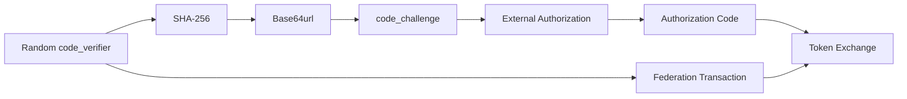

The verifier is never sent in the browser authorization request. It is held by TSCloak until the token exchange.

<a id="id-token-verification"></a>
### ID Token Verification

TSCloak verifies the upstream ID token using the provider's published JWKS.

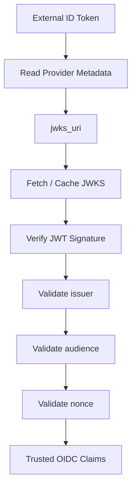

The verification checks include:

- JWT signature
- Expected issuer
- Expected audience/client ID
- Expected nonce

The `sub` claim is then used as the stable external identity identifier.

> **Important:** TSCloak's own signing JWKS is for tokens **issued by TSCloak**. It must not be reused as the trust key set for an external provider.

<a id="stable-subject-mapping"></a>
### Stable Subject Mapping

The primary federation key is:

```text
(providerId, subject)
```

where:

```text
subject = upstream OIDC "sub"
```

This prevents two different providers with the same email address from accidentally becoming the same identity.

---

<a id="user-mapping"></a>
## 👤 User Mapping

<a id="federated-identity"></a>
### Federated Identity

A federated identity is a durable link between an upstream identity and a local TSCloak user.

```text
External Provider
       │
       │ providerId + sub
       ▼
┌───────────────────────────┐
│ FederatedIdentity         │
│                           │
│ providerId                │
│ subject                   │
│ userId                    │
│ email                     │
│ profile                   │
└─────────────┬─────────────┘
              │
              │ userId
              ▼
       ┌─────────────┐
       │ TSCloak User│
       └─────────────┘
```

The database enforces uniqueness for:

```text
(providerId, subject)
```

<a id="new-user-creation"></a>
### New User Creation

When the external subject is not known:

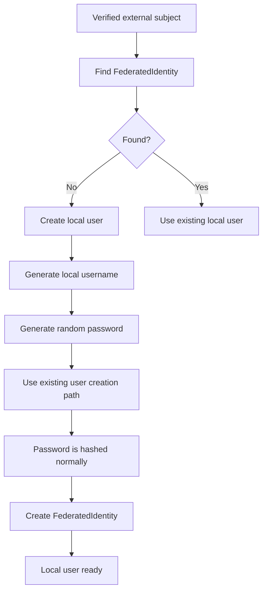

The local user is created under the `clientId` associated with the TSCloak authorization transaction.

This is important because TSCloak users are client-scoped.

<a id="existing-user-resolution"></a>
### Existing User Resolution

For a known federated identity:

```text
(providerId, subject)
        │
        ▼
FederatedIdentity
        │
        ▼
     userId
        │
        ▼
  TSCloak User
```

No password authentication is required from the user in this path.

<a id="email-linking-policy"></a>
### Email Linking Policy

Federation intentionally does **not** automatically link a provider identity to a local account merely because the email addresses match.

Example:

```text
Existing local account
email = alice@example.com

Google identity
email = alice@example.com
sub   = 123456789
```

This does **not** automatically create:

```text
Google subject 123456789
        │
        ▼
Existing Alice account
```

Instead, the provider identity must be explicitly associated through the federation identity model.

This avoids treating email equality as proof of account ownership across authentication systems.

---

<a id="data-model"></a>
## 🗃️ Data Model

<a id="federation-provider"></a>
### Federation Provider

A provider stores the external IdP configuration.

```text
federation_providers
│
├── id
├── name
├── type
├── issuer
├── clientId
├── clientSecret
├── scopes
├── enabled
├── createdAt
└── updatedAt
```

Typical values:

| Field | Example |
|---|---|
| `name` | `Google` |
| `type` | `oidc` |
| `issuer` | `https://accounts.google.com` |
| `clientId` | External client ID |
| `clientSecret` | External client secret |
| `scopes` | `openid profile email` |
| `enabled` | `true` |

> 🔒 `clientSecret` is a credential. It must be accepted as write-only configuration and must not be returned in normal API responses.

<a id="federated-identity"></a>
### Federated Identity

```text
federated_identities
│
├── id
├── providerId ──────► federation_providers.id
├── userId ──────────► users.id
├── subject
├── email
├── profile
├── createdAt
└── updatedAt
```

Constraint:

```text
UNIQUE(providerId, subject)
```

<a id="federation-transaction"></a>
### Federation Transaction

```text
federation_transactions
│
├── id
├── state              ← browser correlation
├── nonce              ← ID token correlation
├── codeVerifier       ← PKCE secret
├── providerId         ← selected provider
├── clientId           ← TSCloak client
├── interactionUid     ← pending OIDC interaction
├── expiresAt
└── createdAt
```

The transaction is intentionally short-lived.

<a id="entity-relationship"></a>
### Entity Relationship

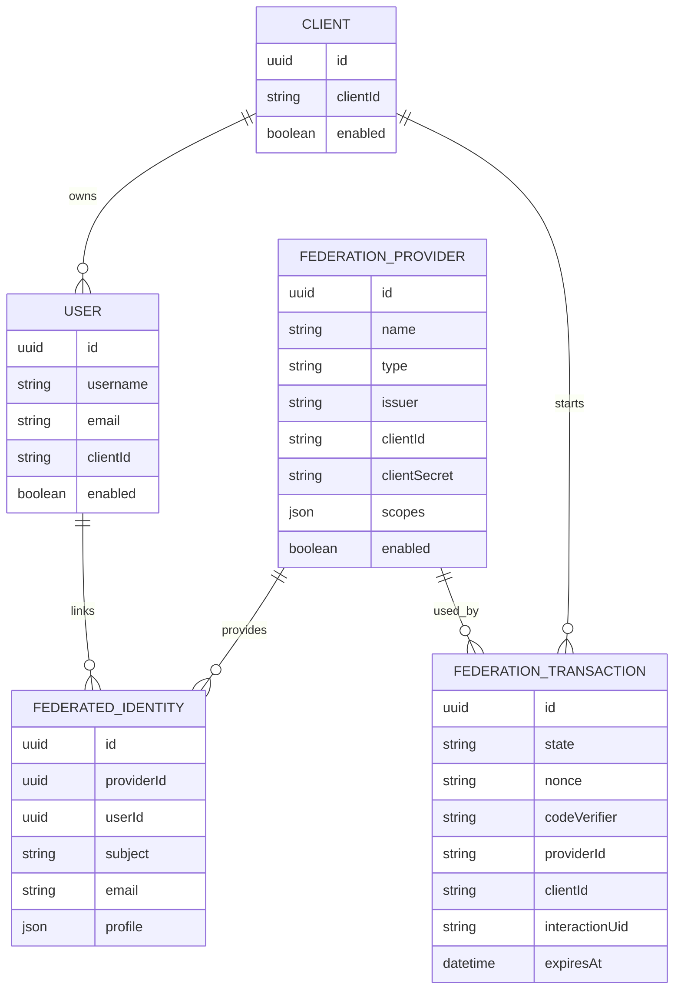

---

<a id="provider-configuration"></a>
## ⚙️ Provider Configuration

<a id="oidc-discovery"></a>
### OIDC Discovery

The federation implementation uses standard OpenID Connect discovery.

Given an issuer:

```text
https://accounts.google.com
```

TSCloak resolves:

```text
https://accounts.google.com/.well-known/openid-configuration
```

The metadata supplies endpoints such as:

```json
{
  "issuer": "https://accounts.google.com",
  "authorization_endpoint": "...",
  "token_endpoint": "...",
  "userinfo_endpoint": "...",
  "jwks_uri": "..."
}
```

This avoids hardcoding provider-specific endpoint URLs.

<a id="provider-configuration-example"></a>
### Provider Configuration Example

```json
{
  "name": "Google",
  "type": "oidc",
  "issuer": "https://accounts.google.com",
  "clientId": "<GOOGLE_CLIENT_ID>",
  "clientSecret": "<GOOGLE_CLIENT_SECRET>",
  "scopes": [
    "openid",
    "profile",
    "email"
  ],
  "enabled": true
}
```

### Provider lifecycle

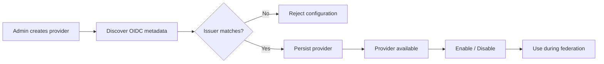

<a id="callback-uri"></a>
### Callback URI

The external provider redirects back to TSCloak.

Current federation callback:

```text
/api/federation/callback
```

With a local issuer:

```text
http://localhost:3000/api/federation/callback
```

The external provider should be configured with this callback URI.

The application callback is **different**.

```text
External Provider
      │
      ▼
TSCloak federation callback
      │
      ▼
TSCloak OIDC interaction
      │
      ▼
Application redirect URI
```

---

<a id="administration"></a>
## 🛠️ Administration

<a id="provider-management"></a>
### Provider Management

The federation module provides provider management operations.

Conceptually:

```text
┌───────────────────────────────────────────────────┐
│ TSCloak Federation                                │
├───────────────────────────────────────────────────┤
│                                                   │
│  Google        OIDC       ● Enabled               │
│  accounts...                                    │
│                                                   │
│  Microsoft     OIDC       ○ Disabled              │
│  login...                                        │
│                                                   │
│                              [ + Add Provider ]   │
└───────────────────────────────────────────────────┘
```

Provider management includes:

- Create
- List
- Read
- Update
- Delete
- Enable / disable through provider configuration

The response DTO intentionally omits the provider client secret.

<a id="client-scoping"></a>
### Client Scoping

TSCloak clients remain independent of provider credentials.

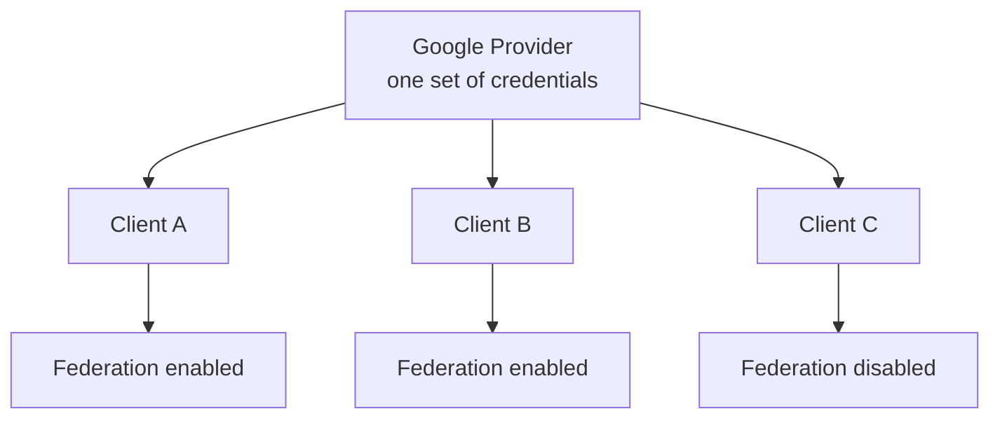

A provider can therefore be reused without duplicating its external credentials.

The federation transaction still records the `clientId` so that the authenticated user is resolved in the context of the original TSCloak client.

---

<a id="google-example"></a>
## 🇬 Google Example

### 1. Create Google credentials

Create an OIDC/OAuth client in Google Cloud.

Obtain:

```text
Client ID
Client Secret
```

### 2. Configure the redirect URI

Use the TSCloak federation callback:

```text
http://localhost:3000/api/federation/callback
```

### 3. Create the provider

```json
{
  "name": "Google",
  "type": "oidc",
  "issuer": "https://accounts.google.com",
  "clientId": "<GOOGLE_CLIENT_ID>",
  "clientSecret": "<GOOGLE_CLIENT_SECRET>",
  "scopes": [
    "openid",
    "profile",
    "email"
  ],
  "enabled": true
}
```

### 4. Start the federation flow

The federation endpoint receives the provider and TSCloak client context, creates a secure transaction, and redirects the browser to the external provider.

```text
TSCloak
  │
  ├── state
  ├── nonce
  ├── code_verifier
  │
  ▼
Google
```

### 5. Google authenticates the user

Google returns:

```text
code
state
```

to:

```text
/api/federation/callback
```

TSCloak then exchanges the code and verifies the resulting ID token.

---

<a id="api-flow"></a>
## 🧪 API Flow

<a id="start-federation"></a>
### Start Federation

The federation authorization endpoint follows the pattern:

```http
GET /api/federation/providers/:id/authorize
```

Query parameters include:

```text
client_id
redirect_uri
```

Example shape:

```text
GET /api/federation/providers/<provider-id>/authorize
    ?client_id=<tscloak-client-id>
    &redirect_uri=<application-callback>
```

Processing:

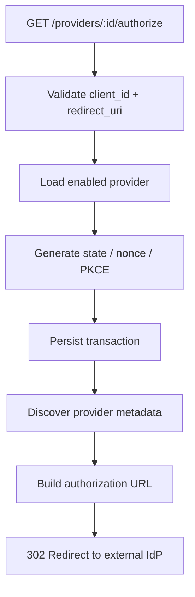

<a id="federation-callback"></a>
### Federation Callback

The callback receives:

```http
GET /api/federation/callback
```

with:

```text
code
state
```

Processing:

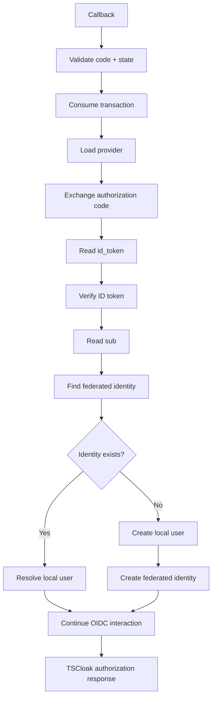

### Current callback behavior

The federation callback already performs the external identity resolution and local identity creation work.

The final integration point is completing the **pending TSCloak OIDC interaction** so that the original application authorization request can continue naturally.

---

<a id="security-notes"></a>
## ⚠️ Important Security Notes

### 🔒 Do not expose provider secrets

Never return:

```text
clientSecret
```

from normal provider response APIs.

Use a write-only DTO property for API documentation and validation.

### 🔑 Do not trust email as the identity key

Use:

```text
providerId + subject
```

not:

```text
email
```

for the primary external identity mapping.

### 🛡️ Verify upstream ID tokens

Do not accept an external `sub` value without verifying the upstream ID token.

Verification must include the provider's:

```text
issuer
audience
JWKS
nonce
signature
```

### 🔐 Keep federation transactions short-lived

A transaction contains security-sensitive browser state and a PKCE verifier.

It should:

- expire quickly
- be single-use
- be deleted/consumed after successful processing
- be rejected when expired

### 🔑 Keep TSCloak and upstream signing keys separate

There are two different trust relationships:

```text
TSCloak-issued token
        │
        ▼
TSCloak signing JWKS


External-provider ID token
        │
        ▼
External provider JWKS
```

Never use TSCloak's own signing key set to validate Google/Microsoft/etc. ID tokens.

---

<a id="implementation-status"></a>
## 📊 Implementation Status

### Implemented

- [x] Federation provider entity
- [x] Federated identity entity
- [x] Federation transaction entity
- [x] OIDC discovery
- [x] External authorization URL generation
- [x] `state` generation
- [x] `nonce` generation
- [x] PKCE S256 generation
- [x] Authorization code exchange
- [x] External ID token signature verification
- [x] Issuer validation
- [x] Audience validation
- [x] Nonce validation
- [x] Stable `(providerId, subject)` identity mapping
- [x] Local federated-user creation path
- [x] Provider email persistence when available
- [x] Generated fallback email when the local email field requires a value
- [x] No implicit email-based account linking
- [x] Provider CRUD service
- [x] Swagger DTOs for provider management
- [x] Secret excluded from provider response DTO

### Integration remaining

- [ ] Persist the originating `interactionUid` in the federation transaction
- [ ] Resume the pending TSCloak OIDC interaction after successful federation
- [ ] Complete the application-facing authorization redirect after federation
- [ ] Add comprehensive federation E2E coverage

> The federation callback currently resolves the external identity and can create the local identity. The final step is to hand that authenticated account back to the existing OIDC interaction instead of ending the callback with a standalone JSON response.

---

<a id="roadmap"></a>
## 🗺️ Roadmap

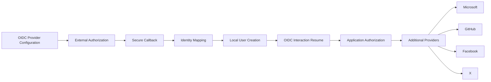

### Next federation milestones

- [ ] Finish OIDC interaction resume
- [ ] Add provider-specific client authentication methods where required
- [ ] Add UserInfo fallback when an upstream provider does not place sufficient claims in the ID token
- [ ] Add account-linking workflow with explicit user confirmation
- [ ] Add provider/client availability controls
- [ ] Add federation E2E test suite
- [ ] Add OAuth 2.0-only provider adapters
- [ ] Add provider icon/name metadata for custom login UI

---

## 🎯 Design Principles

Federation follows the same architecture principles as the rest of TSCloak:

| Principle | Federation application |
|---|---|
| **Single issuer** | Applications continue trusting TSCloak |
| **Protocol delegation** | TSCloak continues using `oidc-provider` for its own OIDC protocol |
| **Stable identity** | External users are identified by provider + subject |
| **Explicit trust boundaries** | Upstream ID tokens are verified against upstream keys |
| **No implicit email linking** | Matching email does not silently merge accounts |
| **Short-lived transactions** | Browser federation state expires and is consumed |
| **PKCE** | Authorization code exchange is protected with S256 |
| **Separation of concerns** | Federation logic remains in its own NestJS module |
| **Reusable providers** | External provider credentials are configured once |
| **Local token authority** | Applications receive TSCloak-issued tokens |

---

## 🧩 Conceptual Summary

```text
                    ┌──────────────────────┐
                    │      Application     │
                    │                      │
                    │   OIDC Client        │
                    └──────────┬───────────┘
                               │
                               │ Trusts
                               ▼
                    ┌──────────────────────┐
                    │       TSCloak        │
                    │                      │
                    │  OIDC Authorization  │
                    │       Server         │
                    └──────────┬───────────┘
                               │
                       Federation
                               │
                               ▼
                    ┌──────────────────────┐
                    │    External IdP      │
                    │                      │
                    │ Google / Microsoft / │
                    │       OIDC           │
                    └──────────┬───────────┘
                               │
                         Authenticated
                            subject
                               │
                               ▼
                    ┌──────────────────────┐
                    │       TSCloak        │
                    │                      │
                    │  Federated Identity  │
                    │         ↓            │
                    │    Local User        │
                    │         ↓            │
                    │  OIDC Interaction   │
                    └──────────┬───────────┘
                               │
                         TSCloak tokens
                               │
                               ▼
                    ┌──────────────────────┐
                    │      Application     │
                    └──────────────────────┘
```

> **One application integration. Multiple identity sources. One TSCloak issuer.**

---

<div align="center">

### 🔐 TSCloak Federation

**Secure Identities. Trusted Access.**

Built with ❤️ using NestJS, TypeScript, OAuth 2.0 and OpenID Connect.

</div>
