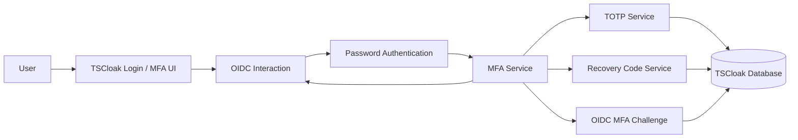
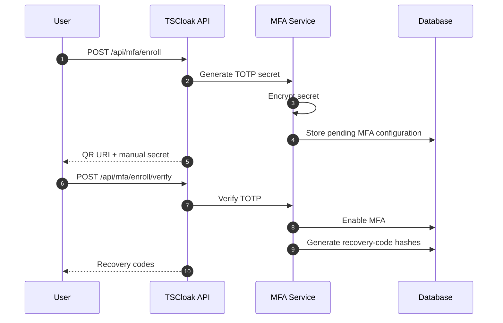
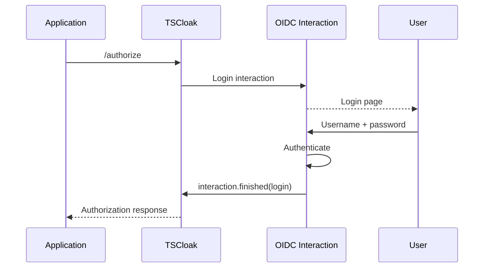
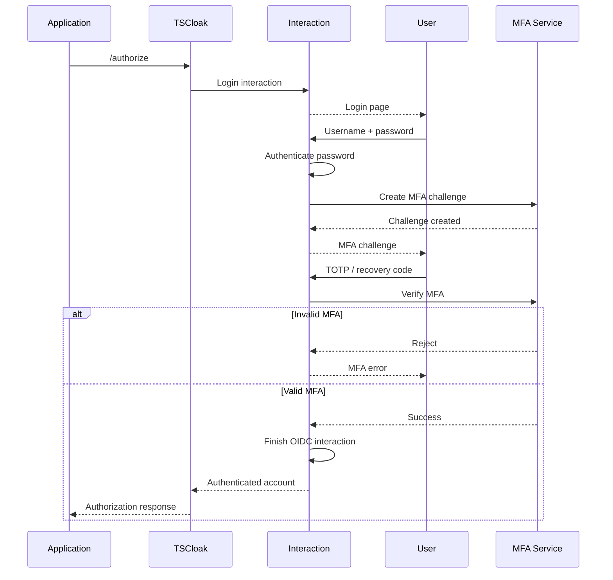
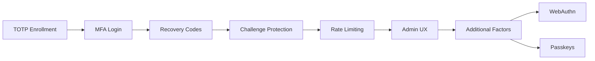

<div align="center">

#  TSCloak Multi-Factor Authentication

### Stronger authentication. One TSCloak identity.

[](#)
[](#)
[](#)
[](https://nestjs.com/)
[](https://www.typescriptlang.org/)

**Optional user MFA for TSCloak using TOTP and one-time recovery codes.**

</div>

---

## 📖 Overview

TSCloak MFA adds a second authentication factor to the existing TSCloak user login without changing the application's OIDC integration.

The application continues to trust TSCloak as its OIDC issuer:

```text
Application
    │
    │ OIDC /authorize
    ▼
 TSCloak
    │
    │ Username + Password
    ▼
 Password Authentication
    │
    │ MFA enabled?
    ▼
 ┌───────────────────┐
 │ MFA Challenge     │
 │                   │
 │ TOTP / Recovery   │
 │ Code              │
 └─────────┬─────────┘
           │
           ▼
     OIDC Interaction
           │
           ▼
   Authorization Code
           │
           ▼
      Application
```

> **Important:** When MFA is enabled, the OIDC authorization flow is not completed until the MFA challenge succeeds.

---

## 🧭 Navigation

- [📖 Overview](#-overview)
- [🏗️ Architecture](#️-architecture)
  - [MFA Components](#mfa-components)
  - [Authentication Boundaries](#authentication-boundaries)
  - [Module Structure](#module-structure)
- [🔐 Enrollment](#-enrollment)
  - [Enrollment Flow](#enrollment-flow)
  - [TOTP Secret](#totp-secret)
  - [QR Code and Manual Setup](#qr-code-and-manual-setup)
  - [Verification](#verification)
- [🔑 Recovery Codes](#-recovery-codes)
  - [Generation](#generation)
  - [Storage](#storage)
  - [One-Time Consumption](#one-time-consumption)
  - [Regeneration](#regeneration)
- [🔄 OIDC Login Flow](#-oidc-login-flow)
  - [Without MFA](#without-mfa)
  - [With MFA](#with-mfa)
  - [MFA Challenge](#mfa-challenge)
  - [AMR](#amr)
- [🛡️ Security Model](#️-security-model)
  - [TOTP Verification](#totp-verification)
  - [Challenge Lifetime](#challenge-lifetime)
  - [Rate Limiting](#rate-limiting)
  - [Secret Protection](#secret-protection)
- [🗃️ Data Model](#️-data-model)
- [⚙️ API](#️-api)
- [🧪 E2E Coverage](#-e2e-coverage)
- [📊 Implementation Status](#-implementation-status)
- [🗺️ Roadmap](#️-roadmap)

---

<a id="architecture"></a>
## 🏗️ Architecture

MFA is implemented as an application-level security capability around the existing TSCloak authentication and `oidc-provider` interaction flow.

The MFA layer does not replace the OIDC provider. It gates completion of the login interaction.

<a id="mfa-components"></a>
### MFA Components



<a id="authentication-boundaries"></a>
### Authentication Boundaries

| Component | Responsibility |
|---|---|
| **OIDC Provider** | Owns the application-facing OIDC protocol and authorization response |
| **OIDC Interaction** | Represents the pending authentication operation |
| **Password Authentication** | Verifies the user's primary credential |
| **MFA Service** | Coordinates enrollment, verification, disablement and recovery-code operations |
| **TOTP Service** | Generates and verifies RFC 6238-compatible TOTP values |
| **Recovery Code Service** | Generates, hashes, verifies and consumes recovery codes |
| **MFA Challenge** | Binds an MFA step to a specific OIDC interaction and user |
| **Rate Limiter** | Limits repeated MFA failures |
| **Database** | Stores MFA configuration, recovery-code hashes and short-lived challenges |

<a id="module-structure"></a>
### Module Structure

```text
src/
└── mfa/
    ├── dto/
    │   ├── disable-mfa.dto.ts
    │   ├── verify-mfa-enrollment.dto.ts
    │   └── verify-mfa.dto.ts
    │
    ├── entities/
    │   ├── user-mfa.entity.ts
    │   └── user-mfa-recovery-code.entity.ts
    │
    ├── services/
    │   ├── mfa.service.ts
    │   ├── mfa-crypto.service.ts
    │   ├── mfa-recovery-code.service.ts
    │   └── mfa-totp.service.ts
    │
    ├── mfa.controller.ts
    └── mfa.module.ts
```

The OIDC login flow additionally uses a dedicated MFA challenge service:

```text
src/oidc/
└── services/
    └── oidc-mfa-challenge.service.ts
```

---

<a id="enrollment"></a>
## 🔐 Enrollment

MFA enrollment is a two-step process:

```text
Generate secret
      │
      ▼
Show QR / manual secret
      │
      ▼
User configures authenticator
      │
      ▼
User enters current TOTP
      │
      ▼
Verify TOTP
      │
      ▼
Enable MFA
      │
      ▼
Generate recovery codes
```

<a id="enrollment-flow"></a>
### Enrollment Flow



MFA remains disabled until the enrollment verification succeeds.

<a id="totp-secret"></a>
### TOTP Secret

TSCloak generates a cryptographically suitable TOTP secret and stores the protected value rather than keeping the secret as ordinary plaintext application data.

The secret is used to produce an authenticator URI:

```text
otpauth://totp/TSCloak:<account>
    ?secret=<secret>
    &issuer=TSCloak
```

The exact authenticator application is not prescribed; any compatible TOTP authenticator can be used.

<a id="qr-code-and-manual-setup"></a>
### QR Code and Manual Setup

Enrollment exposes both:

```text
QR Code
   +
Manual Secret
```

This allows the user to either scan the QR code or enter the secret manually.

The enrollment response is intended for the authenticated user performing enrollment.

<a id="verification"></a>
### Verification

The enrollment verification endpoint accepts a six-digit TOTP value.

```text
6 digits
    │
    ▼
TOTP verification
    │
    ├── invalid ──► MFA remains disabled
    │
    └── valid ────► MFA enabled
                         │
                         ▼
                  Recovery codes
```

No MFA enrollment is considered complete merely because a secret was generated.

---

<a id="recovery-codes"></a>
## 🔑 Recovery Codes

Recovery codes provide a fallback when the user cannot access the configured authenticator.

TSCloak generates **10 recovery codes** during successful MFA enrollment.

Example format:

```text
A1B2-C3D4-E5F6-7890
```

The generated values are returned to the user at the appropriate enrollment/regeneration operation.

<a id="generation"></a>
### Generation

Recovery codes are generated using cryptographically random bytes and converted into a human-readable format.

```text
Cryptographic randomness
          │
          ▼
      10 codes
          │
          ▼
   Human-readable form
          │
          ▼
       User sees
```

Recovery codes are intended to be saved by the user in a secure location.

<a id="storage"></a>
### Storage

TSCloak does **not** store recovery codes as plaintext.

The persistence model stores:

```text
Recovery Code
     │
     ▼
Argon2 hash
     │
     ▼
Database
```

The database record also tracks whether a code has already been consumed.

Conceptually:

```text
user_mfa_recovery_codes
│
├── id
├── userMfaId
├── codeHash
├── usedAt
└── createdAt
```

<a id="one-time-consumption"></a>
### One-Time Consumption

A recovery code is intended to be usable only once.

The consumption operation verifies an unused hash and conditionally marks that exact record as used.

```text
Recovery code submitted
        │
        ▼
Find unused codes
        │
        ▼
Verify Argon2 hash
        │
        ▼
Conditional usedAt update
        │
        ├── success ──► authentication continues
        │
        └── already used ──► authentication rejected
```

The database update includes an `unused` condition so that concurrent attempts cannot both successfully consume the same recovery-code record.

<a id="regeneration"></a>
### Regeneration

Regenerating recovery codes invalidates the previous set.

```text
Old recovery codes
        │
        ▼
   Invalidate
        │
        ▼
Generate 10 new codes
        │
        ▼
Return new codes once
```

This provides a way to replace a lost or compromised recovery-code set.

---

<a id="oidc-login-flow"></a>
## 🔄 OIDC Login Flow

MFA is integrated directly into the existing OIDC interaction rather than creating a separate application authentication protocol.

<a id="without-mfa"></a>
### Without MFA

When MFA is not enabled:



<a id="with-mfa"></a>
### With MFA

When MFA is enabled:



> **Security boundary:** A successful password authentication does not by itself finish the OIDC login when MFA is enabled.

<a id="mfa-challenge"></a>
### MFA Challenge

The MFA challenge binds the second factor to:

```text
interactionUid
userId
expiresAt
```

The challenge is therefore associated with the specific OIDC interaction being authenticated.

```text
OIDC Interaction
      │
      ▼
MFA Challenge
 ┌────────────────────┐
 │ interactionUid     │
 │ userId             │
 │ expiresAt          │
 └─────────┬──────────┘
           │
           ▼
     TOTP / Recovery
           │
           ▼
  interaction.finished()
```

The current challenge lifetime is **5 minutes**.

An expired challenge is rejected and removed.

<a id="amr"></a>
### AMR

For a successful password-only login, TSCloak records:

```json
["pwd"]
```

For a successful password + MFA login:

```json
["pwd", "otp"]
```

This allows relying applications to distinguish the authentication methods used for the OIDC session when `amr` is requested.

---

<a id="security-model"></a>
## 🛡️ Security Model

MFA introduces additional secrets and authentication state, so the implementation separates:

```text
Primary Credential
       │
       ▼
Password Authentication
       │
       ▼
MFA Challenge
       │
       ├── TOTP
       │
       └── Recovery Code
       │
       ▼
OIDC Interaction Completion
```

<a id="totp-verification"></a>
### TOTP Verification

TSCloak uses TOTP compatible with RFC 6238 through the configured TOTP library.

The verification endpoint accepts a six-digit code.

```text
Authenticator
     │
     │ current TOTP
     ▼
TSCloak
     │
     ▼
TOTP verification
     │
     ├── valid
     └── invalid
```

OTP values are not persisted as authentication credentials.

<a id="challenge-lifetime"></a>
### Challenge Lifetime

MFA challenges are short-lived.

```text
Challenge created
      │
      ├────────────── 5 minutes ──────────────┐
      │                                       │
      ▼                                       ▼
  MFA accepted                         Challenge expired
      │                                       │
      ▼                                       ▼
Interaction finished                    Reject request
```

A missing or expired challenge cannot be used to complete an OIDC login.

<a id="rate-limiting"></a>
### Rate Limiting

Repeated MFA failures are rate-limited.

The current in-memory policy is:

```text
5 failures
   │
   ▼
5-minute failure window
   │
   ▼
60-second block
```

The limiter is applied to both authenticated MFA API operations and the OIDC MFA challenge path.

The OIDC path uses the interaction/challenge context when applying the MFA attempt key.

> The limiter is intentionally separate from the OIDC provider itself so that MFA-specific failure handling remains localized to the MFA flow.

<a id="secret-protection"></a>
### Secret Protection

The TOTP secret is encrypted before persistence using authenticated encryption.

Conceptually:

```text
TOTP secret
    │
    ▼
AES-256-GCM
    │
    ▼
Encrypted database value
```

The encryption key is supplied through the MFA encryption-key configuration.

Recovery codes use a different protection model:

```text
Recovery code
    │
    ▼
Argon2
    │
    ▼
Hash stored in database
```

This means the two MFA credential types are protected according to their different operational requirements.

---

<a id="data-model"></a>
## 🗃️ Data Model

### User MFA

```text
user_mfa
│
├── id
├── userId
├── enabled
├── method
├── encryptedSecret
├── enrolledAt
├── createdAt
└── updatedAt
```

The MFA record is associated one-to-one with a TSCloak user.

### Recovery Codes

```text
user_mfa_recovery_codes
│
├── id
├── userMfaId
├── codeHash
├── usedAt
└── createdAt
```

The relationship is:

```text
User
 │
 └── UserMfa
       │
       └── Recovery Codes
```

### OIDC MFA Challenge

```text
oidc_mfa_challenges
│
├── id
├── interactionUid
├── userId
├── expiresAt
└── createdAt
```

The challenge is deliberately short-lived and tied to an OIDC interaction.

---

<a id="api"></a>
## ⚙️ API

MFA management is exposed below:

```text
/api/mfa
```

### Enrollment

```http
POST /api/mfa/enroll
```

Starts enrollment and returns the information required to configure a TOTP authenticator.

```http
POST /api/mfa/enroll/verify
```

Verifies the current TOTP and completes enrollment.

### Status

```http
GET /api/mfa/status
```

Returns the current MFA status for the authenticated user.

### Disable

```http
POST /api/mfa/disable
```

Disables MFA after verification with the current TOTP.

### Recovery Code Regeneration

```http
POST /api/mfa/recovery-codes/regenerate
```

Generates a replacement recovery-code set and invalidates the previous set.

### OIDC MFA

The browser interaction uses the OIDC interaction route:

```http
POST /interaction/:uid/mfa
```

The request selects either:

```text
totp
```

or:

```text
recovery
```

The challenge must already exist for the interaction.

---

<a id="e2e-coverage"></a>
## 🧪 E2E Coverage

The MFA E2E suite exercises TSCloak as an external client of the running identity provider.

The coverage includes:

```text
┌─────────────────────────────────────────────┐
│              TSCloak MFA E2E                │
├─────────────────────────────────────────────┤
│ ✓ Enrollment lifecycle                      │
│ ✓ TOTP authentication                       │
│ ✓ Recovery-code authentication              │
│ ✓ Invalid MFA rejection                     │
│ ✓ Recovery-code reuse rejection              │
│ ✓ Recovery-code regeneration                │
│ ✓ Recovery-code exhaustion                  │
│ ✓ MFA challenge security                    │
│ ✓ Challenge reuse rejection                 │
│ ✓ MFA bypass rejection                      │
│ ✓ MFA rate limiting                          │
│ ✓ OIDC AMR                                  │
└─────────────────────────────────────────────┘
```

The tests intentionally interact with the running IdP through its public/API and OIDC interfaces rather than directly manipulating ORM state.

### Recovery-code concurrency

The recovery-code flow also covers concurrent use of the same recovery code.

The expected security property is:

```text
Same recovery code
       │
       ├────────► Request A ──► success
       │
       └────────► Request B ──► rejected
```

Only one request should be able to consume a particular recovery code.

---

<a id="implementation-status"></a>
## 📊 Implementation Status

### Implemented

- [x] Optional per-user MFA
- [x] TOTP authentication
- [x] TOTP enrollment
- [x] QR / manual TOTP setup information
- [x] Enrollment verification
- [x] Encrypted TOTP secret storage
- [x] Recovery-code generation
- [x] Hashed recovery-code storage
- [x] One-time recovery-code consumption
- [x] Recovery-code regeneration
- [x] Recovery-code invalidation after regeneration
- [x] OIDC MFA challenge
- [x] Challenge expiration
- [x] Password + MFA OIDC flow
- [x] `amr` values for password and OTP authentication
- [x] MFA attempt rate limiting
- [x] MFA disable flow
- [x] MFA status endpoint
- [x] OIDC MFA E2E coverage
- [x] MFA challenge security E2E coverage
- [x] Enrollment lifecycle E2E coverage
- [x] Recovery-code exhaustion/concurrency E2E coverage

### Current scope

```text
TOTP
  +
Recovery Codes
  +
OIDC Login Challenge
  +
Rate Limiting
```

The current MFA implementation does not include:

```text
SMS MFA
Email OTP
WebAuthn / Passkeys
```

---

<a id="roadmap"></a>
## 🗺️ Roadmap



Potential future work can include:

- [ ] Richer administration and audit UX
- [ ] Additional MFA methods
- [ ] WebAuthn / passkey support
- [ ] More detailed authentication-event auditing
- [ ] Additional policy controls for MFA enforcement

---

## 🎯 Design Principles

| Principle | MFA application |
|---|---|
| **Existing OIDC flow** | MFA gates the existing TSCloak OIDC interaction |
| **User-scoped security** | MFA configuration belongs to an individual TSCloak user |
| **Strong second factor** | TOTP provides the primary second factor |
| **Recoverability** | One-time recovery codes provide account recovery |
| **No plaintext recovery codes** | Recovery codes are stored as Argon2 hashes |
| **Protected TOTP secret** | TOTP secret is encrypted before persistence |
| **Short-lived challenges** | OIDC MFA challenges expire |
| **Replay resistance** | Recovery codes are consumed once |
| **Brute-force protection** | MFA attempts are rate-limited |
| **OIDC transparency** | Applications continue integrating with TSCloak as the issuer |
| **Authentication context** | `amr` records password and OTP authentication methods |

---

## 🧩 Conceptual Summary

```text
                    ┌──────────────────────┐
                    │      Application     │
                    │                      │
                    │      OIDC Client     │
                    └──────────┬───────────┘
                               │
                               │ Trusts
                               ▼
                    ┌──────────────────────┐
                    │       TSCloak        │
                    │                      │
                    │ OIDC Authorization   │
                    │       Server         │
                    └──────────┬───────────┘
                               │
                         User Login
                               │
                               ▼
                    ┌──────────────────────┐
                    │    Authentication    │
                    │                      │
                    │  Username + Password │
                    └──────────┬───────────┘
                               │
                         MFA enabled
                               │
                               ▼
                    ┌──────────────────────┐
                    │    MFA Challenge     │
                    │                      │
                    │  TOTP / Recovery     │
                    └──────────┬───────────┘
                               │
                         Verified User
                               │
                               ▼
                    ┌──────────────────────┐
                    │   OIDC Interaction   │
                    │                      │
                    │ interaction.finished │
                    └──────────┬───────────┘
                               │
                               │ TSCloak tokens
                               ▼
                    ┌──────────────────────┐
                    │      Application     │
                    └──────────────────────┘
```

> **One application integration. One TSCloak issuer. An additional authentication factor.**

---

<div align="center">

### 🔐 TSCloak MFA

**Stronger Authentication. Trusted Access.**

Built with ❤️ using NestJS, TypeScript, OAuth 2.0 and OpenID Connect.

</div>
