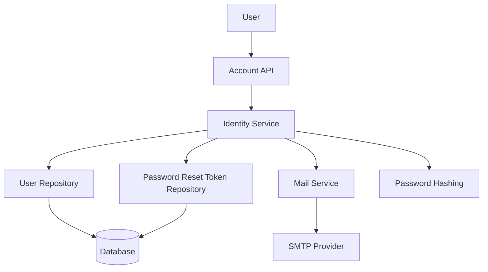
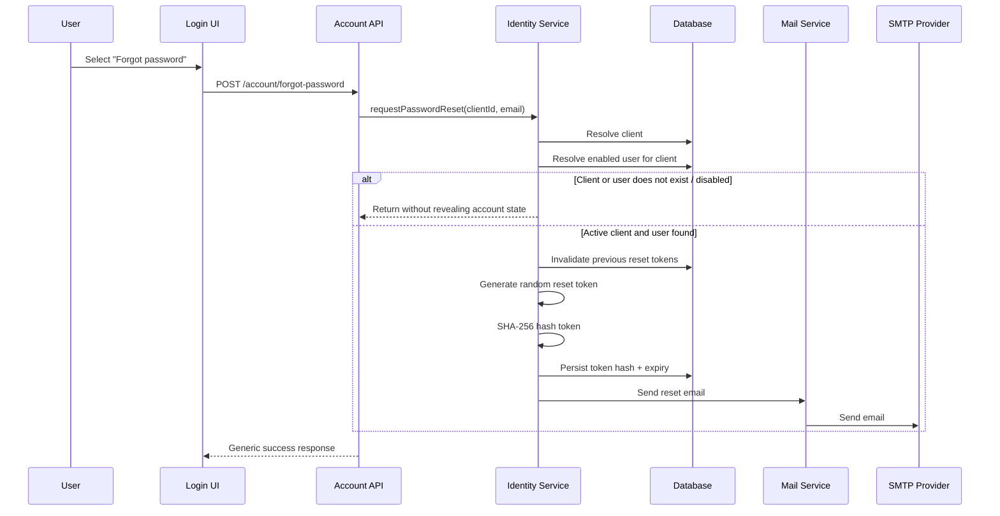
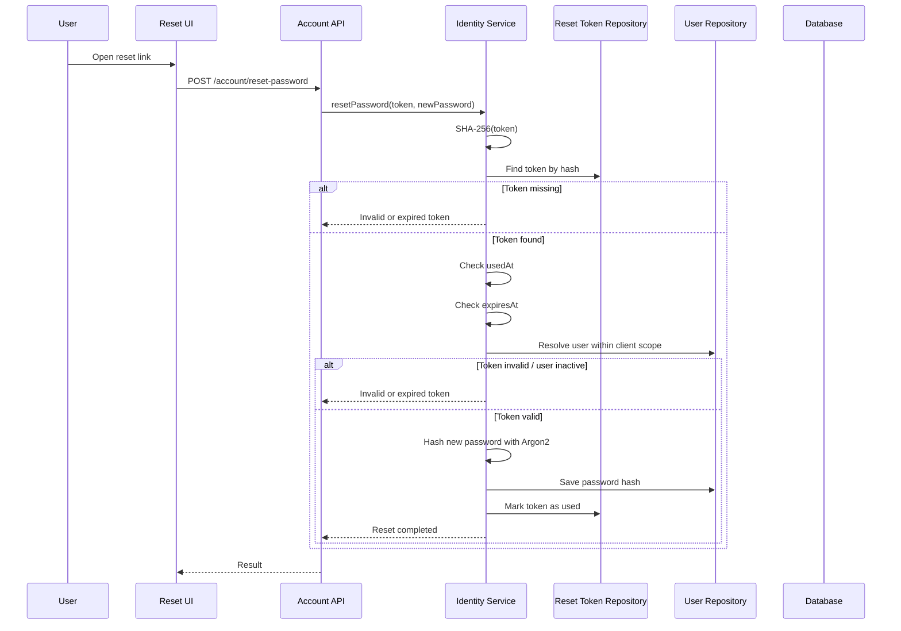
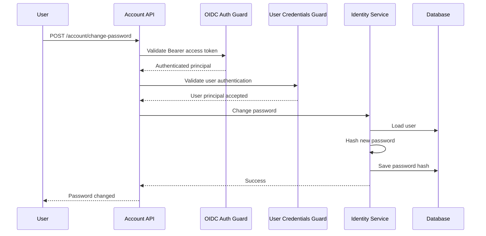
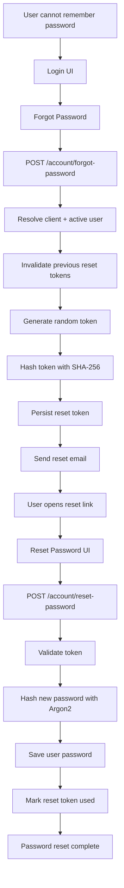

# 🔐 Password Reset Flow

TSCloak provides a password reset flow for users who have forgotten their password. The flow is implemented as an application-level account capability around the identity layer rather than as part of the OAuth 2.0 / OpenID Connect protocol itself.

The reset flow is designed around the same application boundaries used throughout TSCloak:

- **Identity** owns user accounts and password state.
- **Account** exposes password-management endpoints.
- **Password reset tokens** are persisted independently from user passwords.
- **Mail** delivers the password-reset link.
- **OIDC Provider** continues to own OAuth 2.0 / OpenID Connect protocol processing.

> TSCloak does not reimplement the OAuth 2.0 or OpenID Connect protocol stack. It uses `nest-oidc-provider` and the underlying `oidc-provider` library for protocol handling.

---

## 🧭 Navigation

- [Overview](#overview)
- [Password Management Endpoints](#password-management-endpoints)
- [Architecture](#architecture)
- [Forgot Password Flow](#forgot-password-flow)
- [Reset Token Design](#reset-token-design)
- [Reset Password Flow](#reset-password-flow)
- [Change Password Flow](#change-password-flow)
- [Client-Scoped Identity](#client-scoped-identity)
- [Security Behavior](#security-behavior)
- [Password Reset Email](#password-reset-email)
- [Configuration](#configuration)
- [Complete Flow](#complete-flow)
- [Relationship with OIDC Authentication](#relationship-with-oidc-authentication)
- [Implementation Notes](#implementation-notes)

<a id="overview"></a>
## 📖 Overview

The password reset feature supports three application-level operations:

| Method | Endpoint | Purpose | Authentication |
|---|---|---|---|
| `POST` | `/account/change-password` | Change the password of the currently authenticated user | OIDC user access token |
| `POST` | `/account/forgot-password` | Request a password reset email | Public |
| `POST` | `/account/reset-password` | Set a new password using a reset token | Public + reset token |

The flow is intentionally separated into two different use cases:

1. **Forgot password** — the user no longer has the current password and requests a one-time reset link.
2. **Change password** — the user is already authenticated and wants to replace the current password.

---

<a id="password-management-endpoints"></a>
## 🔑 Password Management Endpoints

### `POST /account/forgot-password`

Starts the password-reset process.

The request identifies the application/client and the user's email address because users are scoped to clients in TSCloak.

Example request:

```http
POST /account/forgot-password
Content-Type: application/json

{
  "clientId": "my-client",
  "email": "user@example.com"
}
```

The endpoint returns a generic response regardless of whether the client or user exists. This prevents the endpoint from becoming an account-enumeration mechanism.

Example response:

```json
{
  "message": "If an account exists, a password reset link has been sent."
}
```

### `POST /account/reset-password`

Completes a password reset using the one-time token received through the reset email.

Example request:

```http
POST /account/reset-password
Content-Type: application/json

{
  "token": "7e7c8c0d8e...",
  "newPassword": "NewPassword456!",
  "confirmPassword": "NewPassword456!"
}
```

The reset token is validated before the password is changed.

### `POST /account/change-password`

Changes the password of an authenticated user.

This endpoint requires an OIDC bearer access token and validates that the token represents a user rather than a client-credentials principal.

---

<a id="architecture"></a>
## 🏗️ Architecture

The password reset feature follows the application/domain architecture of TSCloak.



The OAuth 2.0 / OpenID Connect protocol engine is not responsible for the reset-token lifecycle. The account and identity layers own this application behavior.

---

<a id="forgot-password-flow"></a>
## 📩 Forgot Password Flow

The forgot-password flow starts when a user cannot authenticate with their existing password.



### Account Enumeration Protection

The endpoint deliberately does not tell the caller whether the supplied email belongs to an active user.

For example, these cases use the same externally visible response:

- Client does not exist.
- Client is disabled.
- User does not exist.
- User is disabled.
- User exists and a reset email was generated.

This prevents callers from using the endpoint to discover registered accounts.

---

<a id="reset-token-design"></a>
## 🎫 Reset Token Design

TSCloak does not store the raw password-reset token in the database.

The process is:

```text
Random token
     │
     ▼
SHA-256(token)
     │
     ▼
Token hash stored in database
```

The raw token is only used to construct the reset URL delivered to the user.

### Stored Token Data

The password-reset token record contains:

| Field | Purpose |
|---|---|
| `id` | Internal reset-token identifier |
| `tokenHash` | SHA-256 hash of the raw reset token |
| `userId` | User associated with the reset request |
| `clientId` | Client/application scope of the user |
| `expiresAt` | Token expiration timestamp |
| `usedAt` | Timestamp showing that the token has already been consumed |
| `createdAt` | Token creation timestamp |

The token is therefore both **client-scoped** and **user-scoped**.

### Token Lifetime

The current reset token lifetime is **30 minutes**.

```text
Created
  │
  ├── Valid for 30 minutes
  │
  ▼
Expired
```

### One-Time Use

After a successful password reset, `usedAt` is populated. A token with a non-null `usedAt` cannot be used again.

When a new reset request is created for a user, previously active reset tokens for that user/client are invalidated first.

---

<a id="reset-password-flow"></a>
## 🔄 Reset Password Flow

The reset-password endpoint accepts the raw token supplied by the user interface.



### Validation Sequence

The reset operation validates the following in order:

1. A reset token was supplied.
2. The token hash exists.
3. The token has not already been used.
4. The token has not expired.
5. The associated user still exists and is enabled.
6. The new password is hashed.
7. The new password is persisted.
8. The reset token is marked as used.

If any token validation step fails, the password is not changed.

### Password Hashing

The new password is hashed with **Argon2** before it is persisted.

The raw password is never stored as the user's password value.

---

<a id="change-password-flow"></a>
## 🔒 Change Password Flow

Change-password is different from password reset because the user already has an authenticated OIDC session/access token.



The endpoint is protected by the OIDC authentication layer and an additional user-credentials check.

### Client Credentials Restriction

A client-credentials token represents the client application rather than a human user. TSCloak distinguishes this principal from a user token.

A client-credentials token cannot use the change-password operation.

The application returns:

```text
403 Forbidden
User authentication is required
```

for a principal that does not represent a user.

---

<a id="client-scoped-identity"></a>
## 🧩 Client-Scoped Identity

TSCloak allows usernames and email addresses to be unique **within a client** rather than globally.

Conceptually:

```text
Client A
  ├── alice@example.com
  └── bob@example.com

Client B
  ├── alice@example.com
  └── bob@example.com
```

The forgot-password request therefore requires both:

```json
{
  "clientId": "my-client",
  "email": "user@example.com"
}
```

The identity lookup is performed within that client scope.

This prevents an email address belonging to one client from being used to reset an account belonging to another client.

---

<a id="security-behavior"></a>
## 🛡️ Security Behavior

### Generic Forgot-Password Response

The forgot-password endpoint intentionally avoids revealing whether an account exists.

### Hashed Reset Tokens

Only the SHA-256 token hash is stored in the database. The raw reset token is delivered through the reset link.

### Short Token Lifetime

Reset tokens expire after 30 minutes.

### One-Time Tokens

A reset token is invalid after it has been successfully consumed.

### Previous Token Invalidation

Creating a new reset request invalidates existing reset tokens for the same user/client before a new token is created.

### Enabled Account Checks

The reset flow requires both the client and the user to remain enabled.

### Password Hashing

New passwords are stored as Argon2 hashes rather than plaintext values.

### User-Only Password Changes

Client-credentials access tokens are explicitly prevented from changing user passwords.

---

<a id="password-reset-email"></a>
## ✉️ Password Reset Email

The reset email is generated by the TSCloak Mail Service.

The email contains a link constructed from the configured password-reset UI URL:

```text
PASSWORD_RESET_UI_URL?token=<raw-reset-token>
```

The raw token is URL-encoded before it is placed into the link.

The email template is responsible for the user-facing message and branding, while the identity service is responsible for generating and persisting the reset token.

### Mail Architecture

```text
Identity Service
      │
      ▼
Mail Service
      │
      ▼
Password Reset Template
      │
      ▼
Nodemailer
      │
      ▼
SMTP Provider
```

---

<a id="configuration"></a>
## ⚙️ Configuration

The password reset email flow uses SMTP configuration and a password-reset UI URL.

Example environment configuration:

```env
SMTP_HOST=smtp-relay.brevo.com
SMTP_PORT=587
SMTP_SECURE=false
SMTP_USER=<Brevo SMTP login>
SMTP_PASSWORD=<Brevo SMTP key>
MAIL_FROM="TSCloak <verified-sender@example.com>"
PASSWORD_RESET_UI_URL=http://localhost:3000/reset-password
```

The exact SMTP provider is deployment-specific. The application uses Nodemailer as the mail transport.

---

<a id="complete-flow"></a>
## 🔄 Complete Password Reset Flow

The complete user journey can be summarized as:



---

<a id="relationship-with-oidc-authentication"></a>
## 🔗 Relationship with OIDC Authentication

Password reset is an application account-management capability. It is not an OAuth 2.0 grant and does not replace the OIDC authorization flow.

The relationship is:

```text
Password Reset
      │
      ▼
User Password Updated
      │
      ▼
Future OIDC Login
      │
      ▼
Authorization Code + PKCE
      │
      ▼
OIDC Tokens
```

The password reset operation changes the credential used during future user authentication. The authorization server continues to use `oidc-provider` for OAuth 2.0 and OpenID Connect protocol processing.

---

<a id="implementation-notes"></a>
## 🧱 Implementation Notes

### Password Reset Token Entity

The reset-token persistence model is intentionally separate from the `User` entity.

Conceptually:

```text
User
 │
 ├── id
 ├── clientId
 ├── email
 ├── passwordHash
 └── enabled

PasswordResetToken
 │
 ├── tokenHash
 ├── userId
 ├── clientId
 ├── expiresAt
 ├── usedAt
 └── createdAt
```

This keeps temporary credential-recovery state separate from the permanent identity record.

### Repository Boundary

The identity service uses repositories for user and reset-token persistence. This follows the broader TSCloak design principle of keeping application logic separated from the underlying TypeORM/database implementation.

### Protocol Boundary

The reset flow does not modify the OAuth/OIDC protocol engine. It changes the user's stored password and therefore affects the credentials available during a later login interaction.

---

## 📌 Summary

TSCloak's password reset flow provides:

- Client-scoped password recovery
- Generic forgot-password responses to reduce account enumeration
- Cryptographically random reset tokens
- SHA-256 token hashing at rest
- 30-minute token expiration
- One-time token consumption
- Previous-token invalidation
- Enabled-client and enabled-user validation
- Argon2 password hashing
- SMTP-based password reset email delivery
- Explicit separation between user password changes and client-credentials authentication

The flow remains an application-level identity capability while the underlying OAuth 2.0 and OpenID Connect protocol processing continues to be handled by `oidc-provider`.
