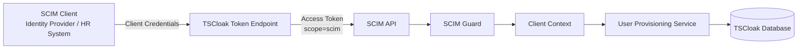
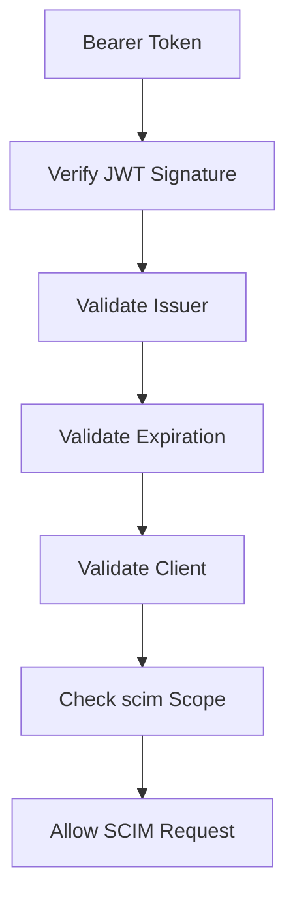
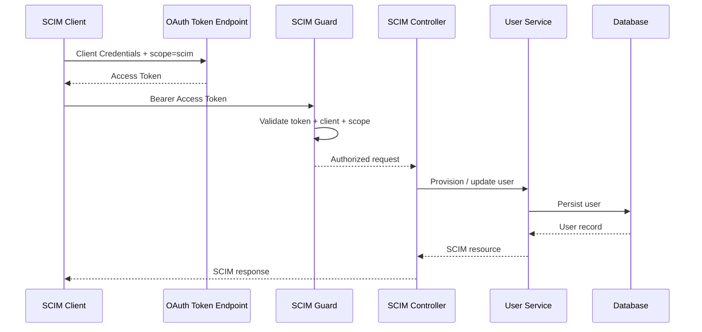
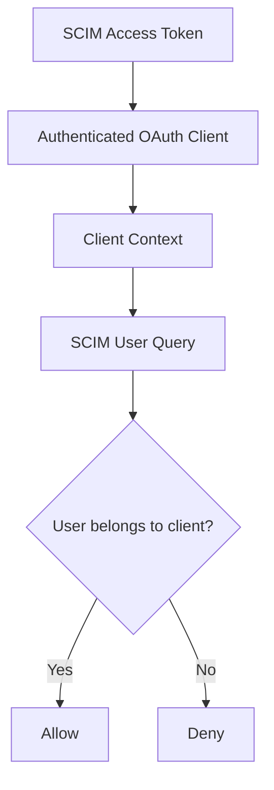

<div align="center">

#  TSCloak SCIM Provisioning

### Secure user lifecycle provisioning through SCIM 2.0

[](#)
[](#)
[](#)
[](https://nestjs.com/)
[](https://www.typescriptlang.org/)

**SCIM 2.0-compatible user provisioning for TSCloak clients using OAuth 2.0 Client Credentials.**

</div>

---

## 📚 Navigation

- [Overview](#overview)
- [Architecture](#architecture)
- [Module Structure](#module-structure)
- [Authentication](#authentication)
  - [SCIM Scope](#scim-scope)
  - [Client Credentials Flow](#client-credentials-flow)
  - [Access Token Validation](#access-token-validation)
- [User Provisioning](#user-provisioning)
  - [User Mapping](#user-mapping)
  - [Create User](#create-user)
  - [Get User](#get-user)
  - [List Users](#list-users)
  - [Replace User](#replace-user)
  - [Patch User](#patch-user)
  - [Delete User](#delete-user)
- [Password Setup](#password-setup)
- [SCIM Discovery](#scim-discovery)
- [Security Model](#security-model)
- [API Reference](#api-reference)
- [Testing](#testing)
- [Implementation Status](#implementation-status)
- [Roadmap](#roadmap)
- [Design Principles](#design-principles)

---

<a id="overview"></a>

## 🔐 Overview

TSCloak provides a SCIM 2.0 provisioning interface for external identity and workforce-management systems.

SCIM allows a connected system to create, read, update, deactivate, and delete users in a standardized way without requiring custom provisioning APIs for every integration.

The TSCloak implementation uses OAuth 2.0 Client Credentials for machine-to-machine authentication.

### Key capabilities

- SCIM 2.0 user provisioning.
- OAuth 2.0 Client Credentials authentication.
- Dedicated `scim` OAuth scope.
- Client-aware provisioning.
- Standard SCIM discovery endpoints.
- Create, read, replace, patch, and delete user operations.
- Soft deactivation through SCIM `active`.
- Password handling without exposing password values.
- TSCloak role assignment for provisioned users.

> **Important:** SCIM is an OAuth scope, not a grant type. Selecting the `scim` scope automatically requires Client Credentials support, while token endpoint authentication remains an independent client configuration.

---

<a id="architecture"></a>

## 🏗️ Architecture



### Component responsibilities

| Component | Responsibility |
|---|---|
| SCIM Client | Requests an OAuth access token and calls SCIM endpoints |
| OAuth Token Endpoint | Issues access tokens using Client Credentials |
| SCIM Guard | Validates token signature, issuer, expiry, client and scope |
| SCIM Controller | Exposes SCIM 2.0 HTTP endpoints |
| User Provisioning Service | Maps SCIM resources into TSCloak users |
| TSCloak Database | Stores users and their client association |

---

<a id="module-structure"></a>

## 📦 Module Structure

The SCIM implementation is isolated in its own NestJS module.

```text
src/
├── scim/
│   ├── controllers/
│   │   └── scim-users.controller.ts
│   ├── dto/
│   │   └── scim-user.dto.ts
│   ├── guards/
│   │   └── scim-auth.guard.ts
│   ├── services/
│   │   └── scim-users.service.ts
│   └── scim.module.ts
│
├── auth/
├── users/
├── clients/
└── ...
```

The SCIM layer reuses TSCloak's existing user and client infrastructure instead of creating a separate identity store.

---

<a id="authentication"></a>

## 🔑 Authentication

SCIM endpoints are protected using OAuth 2.0 access tokens.

The connected SCIM system authenticates as an OAuth client and requests a token with the `scim` scope.

### Authentication model

```text
SCIM Client
    │
    │ client_id + client_secret
    ▼
POST /token
    │
    │ grant_type=client_credentials
    │ scope=scim
    ▼
OAuth Access Token
    │
    │ Authorization: Bearer <token>
    ▼
/scim/v2/*
```

<a id="scim-scope"></a>

### SCIM Scope

The `scim` scope represents permission to access the SCIM provisioning API.

It is configured under **Allowed scopes**.

Selecting SCIM in the client configuration:

1. Adds the `scim` scope.
2. Enables the `client_credentials` grant.
3. Does **not** change the token endpoint authentication method.

This keeps grant types and token endpoint authentication as independent client settings.

---

<a id="client-credentials-flow"></a>

### Client Credentials Flow

A SCIM client requests an access token using its client credentials.

```http
POST /token
Content-Type: application/x-www-form-urlencoded

grant_type=client_credentials&
client_id=<client_id>&
client_secret=<client_secret>&
scope=scim
```

A successful token response contains an access token with the `scim` scope.

```json
{
  "access_token": "<access-token>",
  "token_type": "Bearer",
  "expires_in": 3600,
  "scope": "scim"
}
```

The SCIM client then uses the token:

```http
Authorization: Bearer <access-token>
```

---

<a id="access-token-validation"></a>

### Access Token Validation

The SCIM guard validates the access token before allowing a request to continue.

The validation model is:



The token identifies the OAuth client used for provisioning.

The SCIM request does not need to send a separate TSCloak `clientId`. The client identity is derived from the validated access token.

---

<a id="user-provisioning"></a>

## 👤 User Provisioning

SCIM users are provisioned into the TSCloak client represented by the OAuth access token.

### Provisioning flow



### User lifecycle operations

| Operation | HTTP | Endpoint | Purpose |
|---|---|---|---|
| Create | `POST` | `/scim/v2/Users` | Create a user |
| List | `GET` | `/scim/v2/Users` | List users |
| Get | `GET` | `/scim/v2/Users/:id` | Retrieve a user |
| Replace | `PUT` | `/scim/v2/Users/:id` | Replace user attributes |
| Patch | `PATCH` | `/scim/v2/Users/:id` | Apply partial changes |
| Delete | `DELETE` | `/scim/v2/Users/:id` | Deactivate/remove provisioning |

---

<a id="user-mapping"></a>

### User Mapping

SCIM attributes are mapped to the existing TSCloak user model.

| SCIM attribute | TSCloak user field |
|---|---|
| `userName` | `username` |
| `active` | `enabled` |
| `emails[].value` | `email` |
| `name.givenName` | `givenName` |
| `name.familyName` | `familyName` |
| `displayName` | `displayName` |

The provisioned user is associated with the OAuth client represented by the SCIM access token.

---

<a id="create-user"></a>

### Create User

```http
POST /scim/v2/Users
Authorization: Bearer <access-token>
Content-Type: application/scim+json
```

Example request:

```json
{
  "userName": "john.doe",
  "name": {
    "givenName": "John",
    "familyName": "Doe"
  },
  "displayName": "John Doe",
  "emails": [
    {
      "value": "john.doe@example.com",
      "type": "work",
      "primary": true
    }
  ],
  "active": true
}
```

Example cURL:

```bash
curl -X POST \
  'http://localhost:3000/scim/v2/Users' \
  -H 'accept: */*' \
  -H 'Authorization: Bearer <access-token>' \
  -H 'Content-Type: application/scim+json' \
  -d '{
    "userName": "john.doe",
    "name": {
      "givenName": "John",
      "familyName": "Doe"
    },
    "displayName": "John Doe",
    "emails": [
      {
        "value": "john.doe@example.com",
        "type": "work",
        "primary": true
      }
    ],
    "active": true
  }'
```

The `clientId` is intentionally not supplied by the SCIM client. It is derived from the authenticated OAuth client.

---

<a id="get-user"></a>

### Get User

```http
GET /scim/v2/Users/:id
Authorization: Bearer <access-token>
```

The returned SCIM resource represents the TSCloak user visible to the authenticated SCIM client.

---

<a id="list-users"></a>

### List Users

```http
GET /scim/v2/Users
Authorization: Bearer <access-token>
```

Users are scoped to the client represented by the access token.

This prevents one SCIM client from provisioning or enumerating users belonging to another client.

---

<a id="replace-user"></a>

### Replace User

```http
PUT /scim/v2/Users/:id
Authorization: Bearer <access-token>
Content-Type: application/scim+json
```

`PUT` replaces the supported SCIM attributes of the existing user.

---

<a id="patch-user"></a>

### Patch User

```http
PATCH /scim/v2/Users/:id
Authorization: Bearer <access-token>
Content-Type: application/scim+json
```

`PATCH` applies partial changes to the existing SCIM user.

Typical provisioning systems use PATCH for changes such as:

- Activating a user.
- Deactivating a user.
- Updating an email address.
- Updating a display name.

---

<a id="delete-user"></a>

### Delete User

```http
DELETE /scim/v2/Users/:id
Authorization: Bearer <access-token>
```

User deletion is handled as a lifecycle operation rather than exposing the underlying database record directly.

Where appropriate, the user is soft-disabled so the TSCloak identity remains auditable while access is disabled.

---

<a id="password-setup"></a>

## 🔐 Password Setup

SCIM provisioning must never expose a user's password in a SCIM response.

### When a password is supplied

If the SCIM request contains a password:

1. The password is received only during provisioning.
2. It is hashed before persistence.
3. The original password is not returned.
4. The plaintext password is not stored.

A password hash is intentionally one-way and cannot be converted back into the original password.

### When a password is not supplied

If the SCIM client does not provide a password:

1. The user is created without a usable password.
2. TSCloak generates a short-lived, single-use password setup token.
3. A password setup email is sent to the user's email address.
4. The user follows the link and chooses a password.
5. The setup token is invalidated after successful use.

The password setup token is never included in the SCIM response.

---

<a id="scim-discovery"></a>

## 🔎 SCIM Discovery

TSCloak exposes standard SCIM discovery endpoints.

### Service Provider Configuration

```http
GET /scim/v2/ServiceProviderConfig
```

Describes the capabilities supported by the SCIM service provider.

### Resource Types

```http
GET /scim/v2/ResourceTypes
```

Describes the resource types exposed by the SCIM service.

### Schemas

```http
GET /scim/v2/Schemas
```

Describes the SCIM schemas supported by the service provider.

These endpoints allow SCIM clients to discover the capabilities of TSCloak instead of relying entirely on vendor-specific configuration.

---

<a id="security-model"></a>

## 🛡️ Security Model

The SCIM API is designed around client isolation and token-based authorization.

### Security controls

| Control | Purpose |
|---|---|
| OAuth 2.0 | Machine-to-machine authentication |
| Client Credentials | Non-interactive SCIM authentication |
| `scim` scope | Explicit SCIM API authorization |
| JWT validation | Ensures token integrity and validity |
| Client context | Restricts provisioning to the authenticated client |
| HTTPS | Protects credentials and bearer tokens in transit |
| Password hashing | Prevents plaintext password storage |
| Single-use setup token | Protects password initialization |

### Client isolation



A SCIM client should only be able to operate on users associated with its own TSCloak client context.

---

<a id="api-reference"></a>

## 📡 API Reference

### Authentication

| Method | Endpoint | Description |
|---|---|---|
| `POST` | `/token` | Obtain an OAuth access token using Client Credentials |

### Discovery

| Method | Endpoint | Description |
|---|---|---|
| `GET` | `/scim/v2/ServiceProviderConfig` | SCIM service capabilities |
| `GET` | `/scim/v2/ResourceTypes` | Supported resource types |
| `GET` | `/scim/v2/Schemas` | Supported schemas |

### Users

| Method | Endpoint | Description |
|---|---|---|
| `GET` | `/scim/v2/Users` | List users |
| `POST` | `/scim/v2/Users` | Create user |
| `GET` | `/scim/v2/Users/:id` | Get user |
| `PUT` | `/scim/v2/Users/:id` | Replace user |
| `PATCH` | `/scim/v2/Users/:id` | Partially update user |
| `DELETE` | `/scim/v2/Users/:id` | Delete/deactivate user |

### Content type

SCIM requests should use:

```http
Content-Type: application/scim+json
```

---

<a id="testing"></a>

## 🧪 Testing

SCIM integration can be tested in layers.

### 1. Obtain a token

```bash
curl -X POST 'http://localhost:3000/token' \
  -H 'Content-Type: application/x-www-form-urlencoded' \
  --data-urlencode 'grant_type=client_credentials' \
  --data-urlencode 'client_id=<client_id>' \
  --data-urlencode 'client_secret=<client_secret>' \
  --data-urlencode 'scope=scim'
```

### 2. Verify the token

Confirm that the issued JWT contains:

```json
{
  "scope": "scim"
}
```

### 3. Call SCIM

```bash
curl -X GET \
  'http://localhost:3000/scim/v2/Users' \
  -H 'Authorization: Bearer <access-token>'
```

### 4. Provision a user

Use the `POST /scim/v2/Users` example above with:

```http
Content-Type: application/scim+json
```

### 5. Verify client isolation

Create users through two different SCIM clients and confirm that each client can only access its own provisioned users.

---

<a id="implementation-status"></a>

## ✅ Implementation Status

| Capability | Status |
|---|---|
| SCIM module | ✅ Implemented |
| SCIM Bearer authentication | ✅ Implemented |
| OAuth Client Credentials | ✅ Implemented |
| `scim` scope | ✅ Implemented |
| Client-aware provisioning | ✅ Implemented |
| `POST /Users` | ✅ Implemented |
| `GET /Users` | ✅ Implemented |
| `GET /Users/:id` | ✅ Implemented |
| `PUT /Users/:id` | ✅ Implemented |
| `PATCH /Users/:id` | ✅ Implemented |
| `DELETE /Users/:id` | ✅ Implemented |
| ServiceProviderConfig | ✅ Implemented |
| ResourceTypes | ✅ Implemented |
| Schemas | ✅ Implemented |
| Swagger documentation | ✅ Implemented |
| Password-safe provisioning | ✅ Designed |
| Password setup email flow | 🚧 Planned |
| SCIM Groups | ⏳ Not currently supported |

---

<a id="roadmap"></a>

## 🚀 Roadmap

### Near term

- Complete password setup email flow.
- Expand SCIM filtering support.
- Add pagination controls.
- Improve SCIM error responses.
- Expand automated SCIM conformance tests.

### Future

- SCIM Groups.
- More SCIM schemas and enterprise extensions.
- Bulk operations.
- Advanced attribute filtering.
- Additional provisioning audit events.

---

<a id="design-principles"></a>

## 🎯 Design Principles

### 1. Standards first

Use SCIM 2.0 conventions so external identity systems can integrate without custom TSCloak-specific provisioning logic.

### 2. OAuth separation

Grant types and token endpoint authentication methods remain independent client settings.

### 3. Scope-based authorization

SCIM access is explicitly represented by the `scim` OAuth scope.

### 4. Client isolation

The authenticated OAuth client determines the TSCloak client context for provisioning.

### 5. Never expose secrets

Passwords, password hashes, client secrets, and password setup tokens are never returned as SCIM resource attributes.

### 6. Reuse existing identity infrastructure

SCIM provisions into the existing TSCloak user model rather than maintaining a separate SCIM identity database.

### 7. Lifecycle over destructive operations

Deactivation is preferred where the lifecycle requires retaining identity and audit information.

---

<a id="conceptual-summary"></a>

## 🧭 Conceptual Summary

```text
                    ┌──────────────────────────┐
                    │       SCIM Client        │
                    │  HR / IdP / Directory    │
                    └────────────┬─────────────┘
                                 │
                         Client Credentials
                                 │
                                 ▼
                    ┌──────────────────────────┐
                    │    TSCloak OAuth 2.0     │
                    │       Token Endpoint     │
                    └────────────┬─────────────┘
                                 │
                          scope = scim
                                 │
                                 ▼
                    ┌──────────────────────────┐
                    │       SCIM API            │
                    │    /scim/v2/Users        │
                    └────────────┬─────────────┘
                                 │
                         Client Context
                                 │
                                 ▼
                    ┌──────────────────────────┐
                    │   TSCloak User Model     │
                    │  Create / Update / Disable│
                    └────────────┬─────────────┘
                                 │
                                 ▼
                    ┌──────────────────────────┐
                    │       Database            │
                    └──────────────────────────┘
```

The result is a standards-oriented provisioning path:

**SCIM Client → OAuth 2.0 → `scim` scope → SCIM API → Client-scoped TSCloak User**

---

<div align="center">

### 🔐 TSCloak SCIM

**Secure Provisioning. Standardized Lifecycle.**

Built with ❤️ using NestJS, TypeScript, OAuth 2.0, OpenID Connect and SCIM 2.0.

</div>
